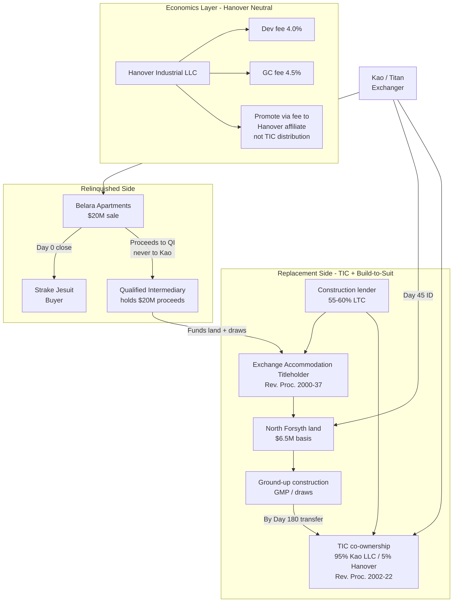
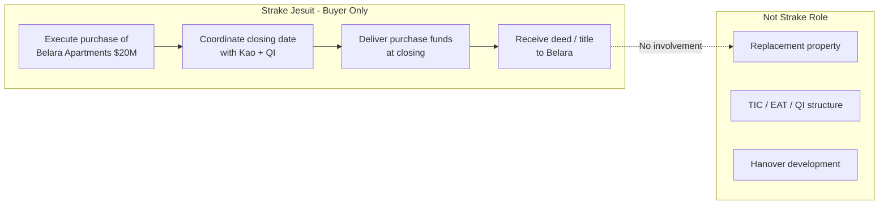
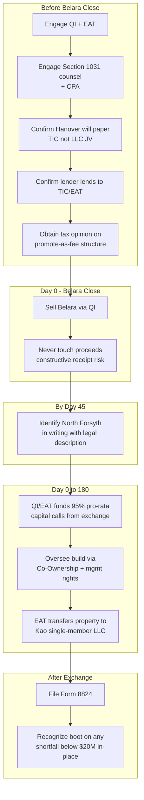
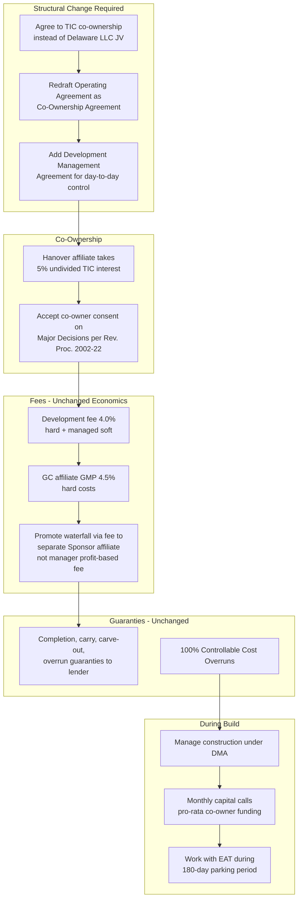
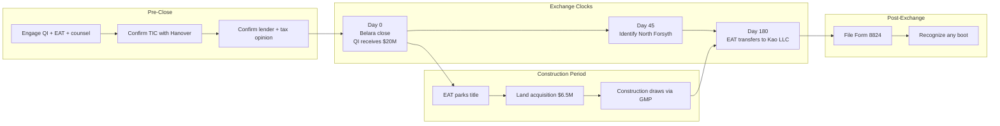

# North Forsyth 1031 Exchange Diagrams

*Visual guide for the Belara Apartments → North Forsyth Commerce Center exchange. Informational only — not legal or tax advice. The promote-as-fee and development-TIC positions below are aggressive and require a written tax opinion from Section 1031 counsel before relying on them.*

---

## Bottom Line

Run the exchange by converting Kao's position from a Delaware LLC membership interest into a **tenancy-in-common (TIC)** interest in the real estate itself, delivering Hanover's promote as a **fee** rather than an LLC distribution, and layering a **build-to-suit improvement exchange** to handle the ground-up timing. Kao receives qualifying real property. Hanover's net economics stay neutral. The hard part is replicating the promote inside the TIC rules — that is where the tax opinion earns its keep.

---

## Deal Facts at a Glance

| Item | Detail |
|---|---|
| **Relinquished property** | Belara Apartments — $20M sale to Strake Jesuit, owned ~10 years, all cash, no debt |
| **Seller / exchanger** | Titan Management / Kao Management Trust (single taxpayer) |
| **Buyer (relinquished only)** | Strake Jesuit |
| **Replacement property** | North Forsyth Commerce Center — two to-be-built industrial buildings, ~327,600 SF, Forsyth County, GA |
| **Total project cost** | ~$50.3M; land basis $6.5M |
| **Financing** | Non-recourse construction loan at 55–60% loan-to-cost (~$30M) |
| **Equity split** | 95% Kao / 5% Hanover (~$20M Kao equity check) |
| **Exchange clocks** | 45-day identification; 180-day completion |
| **Why LLC JV fails** | IRC §1031(a)(2)(D) excludes partnership/LLC membership interests — *Gluck v. Commissioner*, T.C. Memo. 2020-66 |
| **Working structure** | TIC co-ownership (Rev. Proc. 2002-22) + EAT build-to-suit (Rev. Proc. 2000-37) + QI (Treas. Reg. §1.1031(k)-1) |

---

## Diagram 1: Complete Overview

This diagram shows the full transaction — from the Belara sale on the relinquished side through the TIC + build-to-suit structure on the replacement side, with Hanover's economics held neutral via fees.

### How to read this diagram

**Three legs, one exchange.** The relinquished side (Belara sale) and replacement side (North Forsyth development) are connected only through the Qualified Intermediary. Strake buys Belara. Kao never touches the $20M. The QI funds land acquisition and construction draws through an Exchange Accommodation Titleholder (EAT) during the 180-day window, then the improved property transfers into TIC co-ownership.

**Exchange clocks**

| Milestone | Deadline | What happens |
|---|---|---|
| Day 0 | Belara closing | QI receives $20M; 45-day and 180-day clocks start |
| Day 45 | Identification | North Forsyth identified in writing with legal description |
| Day 180 | Completion | EAT transfers partially built property to Kao's single-member LLC |

**Boot risk.** Only value actually in place and paid for by Day 180 counts toward the exchange. With $6.5M of land plus early vertical on a $50.3M project, reaching $20M of in-place value inside 180 days is realistic. Any shortfall below $20M is taxable boot.

**Why the term sheet LLC fails.** The Hanover term sheet forms a Delaware LLC and gives Kao a 95% membership interest. Under IRC §1031(a)(2)(D), a partnership or LLC membership interest is personal property — not like-kind real estate — even if the LLC owns nothing but the project. This is the exact fact pattern in *Gluck v. Commissioner*, T.C. Memo. 2020-66.

**The promote problem.** A TIC must share economics pro-rata to ownership. Hanover's promote waterfall (20% / 30% / 40% over IRR hurdles) is by definition disproportionate. The workaround: deliver promote economics as a fee to a separate Hanover affiliate, not as a TIC distribution. This requires a tax opinion.

### LLC-to-TIC mapping (full term sheet)

| Term sheet provision (LLC JV) | TIC equivalent | Notes / friction |
|---|---|---|
| **Joint Venture Structure** — Delaware LLC, LP takes 95% membership interest | TIC co-ownership of the fee; each party holds its undivided interest through its own single-member LLC; Co-Ownership Agreement replaces the operating agreement | This is the change that makes the exchange qualify. The membership interest is the disqualifier. |
| **Equity Capitalization** — 95% / 5% LP/Sponsor, monthly capital calls | 95% / 5% undivided TIC interests; Kao's calls funded via QI/EAT from exchange proceeds during the build | Capital calls must read as co-owners funding pro-rata share of project cost, not partnership contributions. |
| **Governance** — Sponsor as managing member, Major Decision approval rights | Development Management Agreement gives Hanover day-to-day control; Co-Ownership Agreement reserves Major Decisions to co-owner consent | Real friction. Rev. Proc. 2002-22 caps manager control and requires co-owner consent on big items. |
| **Promote waterfall** — 20% / 30% / 40% carry over 10% / 14% / 18% IRR hurdles | Contingent incentive fee and/or disposition fee to Hanover affiliate, sized to replicate waterfall dollars | Hardest piece. Profit-based fee to the manager violates 2002-22; route to separate Sponsor affiliate. |
| **Development Fee** — 4.0% of hard + managed soft costs | Unchanged | Already a fee for services; survives intact. |
| **General Contractor / GMP** — Sponsor affiliate as GC, 4.5% of hard costs | Unchanged | GC contracts with EAT during build, then co-owners. Already fee-for-service. |
| **Guaranties** — completion, carry, carve-out, overrun guaranties | Unchanged in substance; guaranties run to co-ownership and lender | Lender lends to co-owners (or EAT during parking). Hanover guaranty package still works. |
| **Partner Funding Default** — unfunded calls become 18% preferred equity | Co-owner cost advance bearing contractual interest, plus loss of consent rights | "Preferred equity" is a partnership concept; recast as loan/advance among co-owners. |
| **Forced Sale** — named-price buy-sell after stabilization | Co-ownership buy-sell | Sensitive. Rev. Proc. 2002-22 restricts options at other than FMV. Draft carefully. |
| **Equity Funding Fee** — $125K to JLL at closing | Unchanged | Transaction fee, no effect on structure. |
| **Cash Flow Distributions** — preferred returns then promote tiers | Operating and capital-event cash splits pro-rata to TIC interests; promote lives in fee layer | TIC must distribute pro-rata. Disproportionate split looks like partnership allocation. |

### Sources for Diagram 1

- [IRC §1031 — Like-kind exchanges](https://www.law.cornell.edu/uscode/text/26/1031) (Cornell LII)
- [IRC §1031(a)(2)(D) — Partnership interest exclusion](https://www.law.cornell.edu/uscode/text/26/1031) (subsection (a)(2)(D) within §1031)
- [IRS — Like-Kind Exchanges (Real Estate Tax Tips)](https://www.irs.gov/businesses/small-businesses-self-employed/like-kind-exchanges-real-estate-tax-tips)
- [Rev. Proc. 2002-22 — TIC co-ownership guidance](https://www.irs.gov/pub/irs-drop/rp-02-22.pdf)
- [Rev. Proc. 2000-37 — EAT / build-to-suit exchange](https://www.irs.gov/pub/irs-drop/rp-00-37.pdf)
- [Treas. Reg. §1.1031(k)-1 — QI safe harbor](https://www.law.cornell.edu/cfr/text/26/1.1031(k)-1)
- *Gluck v. Commissioner*, T.C. Memo. 2020-66 — [Tax Notes summary](https://www.taxnotes.com/research/federal/court-documents/court-opinions-and-orders/tax-court-lacks-jurisdiction-over-like-kind-exchange-determination/2ckgc)

---

## Diagram 2: Strake — What They Need to Do

Strake Jesuit is the **buyer on the relinquished side only**. They are not part of the replacement property structure, the TIC, the EAT, or the Hanover development.

### Strake action checklist

- [ ] **Close Belara on the agreed date.** Purchase funds flow through escrow to the Qualified Intermediary — not to Kao/Titan directly. This is essential for the exchange to work; if Kao touches the proceeds, constructive receipt defeats the deferral.
- [ ] **Coordinate closing logistics with Kao and the QI.** Align on closing date (Day 0 for the exchange clocks), escrow instructions, and title transfer.
- [ ] **Complete standard buyer diligence.** Title review, survey, environmental (if applicable), and any gift-acceptance or institutional requirements on Strake's side.
- [ ] **Receive deed and title to Belara.** Transaction complete from Strake's perspective.

### What Strake does NOT do

- Select or fund the replacement property (North Forsyth)
- Participate in the TIC co-ownership, EAT parking, or construction loan
- Interact with Hanover, the construction lender, or Section 1031 counsel on the replacement side
- File any exchange-related tax forms

> **Footnote:** The structuring memo flags possible Georgia gift-acceptance items for Strake as outside the 1031 structure. Those are Strake's own institutional/legal concerns, not part of the exchange mechanics.

### Sources for Diagram 2

- [Treas. Reg. §1.1031(k)-1 — QI safe harbor (constructive receipt)](https://www.law.cornell.edu/cfr/text/26/1.1031(k)-1)
- [IRS — Like-Kind Exchanges (Real Estate Tax Tips)](https://www.irs.gov/businesses/small-businesses-self-employed/like-kind-exchanges-real-estate-tax-tips)

---

## Diagram 3: Kao / Titan — What We Need to Do

Kao Management Trust / Titan Management is the **exchanger** — the taxpayer selling Belara and acquiring the replacement interest. Every step below is driven by the 45-day and 180-day clocks.

### Kao action checklist

**Before Belara closes**

- [ ] Engage a Qualified Intermediary and an Exchange Accommodation Titleholder **before** the Belara closing
- [ ] Engage Section 1031 counsel and CPA to design the TIC + build-to-suit structure
- [ ] Confirm in writing that Hanover will paper the deal as TIC + Development Management Agreement, not Delaware LLC JV
- [ ] Confirm in writing that the construction lender will lend to a TIC with the EAT in place
- [ ] Obtain a written tax opinion on the promote-as-fee structure before closing Belara
- [ ] Model three scenarios: full deferral ($20M in place by Day 180), partial deferral with boot on shortfall, and backup completed-asset or DST replacement

**Day 0 — Belara closing**

- [ ] Sell Belara through the QI; proceeds go directly to the QI
- [ ] Do not touch, direct, or constructively receive the $20M at any point

**By Day 45**

- [ ] Identify North Forsyth in writing, with the land's legal description and as much detail on planned improvements as practicable

**Day 0 to Day 180**

- [ ] Fund 95% pro-rata capital calls via the QI/EAT from exchange proceeds
- [ ] Oversee the build through co-ownership rights and the management arrangement
- [ ] Receive the (likely partially built) property from the EAT into a wholly-owned single-member LLC by Day 180

**After the exchange**

- [ ] Report the exchange on Form 8824
- [ ] Recognize gain on any boot (shortfall below $20M of in-place value by Day 180)

### Critical rules for Kao

**Same taxpayer.** The entity that sold Belara must be the same taxpayer (or a single-member LLC it wholly owns, disregarded for tax under [Treas. Reg. §301.7701-3](https://www.law.cornell.edu/cfr/text/26/301.7701-3)) that takes title to the replacement interest. Do not add other members to the title-holding entity before closing.

**No mortgage boot.** Belara carries zero debt, so there is no debt to replace. Taking on the new ~$30M construction loan creates no boot — you can always trade up in debt. The full ~$20M of equity must be redeployed to fully defer.

**Boot scenarios to model**

| Scenario | In-place value by Day 180 | Tax result |
|---|---|---|
| Full deferral | ≥ $20M | Gain fully deferred |
| Partial deferral | $15M–$19.9M | Deferral on amount exchanged; boot taxed on shortfall |
| Backup replacement | Development stalls | Identify alternate completed-asset or DST to absorb proceeds |

### Sources for Diagram 3

- [IRC §1031 — Like-kind exchanges](https://www.law.cornell.edu/uscode/text/26/1031)
- [Treas. Reg. §1.1031(k)-1 — QI safe harbor](https://www.law.cornell.edu/cfr/text/26/1.1031(k)-1)
- [Treas. Reg. §301.7701-3 — Disregarded entity](https://www.law.cornell.edu/cfr/text/26/301.7701-3)
- [Rev. Proc. 2000-37 — EAT / build-to-suit](https://www.irs.gov/pub/irs-drop/rp-00-37.pdf)
- [Form 8824 — Like-Kind Exchanges](https://www.irs.gov/forms-pubs/about-form-8824)

---

## Diagram 4: Hanover — What They Need to Do

Hanover's **net economics stay neutral** — same development fee, GC fee, promote dollars, and guaranty package as the term sheet. Only the legal wrapper changes: Delaware LLC JV becomes TIC co-ownership + Development Management Agreement.

### Hanover action checklist

**Structural (before closing)**

- [ ] Agree to TIC co-ownership instead of Delaware LLC joint venture
- [ ] Have counsel redraft the Operating Agreement as a **Co-Ownership Agreement**
- [ ] Add a **Development Management Agreement** for day-to-day project control
- [ ] Confirm construction lender will lend to TIC co-owners (or EAT during parking)
- [ ] Structure promote economics as fee to a **separate Sponsor affiliate** (not profit-based fee to the manager)

**Ownership and governance**

- [ ] Take 5% undivided TIC interest through a Hanover affiliate (via single-member LLC)
- [ ] Accept that Major Decisions require **co-owner consent** (not sole Sponsor discretion) per Rev. Proc. 2002-22
- [ ] Fund 5% pro-rata share of equity capital calls

**Fees — unchanged from term sheet**

- [ ] Earn development fee: 4.0% of hard costs + managed soft costs (25% at closing, 65% monthly during construction, 10% at substantial completion)
- [ ] Act as GC through affiliate: GMP at 4.5% of hard costs
- [ ] Receive promote waterfall (20% / 30% / 40% over 10% / 14% / 18% IRR hurdles) via fee to separate affiliate or disposition fee — same dollars, different legal form

**Guaranties — unchanged from term sheet**

- [ ] Provide completion, carry, carve-out, and overrun guaranties to lender (in Sponsor's sole discretion on form)
- [ ] Fund 100% of Controllable Cost Overruns
- [ ] Provide completion guaranty and overrun guaranty to the co-ownership

**During construction**

- [ ] Manage construction under the Development Management Agreement
- [ ] Issue monthly capital calls (pro-rata co-owner funding, not partnership contributions)
- [ ] Coordinate with EAT during the 180-day parking period (GC contracts with EAT during build)

### Term sheet to TIC mapping — economic neutrality

| Term sheet (LLC JV) | TIC equivalent | Economics |
|---|---|---|
| 95% LP membership interest | 95% undivided fee interest via single-member LLC | **Same** |
| 5% Sponsor membership interest | 5% undivided fee interest via Hanover affiliate LLC | **Same** |
| Promote waterfall (20% / 30% / 40%) | Fee to Sponsor affiliate / disposition fee on sale | **Same dollars, different form** |
| Development fee 4.0% | Unchanged | **Same** |
| GC fee 4.5% of hard costs | Unchanged | **Same** |
| Equity funding fee $125K to JLL | Unchanged | **Same** |
| Preferred equity on funding default (18%) | Co-owner cost advance + contractual interest | **Recast, same intent** |
| Forced sale buy-sell | Co-ownership buy-sell (FMV-sensitive drafting) | **Same mechanism, careful drafting** |
| Cash flow distributions + promote tiers | Pro-rata TIC distributions; promote in fee layer | **Same total economics** |

### Friction points for Hanover

1. **"Sole discretion" on guaranties survives** — but "sole discretion" on Major Decisions does not. Rev. Proc. 2002-22 requires co-owner consent on sale, refinance, leasing, hiring the manager, and other material decisions.
2. **Profit-linked fee to the manager is prohibited** under Rev. Proc. 2002-22. Route promote economics to a separate Sponsor affiliate or structure as a one-time disposition fee on sale.
3. **Lender approval** — many construction lenders resist TIC structures. Confirm early and in writing.
4. **Buy-sell and forced sale** — Rev. Proc. 2002-22 restricts options to buy a co-owner's interest at other than fair market value. The term sheet's named-price buy-sell must be re-drafted carefully.

### Sources for Diagram 4

- [Rev. Proc. 2002-22 — TIC co-ownership guidance](https://www.irs.gov/pub/irs-drop/rp-02-22.pdf)
- [Rev. Proc. 2000-37 — EAT / build-to-suit exchange](https://www.irs.gov/pub/irs-drop/rp-00-37.pdf)
- [IRC §1031(a)(2)(D) — Partnership interest exclusion](https://www.law.cornell.edu/uscode/text/26/1031)

---

## Sequenced Timeline

| Phase | Timing | Key actions |
|---|---|---|
| **Pre-closing** | Before Belara close | Engage QI, EAT, 1031 counsel, CPA. Confirm Hanover papers TIC (not LLC). Confirm lender lends to TIC. Draft Co-Ownership Agreement, DMA, fee structure. Obtain tax opinion. |
| **Day 0** | Belara closing | QI receives $20M. 45-day and 180-day clocks start. |
| **By Day 45** | Identification deadline | Identify North Forsyth in writing with legal description and improvement details. |
| **Day 0 to 180** | Construction period | EAT holds title. Construction under GMP. QI/EAT funds land and draws. Kao oversees via management rights. |
| **By Day 180** | Completion deadline | EAT transfers partially built property to Kao's single-member LLC. Only in-place value counts. |
| **Tax filing** | Following tax year | Report on Form 8824. Recognize boot on any shortfall. |

---

## Risk Summary

| Risk | Mitigation |
|---|---|
| **TIC recharacterized as partnership** | Strict co-ownership formalities, market-rate fees, true fee (not profit allocation) for promote, tax opinion or PLR |
| **Promote-as-fee tension** | Route to separate Sponsor affiliate; do not pay profit-based fee to the manager; obtain tax opinion |
| **Rev. Proc. 2002-22 is guidance, not statute** | Draft buy-sell and options carefully around FMV restrictions |
| **Lender resistance to TIC** | Confirm in writing before Belara closes |
| **180-day in-place value shortfall** | Model draw schedule with GC; build in margin; identify backup replacement property |
| **Same-taxpayer drift** | Keep Belara seller and North Forsyth title-holder identical; no new members in title LLC before closing |

---

## References

### Core statute and IRS guidance

- [IRC §1031 — Like-kind exchanges](https://www.law.cornell.edu/uscode/text/26/1031) (Cornell Legal Information Institute)
- [IRC §1031(a)(2)(D) — Exclusion for partnership interests](https://www.law.cornell.edu/uscode/text/26/1031) (subsection (a)(2)(D) within §1031)
- [IRS — Like-Kind Exchanges (Real Estate Tax Tips)](https://www.irs.gov/businesses/small-businesses-self-employed/like-kind-exchanges-real-estate-tax-tips)
- [Treas. Reg. §1.1031(k)-1 — Qualified intermediary safe harbor](https://www.law.cornell.edu/cfr/text/26/1.1031(k)-1)
- [Treas. Reg. §301.7701-3 — Entity classification (disregarded single-member LLC)](https://www.law.cornell.edu/cfr/text/26/301.7701-3)
- [Form 8824 — Like-Kind Exchanges](https://www.irs.gov/forms-pubs/about-form-8824)

### TIC and build-to-suit safe harbors

- [Rev. Proc. 2002-22 — Fifteen factors for TIC co-ownership](https://www.irs.gov/pub/irs-drop/rp-02-22.pdf)
- [Rev. Proc. 2000-37 — Exchange Accommodation Titleholder (reverse/build-to-suit)](https://www.irs.gov/pub/irs-drop/rp-00-37.pdf)

### Case law

- *Gluck v. Commissioner*, T.C. Memo. 2020-66 — partnership interest in replacement property defeats §1031 deferral
  - [Tax Notes — Tax Court analysis](https://www.taxnotes.com/research/federal/court-documents/court-opinions-and-orders/tax-court-lacks-jurisdiction-over-like-kind-exchange-determination/2ckgc)
  - [Briefly Taxing — case summary](https://brieflytaxing.com/1275/)

---

## Disclaimer

This document is **informational only** and does not constitute legal or tax advice. Figures are drawn from the Hanover term sheet (06.12.2026) and the Belara structuring memo and must be reconfirmed. The development-TIC and promote-as-fee positions are aggressive; a professional "should"-level tax opinion from Section 1031 counsel is required before closing. Georgia transfer tax, title, and any Strake gift-acceptance items are outside the scope of this guide.

---

*Companion document: [North_Forsyth_1031_Structuring_Memo.md](North_Forsyth_1031_Structuring_Memo.md)*
