<!-- TAB:overview -->

> **Internal working model only** — not legal advice, not client-facing. **Working structure: Structure A** (exchange first, §721 JV after seasoning) — **DRAFT**; obtain §1031 counsel opinion before Belara closes.

## The deal

Sell **Belara Apartments** ($20M, no debt) and defer gain by reinvesting into **North Forsyth Commerce Center** — ≈$50.3M ground-up industrial (≈327,600 SF, Forsyth County GA) with **Hanover Industrial LLC** as developer.

**Structure A in one line:** Kao exchanges into **100% fee title** via QI + EAT (Phase 1), then — after **genuine seasoning** — forms the term-sheet **95/5 promoted JV** via **§721** (Phase 2). Same commercial economics; promote stays **capital gain**, not ordinary-income fee.

| | |
|---|---|
| **Working structure** | **Structure A** — exchange first, §721 JV after seasoning (**DRAFT**) |
| **Belara seller (today)** | Titan Management — **must align with exchanger** (prefer **Kao Management Trust**) |
| **Belara buyer** | Strake Jesuit |
| **Commercial LP (term sheet)** | Kao Management Trust — 95% economics (**Phase 2 JV**) |
| **Developer** | Hanover Industrial LLC |
| **Land** | $6.5M · third-party seller · **under PSA** · unaffiliated |
| **Project cost** | ≈$50.3M · construction loan **≈60% LTC** (~$30M) |
| **QI** | **Riverway Title** |
| **EAT** | TBD (e.g. NFCC Parking Title LLC — placeholder) |
| **Model Day 0** | **Sept 15, 2026** (Belara + NFCC land / construction start) |
| **45-day ID deadline** | **Oct 30, 2026** — letter on file **Sept 15** before land wire |
| **180-day completion** | **Mar 14, 2027** — EAT deeds **100%** to Kao LLC |
| **Phase 2 JV (model)** | Earliest **~Mar 2028** (seasoning floor — **OPEN** with counsel) |

## Commercial term sheet (unsigned — economics to preserve)

| Item | Term |
|---|---|
| Equity | **95% / 5%** |
| Promote | **20 / 30 / 40%** over **10 / 14 / 18%** IRR |
| Dev fee | **4%** · GC **4.5%** of hard ($300K GMP advance) |
| Overruns | **100% controllable** → Sponsor · **shared** → pro rata |
| Guaranties | Sponsor → lender + JV |
| Close intent | **Simultaneous:** JV + GMP + loan + land + permit |

Hanover has **not signed**. We will submit a **restructured term sheet** — **Structure A sequencing**: Phase 1 exchange + EAT build, Phase 2 §721 JV with full waterfall.

## Why Structure A (not term sheet LLC Day 1)

The unsigned term sheet gives Kao a **95% LLC membership** at closing. That **fails §1031**: post-TCJA, only **real property** is like-kind — not an LLC/partnership interest ([IRC §1031(a)(1)](https://www.law.cornell.edu/uscode/text/26/1031), [Reg. §1.1031(a)-3](https://www.law.cornell.edu/cfr/text/26/1.1031(a)-3)). A **promote inside the exchange vehicle** makes it partnership economics, not replacement real estate.

**Structure A fix:** separate in **time** — real property first, promoted partnership second.

| | Term sheet (as written) | **Structure A** |
|---|---|---|
| Kao receives at exchange | 95% **LLC interest** | **100% fee simple** real property |
| Hanover 5% + promote | Day 1 in JV | **Phase 2** via §721 after seasoning |
| Hanover promote tax character | Capital gain (if exchange worked) | **Capital gain (carry)** in Phase 2 JV |
| Exchange viability | **Fails** | **MLTN at best** — seasoning-dependent (**DRAFT**) |
| Ground-up build | No EAT in term sheet | **QI + EAT** ([Rev. Proc. 2000-37](https://www.irs.gov/pub/irs-drop/rp-00-37.pdf)) |

**Fallback (only if counsel rejects A):** Structure B — Kao **100% forever** + Hanover **ordinary-income incentive fee** (stronger exchange, worse for Hanover). Not the working model.

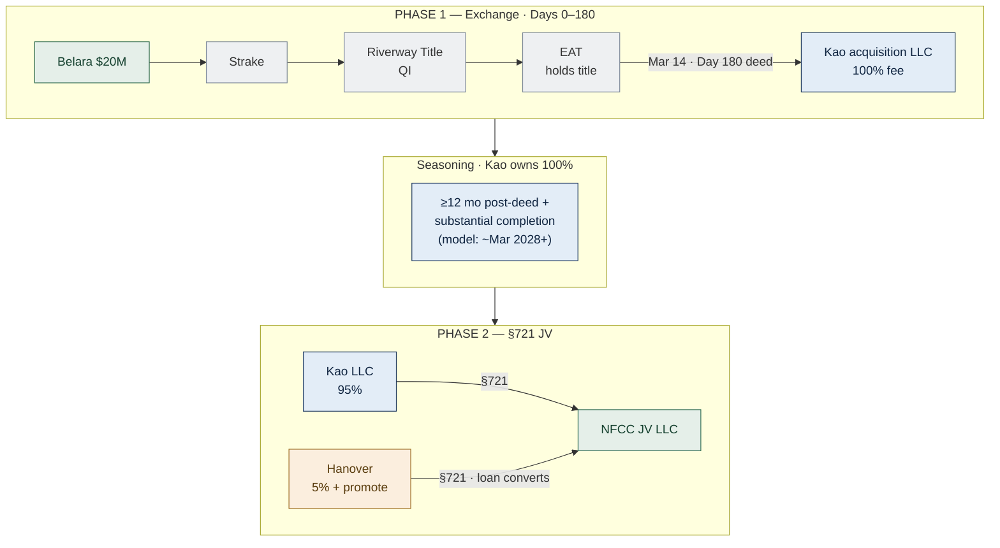

> **Residual risk (honest):** IRS **step-transaction** — could collapse Phase 1 + 2 if pre-wired. Mitigated by **no binding Phase 2 obligation**, **real seasoning**, Kao **operates as sole owner** in the gap. Target opinion: **MLTN**, not "clean." Source: `docs/sources/StructureA-draft.md` — **DRAFT**, not counsel-reviewed.

## Timeline & exchange equity draw

**Day 0 = Belara close** (IRS clocks start). Modeled **Sept 15, 2026**, aligned with NFCC land. Party detail → tabs.

### Two IRS clocks (do not confuse with action order)

| Clock | Starts | Last day (model) | What it means |
|---|---|---|---|
| **45-day identification** | Belara close | **Oct 30, 2026** | Exchangor must give QI a **written list** of replacement property **on or before** this date |
| **180-day completion** | Belara close | **Mar 14, 2027** | Replacement property must be **received** (here: EAT deeds to Kao LLC) **on or before** this date |

**Oct 30 is a deadline, not the day we identify.** QI cannot apply Belara proceeds to NFCC until NFCC is **identified**. In our model the identification letter is delivered **Sept 15 — same day as Belara, before the land wire** (see order below). Oct 30 is cushion if Belara slips.

### Sept 15 — order of operations (same calendar day)

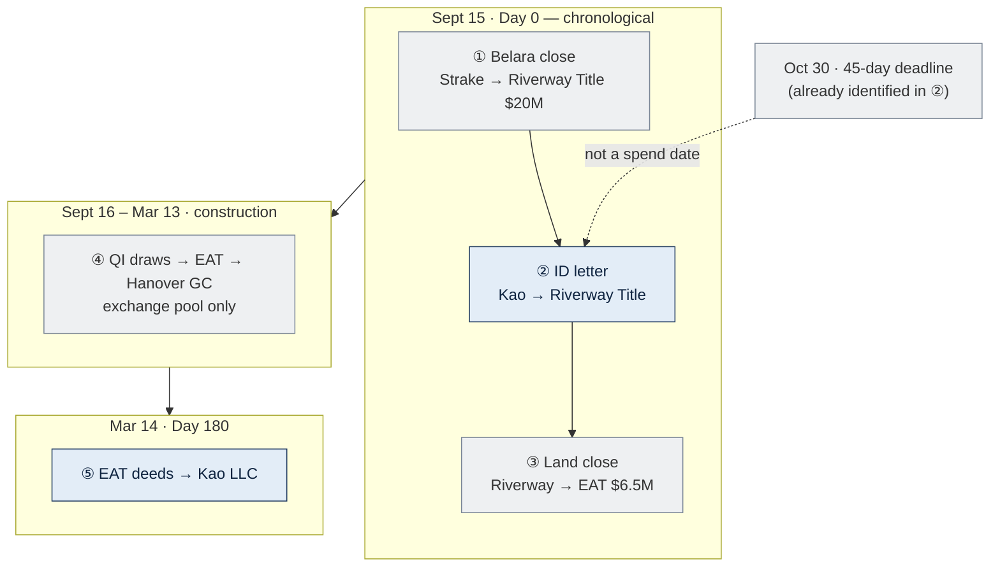

### Exchange pool — sources and uses

QI holds **≈$20M** from Belara (no debt). **Cannot disburse more than the pool** for exchange-funded work.

| Order | When | From → To | $ | Source |
|---|---|---|---|---|
| ① | Sept 15 | Strake → escrow → **Riverway Title** | **20.0M** | Belara sale |
| ② | Sept 15 | (no wire) Kao → **Riverway Title** | — | **ID letter** on file |
| ③ | Sept 15 | **Riverway Title** → **EAT** → land seller | **6.5M** | Exchange pool |
| ④ | Oct–Nov 2026 | **Riverway Title** → **EAT** → Hanover GC | **5.0M** | Exchange pool |
| ⑤ | Dec 2026–Feb 2027 | **Riverway Title** → **EAT** → Hanover GC | **8.5M** | Exchange pool (**exhausts ≈$20M**) |
| ⑤b | Dec 2026–Feb 2027 | **Lender** → **EAT** → Hanover GC | **1.5M** | **Construction loan** (foundations balance) |
| ⑥ | Mar 14, 2027 | **EAT** → **Kao LLC** (**100%** deed) | — | Phase 1 **complete** |
| ⑦ | Mar 2027 – ~Mar 2028+ | **Seasoning** — Kao sole owner | — | Hanover = **loan + fees only** |
| ⑧ | ~Mar 2028+ (**OPEN**) | **§721** — NFCC JV LLC | — | Hanover **5% + promote** |

**Phase 1 capital stack:** QI exchange pool (≈$20M) + construction loan (~$30M) + Hanover **secured loan** (~$1.1M) — **no Hanover equity, no promote** until Phase 2.

**Project draw model (user):** land $6.5M + sitework $5M + foundations $10M = **$21.5M** hard-cost phases. **Exchange pool covers $20.0M**; the last **$1.5M** of foundations is **loan-funded**.

Full build ≈**11 months** (~Aug 2027). Balance of ≈$50.3M project → **construction loan** (~60% LTC).

## Phase 1 money flow (Days 0–180)

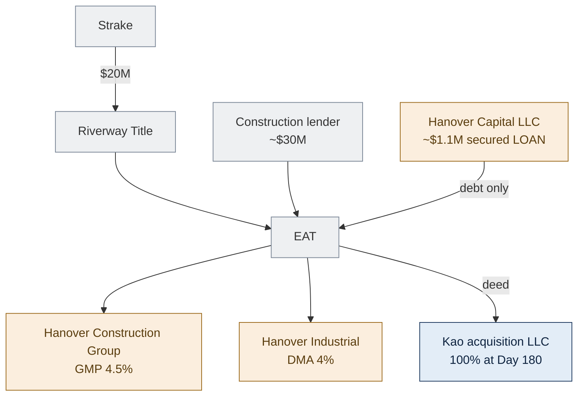

## Phase 2 — §721 JV (after seasoning)

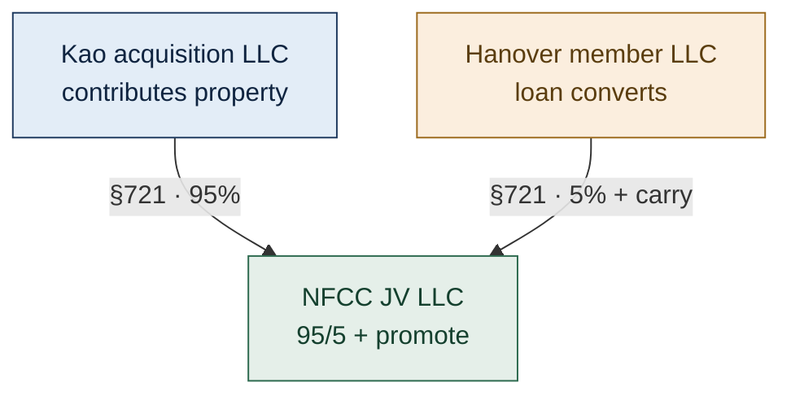

**Seasoning** starts **EAT→Kao deed** (Mar 14, 2027), not Day 0. Draft floor: **later of** 12 months post-deed **and** substantial completion → earliest JV **~Mar 2028**. Comfort: **~24 months** + lease-up/refi.

## Entities — Structure A (names TBD)

| Entity | Phase | Role |
|---|---|---|
| **Kao Management Trust** | Both | Exchangor |
| **Kao acquisition LLC** | 1 → 2 | **100% deed**; then 95% JV member |
| **Riverway Title** | 1 | QI |
| **EAT** (TBD) | 1 | Title holder / borrower during build |
| **Hanover Industrial LLC** | 1–2 | 4% DMA |
| **Hanover Construction Group** | 1–2 | 4.5% GMP — contractor, **not** equity |
| **Hanover Capital LLC** (placeholder) | 1 → 2 | **~$1.1M secured loan** → §721 conversion |
| **Hanover member LLC** | 2 | 5% + promote |
| **NFCC JV LLC** | 2 | Term-sheet waterfall |

## Key terms (short)

| Term | Meaning |
|---|---|
| **QI** | **Riverway Title** — holds ≈$20M Belara proceeds; funds NFCC **only after** identification letter on file |
| **EAT** | Holds title during build (up to 180 days) — provider TBD |
| **45-day ID** | Written list to QI — **deadline** Oct 30, 2026; modeled **Sept 15** before land wire |
| **Boot** | Taxable if less than ≈$20M qualifying value in place by Day 180 |
| **Like-kind** | Real property only — not LLC/partnership interests |
| **Same taxpayer** | Belara seller = replacement recipient (resolve Titan vs Kao Trust) |
| **§721** | Tax-free contribution to form Phase 2 JV — promote lives here |
| **Seasoning** | Real ownership gap between exchange deed and JV — defeats step-transaction |
| **Hanover Phase 1 loan** | ~$1.1M **secured debt** — converts to 5% at §721, **not** equity during exchange |

## Open before Belara PSA

1. **Exchangor entity** — align Titan Management → **Kao Management Trust** (preferred)  
2. **§1031 counsel opinion** on **Structure A** Phase 1 + Phase 2 (**DRAFT** until received)  
3. **EAT** provider · lender approval of EAT + Phase 2 JV path  
4. **Belara PSA** — QI/escrow language (Riverway Title)  
5. **Phase 1 docs** — QEAA, Hanover **loan** (not equity), DMA, GMP, Kao indemnity/LC  
6. **Non-binding Phase 2 LOI** — no fixed-price equity option

## All parties — step index (model)

**Chronological order** — same story on every tab.

| # | When | What happens | Strake | Kao | Riverway (QI) | EAT | Hanover | Land seller | Lender |
|---|---|---|---|---|---|---|---|---|---|
| **1** | Pre-close | QI/EAT engaged; **ID letter drafted**; GMP; land PSA | PSA | Entity align | Engagement | QEAA | GMP + DMA | PSA | Comfort letter |
| **2** | **Sept 15 ①** | **Belara close** | **$20M → QI** | Signs; **no cash** | **Receives $20M** | — | — | — | — |
| **3** | **Sept 15 ②** | **ID letter to QI** (before NFCC spend) | — | **Delivers letter** | **Acknowledges** | — | — | — | — |
| **4** | **Sept 15 ③** | **Land close** | — | — | **$6.5M → EAT** | **On title** | GMP live | **Paid** | — |
| **5** | Sept 16 – Mar 13 | **Construction** | — | — | Draws to EAT | Pays GC | Builds + **secured loan** | — | Loan + Hanover loan |
| **6** | **Mar 14** | **Phase 1 complete** — **100% deed** | — | **Owns 100%** | Closes exchange | Deeds → Kao LLC | Creditor + GC | — | — |
| **7** | Mar 2027 – ~Mar 2028+ | **Seasoning** | — | Sole owner | — | Dissolved | Loan + fees only | — | — |
| **8** | ~Mar 2028+ | **§721 JV** | — | 95% | — | — | **5% + promote** | — | — |

| **Deadline only** | **Oct 30, 2026** | Last day to identify if not already done in step **3** | — | — | — | — | — | — | — |

<!-- TAB:strake -->

## Your role

**Buyer of Belara Apartments only** — **Strake Jesuit**. You purchase the relinquished property so Kao's family can run a §1031 exchange into North Forsyth. You are **not** a party to NFCC, the EAT, Hanover's development, or any exchange filing.

| Role | Party |
|---|---|
| **What you buy** | Belara Apartments — **$20M**, no debt |
| **Seller** | **Titan Management** today (may align to **Kao Management Trust** — not your problem to structure) |
| **Your counsel** | Your attorneys — PSA, diligence, institutional requirements |
| **Escrow / title** | Closing agent per PSA |
| **QI (exchange)** | **Riverway Title** — **your wire destination** at closing |
| **North Forsyth** | **Not involved** — different property, different parties |

## Why your closing matters for the exchange

Kao defers tax only if Belara sale proceeds go **directly to a Qualified Intermediary** — not to the seller. Your purchase price is the **$20M exchange pool** that funds NFCC land and construction. If proceeds wire to Titan/Kao instead of **Riverway Title**, the exchange fails.

You do **not** need to understand EATs or replacement property — but you **must** close with escrow instructions that send **net proceeds to Riverway Title**.

## Key dates (your involvement only)

| Milestone | Date (model) | Your action |
|---|---|---|
| **PSA signed** | Before Sept 15 | Agree price, diligence, closing logistics |
| **Day 0 — Belara close** | **Sept 15, 2026** | Wire **$20M** through escrow → **Riverway Title**; receive Belara deed |
| **After Day 0** | — | **Nothing** on NFCC, construction, or §1031 |

Modeled same day as Kao's NFCC land close — **your** obligation is only the Belara purchase. Kao delivers the §1031 identification letter to Riverway **before** Riverway wires any NFCC funds (not your document to sign).

## Step 1 — Pre-close (before Sept 15)

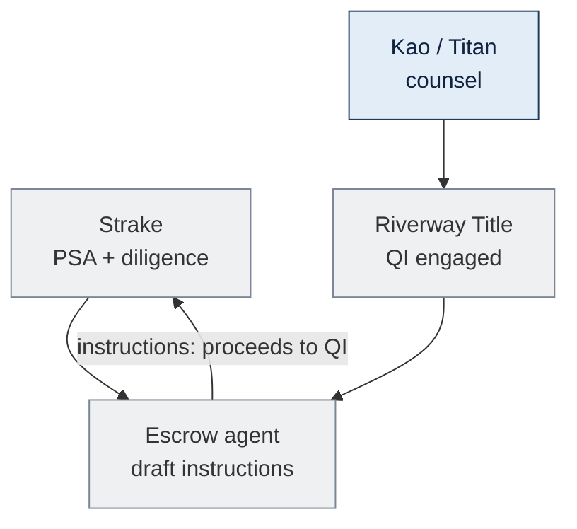

| Who | What |
|---|---|
| **Strake** | Complete diligence (title, survey, environmental, gift/institutional items on your side) |
| **Strake counsel** | Review PSA; confirm closing statement |
| **Kao / seller counsel** | Engage **Riverway Title** as QI; draft exchange + escrow language |
| **Escrow** | Instructions: **net sale proceeds wire to Riverway Title**, not seller |
| **Strake** | Approve escrow instructions before close |

**You do not** select the EAT, sign GMP, or approve NFCC identification.

## Step 2 — Day 0: Belara closing (Sept 15, 2026)

This is your **only** day in the transaction.

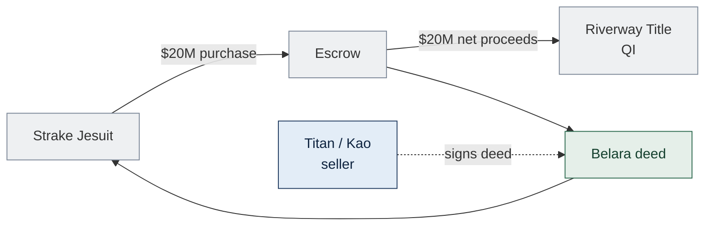

| From | To | $ | Note |
|---|---|---|---|
| **Strake Jesuit** | **Escrow** | **$20M** | Purchase price per PSA |
| **Escrow** | **Riverway Title** | **$20M** (net) | **Required** for §1031 — not to seller |
| **Seller** | **Strake** | — | Deed to Belara |

**You receive** title to Belara. **You do not** send money to North Forsyth, Hanover, or an EAT.

## Step 3 — After closing: what you do not do

| Topic | Strake involvement |
|---|---|
| North Forsyth / NFCC | **None** |
| EAT, construction, 180-day clock | **None** — Kao's exchange |
| Hanover JV, GMP, promote | **None** |
| Form 8824 or IRS filings | **None** — exchanger's return |
| Day 45 identification | **None** |
| Construction loan | **None** |

> Gift-acceptance or other institutional requirements are **your** legal matters — separate from the exchange.

## Escrow checklist (for your counsel)

- [ ] QI (**Riverway Title**) named in escrow instructions as proceeds recipient  
- [ ] Seller does **not** receive sale proceeds at closing  
- [ ] Closing date coordinated with Kao (modeled **Sept 15, 2026**)  
- [ ] No side letter directing proceeds elsewhere  

**Sources:** [Treas. Reg. §1.1031(k)-1](https://www.law.cornell.edu/cfr/text/26/1.1031(k)-1) · [IRS Like-Kind Exchanges](https://www.irs.gov/businesses/small-businesses-self-employed/like-kind-exchanges-real-estate-tax-tips)

<!-- TAB:hanover -->

## Your role — Structure A

**Hanover Industrial LLC** = Sponsor. **Structure A** splits your economics across two phases:

| Phase | Your role | Equity / promote |
|---|---|---|
| **Phase 1** (Days 0–180 + build) | DMA **4%**, GMP **4.5%**, loan **guaranties**, **~$1.1M secured loan** to EAT | **None** — you are **creditor + contractor** |
| **Seasoning** (~Mar 2027 – ~Mar 2028+) | Same fees; loan outstanding; Kao owns **100%** | **Still none** — non-binding Phase 2 LOI only |
| **Phase 2** (§721 JV) | Managing member; term-sheet **5% + promote** | **Capital gain carry** in Delaware LLC JV |

**Hanover Construction Group** = GMP contractor to **EAT**, then to **Kao LLC**, then **JV** — never a substitute for Phase 2 membership.

| Role | Entity (placeholder) |
|---|---|
| **Sponsor / DMA** | Hanover Industrial LLC — 4% |
| **GC / GMP** | Hanover Construction Group — 4.5% hard |
| **Phase 1 capital** | **Hanover Capital LLC** — **~$1.1M secured, interest-bearing loan** (not equity) |
| **Phase 2 member** | Hanover member LLC — 5% + promote via **§721** |
| **JV** | NFCC JV LLC — full term-sheet waterfall |

## Why Structure A (not term sheet Day 1)

Term sheet **LLC JV at closing** breaks Kao's §1031. Structure A preserves **your promote as capital gain** by keeping promote **out of Phase 1** and into **Phase 2 partnership** — same pre-tax economics, later legal ownership.

**You accept in Phase 1:** no equity, no promote, more **guaranty/creditor** risk. **You get in Phase 2:** standard promoted JV if Kao proceeds and seasoning clears counsel.

## Hanover protection in Phase 1 (neutrality package — DRAFT)

1. **Standalone market DMA + GMP** — arm's-length fees with normal remedies  
2. **~$1.1M = true secured loan** at market interest — **not** "preferred return"  
3. **Kao indemnity/LC** for your guaranty exposure  
4. **Cost-based break fee** if Kao declines Phase 2 — **not** promote-mirroring  
5. **Non-binding LOI** for Phase 2 — no fixed-price equity option

## Key dates (Hanover — model)

| Milestone | Date | Hanover role |
|---|---|---|
| **Pre-close** | Before Sept 15 | Execute **GMP** + dev agreements with **EAT**; lender guaranty docs |
| **Day 0 — ① Belara** | **Sept 15, 2026** | **GMP effective** after Kao ID + land close to **EAT** |
| **Construction** | Sept 16, 2026 – Mar 13, 2027 | **Invoice EAT**; paid from QI draws then **loan** |
| **Day 180** | **Mar 14, 2027** | EAT deeds **100%** to Kao LLC — you stay **GC**; **no equity deed** |
| **Seasoning** | Mar 2027 – ~Mar 2028+ | Creditor + contractor; loan outstanding | 
| **Phase 2 §721** | ~**Mar 2028+** (**OPEN**) | Loan converts → **5% + promote** in JV LLC |
| **Full build** | ~**Aug 2027** | Construction completes under Kao ownership |

## Step 1 — Pre-close (before Sept 15)

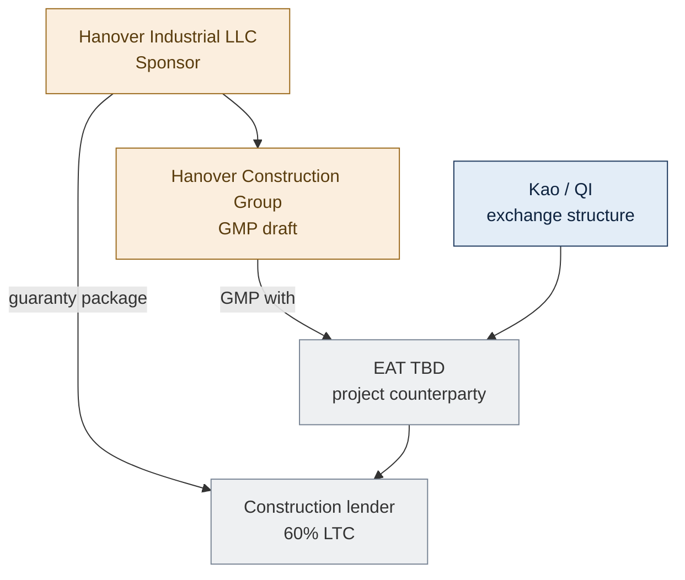

| Who | What |
|---|---|
| **Hanover Industrial** | Negotiate restructured economics; dev management agreement (4%) with **EAT** |
| **Hanover Construction Group** | Finalize **GMP** — 4.5% hard, $300K advance, 5% contingency — **contractor to EAT** |
| **Hanover Capital LLC** | Draft **secured loan** docs (~$1.1M) — subordination, interest, collateral |
| **EAT** | QEAA; holds title; borrows construction + Hanover loans |
| **Phase 2** | **Non-binding LOI** only — full JV docs **after** seasoning |

## Step 2 — Day 0: land close (Sept 15, 2026)

You are **not** at the Belara closing. On NFCC, Riverway funds land **only after** Kao's identification letter is on file (same day, before this wire).

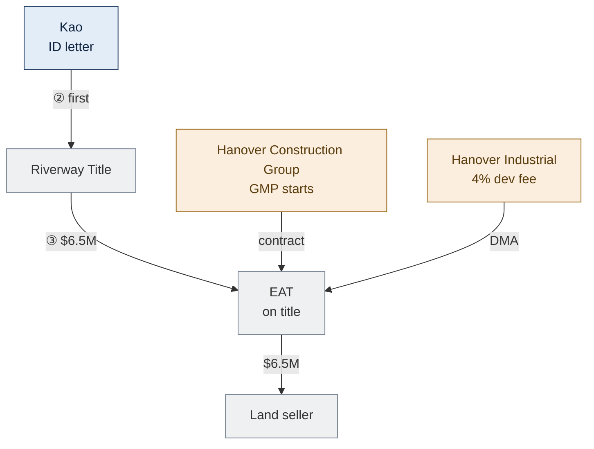

| From | To | $ | Hanover |
|---|---|---|---|
| **Riverway Title** | **EAT** | **$6.5M** | — (exchange funds, not your capital) |
| **EAT** | **Land seller** | **$6.5M** | You facilitate development; **EAT** is buyer of record |
| **EAT** | **Hanover Construction Group** | — | **GMP** in place; mobilization per contract |
| **EAT** | **Hanover Industrial** | — | **Dev management** (4%) accrues per DMA |

## Step 3 — Construction: who pays you (Sept 16, 2026 – Mar 13, 2027)

You bill the **EAT**. Early costs: **Riverway Title → EAT → you**. After the **≈$20M exchange pool** is spent, **lender → EAT → you**.

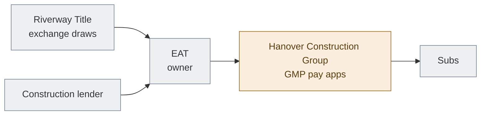

| Phase | Calendar | $ | **Paid from** | Hanover receives |
|---|---|---|---|---|
| Sitework | Oct–Nov 2026 | $5.0M | **QI → EAT** | GMP progress payments |
| Foundations (exchange) | Dec 2026–Feb 2027 | $8.5M | **QI → EAT** | Same |
| Foundations (balance) | Dec 2026–Feb 2027 | $1.5M | **Lender → EAT** | Same |
| Dev management | Ongoing | per DMA | EAT | **4%** dev fee |

- **Draw certification:** GC pay apps; QI releases only against **identified** NFCC and certified work  
- **After exchange pool exhausted (~$20M):** **construction lender** advances to EAT — you **guaranty** per term sheet  
- **Controllable overruns:** **100% Sponsor** per term sheet  

## Step 4 — Day 180 (Mar 14, 2027)

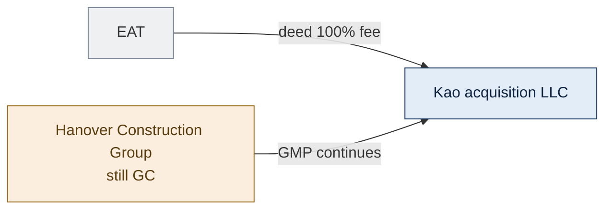

| Event | Hanover |
|---|---|
| **EAT → Kao LLC deed** | **100%** to Kao — exchange done; **you are not on title** |
| **GMP / DMA** | Continue — Kao is owner; you are still vendor |
| **Your loan** | **Still outstanding** — converts at §721, not at Day 180 |
| **Promote** | **Does not start** — Phase 2 only |

## Step 5 — Seasoning (Mar 2027 – ~Mar 2028+)

Kao holds **100%** — depreciation, cash flow, loan obligations, lease-up. You: **secured lender** + **GC/DMA** + **guarantor**. **No binding JV obligation.**

| Milestone | Model date |
|---|---|
| EAT→Kao deed (seasoning starts) | **Mar 14, 2027** |
| Substantial completion (~11 mo build) | ~**Aug 2027** |
| 12 months post-deed | **Mar 14, 2028** |
| Earliest §721 JV (floor: later of above) | **~Mar 2028** |
| Comfort path (draft) | **~Mar 2029** + lease-up/refi |

## Step 6 — Phase 2: §721 JV (~Mar 2028+ — OPEN with counsel)

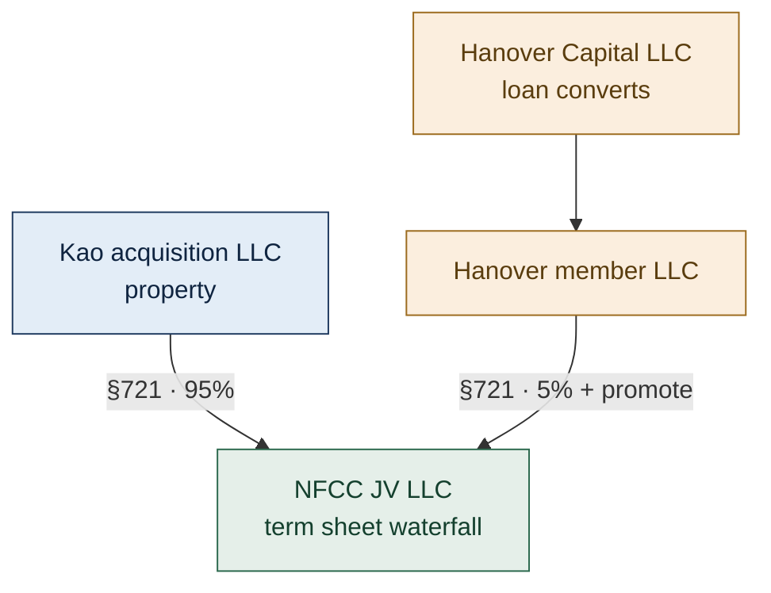

| Item | Phase 2 |
|---|---|
| **Kao** | Contributes property → **95%** |
| **Hanover** | Loan converts → **5%** + **20/30/40 promote** @ 10/14/18 IRR |
| **Tax character** | Promote = **capital gain (carry)** — not ordinary-income fee |
| **Docs** | Essentially **unsigned term sheet JV** — triggered after seasoning |

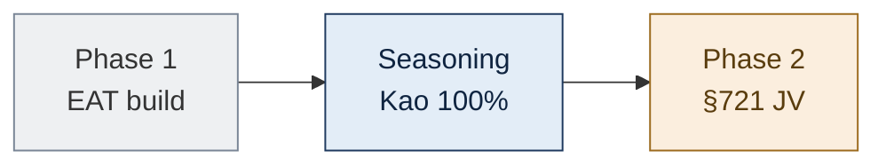

## Commercial terms (term sheet — Phase 2 target)

| Item | Term |
|---|---|
| Equity | 5% (95% Kao) — **at §721**, not Day 1 |
| Promote | 20/30/40 @ 10/14/18 IRR — **capital gain in JV** |
| Dev fee | 4% — runs Phase 1 + 2 |
| GC / GMP | 4.5% hard · $300K advance |
| Phase 1 loan | ~$1.1M secured — **converts** to 5% |
| Overruns / guaranties | Per term sheet |

## Term sheet vs Structure A

| Term sheet | **Structure A** |
|---|---|
| LLC JV **Day 1** | **EAT** Phase 1 → **§721 JV** Phase 2 |
| Hanover 5% **equity** at close | **Loan** Phase 1 → **equity** Phase 2 |
| Promote in Day-1 LLC | Promote in **Phase 2 LLC only** |
| Kao gets LLC interest in exchange | Kao gets **100% real property**, then contributes |

**Sources:** Term sheet 06.12.2026 · `docs/sources/StructureA-draft.md` (**DRAFT**)

<!-- TAB:kao -->

## Your role — Structure A (exchangor)

**Exchangor (our family)** — sell Belara, acquire North Forsyth, defer gain. **Structure A:** you receive **100% fee title** in Phase 1, then contribute to the **95% JV** after seasoning.

| Role | Party |
|---|---|
| **Working structure** | **Structure A** — exchange first, §721 JV after seasoning (**DRAFT**) |
| **Relinquished property** | Belara — seller today: **Titan Management** (align → **Kao Management Trust**) |
| **Belara buyer** | **Strake Jesuit** |
| **QI** | **Riverway Title** — you **never** receive sale proceeds |
| **EAT** | TBD — holds title Days 0–180 |
| **Phase 1 receipt** | **Kao acquisition LLC** — **100% deed** at Day 180 |
| **Phase 2** | Contribute property → **95%** of NFCC JV LLC; Hanover **5% + promote** via §721 |
| **Hanover Phase 1** | Contractor + **secured lender** (~$1.1M) — **not** your partner yet |

## Why a §1031 exchange (not just "buying NFCC")

Selling Belara for **$20M** triggers a large capital gain. **IRC §1031** defers that tax if you reinvest into **like-kind real property** (North Forsyth) and follow IRS rules:

1. **Strake's purchase price** wires to **Riverway Title (QI)** — not to you. Touching the cash = **constructive receipt** = exchange fails.
2. **On or before 45 days** after Belara close, you must have given the QI a **written identification** of replacement property. **Oct 30, 2026** is the **last day**; in our model the letter goes to Riverway **Sept 15, before any NFCC disbursement**.
3. Within **180 days**, EAT deeds **100% fee simple** to your LLC — **not** a 95% LLC interest. Promote and Hanover equity come **later** in Phase 2 §721.

The word **"exchange"** means: Belara out → North Forsyth in, same taxpayer, QI in the middle, tax deferred. It is the **tax mechanism** for this deal — not a separate optional step.

## Key dates (model — STATED user)

**Day 0 = Belara close.** NFCC land closes **same day**, but **only after** the identification letter is on file with QI.

| Milestone | Date | What actually happens |
|---|---|---|
| **Day 0 — ① Belara** | **Sept 15, 2026** | Strake closes → **$20M to Riverway Title**; clocks start |
| **Day 0 — ② ID letter** | **Sept 15, 2026** | **Written identification** of NFCC to Riverway **before** land wire |
| **Day 0 — ③ Land** | **Sept 15, 2026** | Riverway releases **$6.5M** → **EAT**; land seller paid |
| **45-day deadline** | **Oct 30, 2026** | Last day to identify — **not** when we act in this model |
| **Construction** | Sept 16, 2026 – Mar 13, 2027 | QI draws (to ≈$20M) then loan → EAT → Hanover GC |
| **Day 180 — Phase 1 done** | **Mar 14, 2027** | **EAT deeds 100%** → Kao acquisition LLC |
| **Seasoning** | Mar 2027 – ~Mar 2028+ | You own **100%** — operate, depreciate, bear loan |
| **Phase 2 §721** | ~**Mar 2028+** (**OPEN**) | Contribute → **95%** JV; Hanover loan → **5% + promote** |
| **Full build** | ~**Aug 2027** | Construction completes while you own 100% |

## Step 1 — Pre-close (before Sept 15)

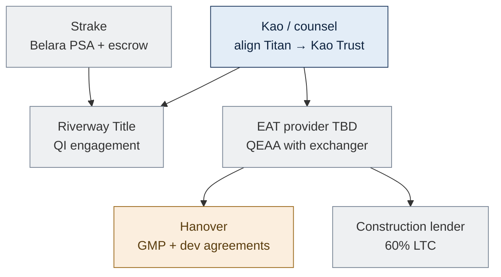

- **Same taxpayer** from Belara through replacement — resolve **Titan Management vs Kao Management Trust** first
- **Engage Riverway Title**; Belara PSA must wire proceeds **to QI only**
- **Select independent EAT** ([Rev. Proc. 2000-37](https://www.irs.gov/pub/irs-drop/rp-00-37.pdf))
- **Form Kao acquisition SMLLC** (name TBD) — receives Day 180 deed
- **Land PSA** with third-party seller ($6.5M)
- **Draft identification letter** for NFCC (land + improvements, value ≥ $20M) — ready to deliver **before** any QI disbursement to EAT

## Step 2 — Day 0: Belara, identification, land (Sept 15, 2026)

IRS **clocks start** at Belara close. **Same calendar day, fixed order** — QI will not fund NFCC until step **②** is complete.

### ② Identification letter (before any NFCC wire)

| | |
|---|---|
| **Who acts** | Exchangor (Kao / aligned entity), through §1031 counsel |
| **Who receives** | **Riverway Title** (QI) |
| **What** | **Written identification** — NFCC parcel, address, planned improvements, estimated value **≥ $20M** |
| **Why first** | Proceeds applied to replacement property must match **identified** property ([Reg. §1.1031(k)-1](https://www.law.cornell.edu/cfr/text/26/1.1031(k)-1)) |

**Oct 30, 2026** is the **45-day deadline** if Belara were earlier; delivering the letter **Sept 15** satisfies the rule and unlocks land/construction draws.

### ① Belara close + ③ NFCC land (after ID on file)

| Step | From | To | $ | Note |
|---|---|---|---|---|
| **①** | **Strake Jesuit** | **Riverway Title** | **$20M** | Belara proceeds — **not** to you |
| **②** | **You (exchangor)** | **Riverway Title** | — | ID letter — **no wire** |
| **③** | **Riverway Title** | **EAT** → land seller | **$6.5M** | Only after **②**; EAT on title |

**You** sign as seller/exchangor. **You do not** receive or control the $20M.

## Step 3 — Construction: who pays whom (Sept 16, 2026 – Mar 13, 2027)

**QI draws** = Riverway releasing **exchange pool** funds on certified requests. Pool is **≈$20M total** (after land: **≈$13.5M** left for improvements).

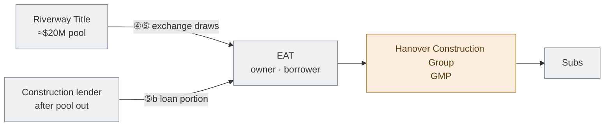

| Phase | Calendar | $ | **Source** | Exchange pool cumulative |
|---|---|---|---|---|
| Land | Sept 15 | $6.5M | **QI** | $6.5M |
| Sitework | Oct–Nov 2026 | $5.0M | **QI** | $11.5M |
| Foundations | Dec 2026–Feb 2027 | $8.5M | **QI** | **$20.0M** (pool exhausted) |
| Foundations (balance) | Dec 2026–Feb 2027 | $1.5M | **Construction loan** | — |
| **Project subtotal** | | **$21.5M** | | (user draw model) |

- **Who requests draws:** EAT / GC under GMP; **QI pays EAT** only for exchange-funded amounts
- **Who is paid:** **Hanover Construction Group** and subs — from **EAT's** account
- Only improvements **complete and paid with exchange funds within 180 days** count toward §1031 value — counsel must document; loan-funded work does not add exchange credit

After exchange pool is out, remaining **≈$28.8M** of ≈$50.3M project → **construction loan** (~60% LTC).

## Step 4 — Day 180: what "exchange complete" means (Mar 14, 2027)

Three concrete events — not a label:

1. **EAT deeds 100% fee simple** (land + improvements in place) → **Kao acquisition LLC** (disregarded → Kao Management Trust if aligned)
2. **Riverway Title** closes exchange per final disbursement instructions
3. You file **Form 8824** — gain deferred to extent **≈$20M** qualifying value was reinvested; shortfall = taxable **boot**

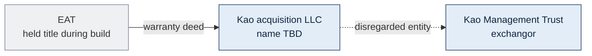

**Until this deed:** you do **not** own NFCC for §1031 purposes — the **EAT** does. That is why the EAT exists.

## Step 5 — Seasoning: you own 100% (Mar 2027 – ~Mar 2028+)

**Seasoning clock starts at the deed** (Mar 14, 2027), not Belara close. You must **actually own and operate** before §721:

- **100% fee title**, borrower on loan, sign leases, take depreciation  
- **No binding obligation** to form JV — non-binding LOI only  
- Hanover remains **lender + contractor**; promote **not active**  
- **Kao indemnity/LC** for Hanover guaranty exposure (per neutrality package)

| Target | Model |
|---|---|
| Floor (draft) | Later of **12 mo post-deed** AND **substantial completion** → **~Mar 2028** |
| Comfort (draft) | **~24 mo post-deed** + lease-up/refi → **~Mar 2029** |

> **Step-transaction risk:** If Phase 2 looks pre-wired from Day 0, IRS could collapse both phases. Real time + real sole ownership is the defense — **DRAFT**, needs counsel opinion.

## Step 6 — Phase 2: §721 JV (~Mar 2028+ — OPEN)

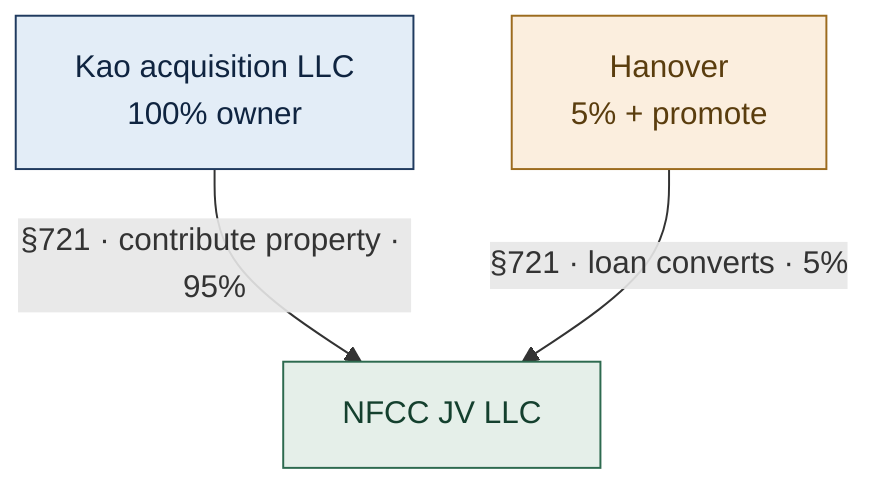

Term-sheet economics **activate here** — 95/5, 20/30/40 promote. Hanover promote = **capital gain (carry)**, not ordinary-income fee.

## Critical rules (exchangor)

- **Same taxpayer** Belara sale → replacement deed — resolve Titan vs Kao Trust **before PSA**
- **Never touch proceeds** — constructive receipt ends the exchange
- **No debt on Belara** at close — no mortgage boot
- **45-day identification** — letter on file **before** QI funds NFCC; **Oct 30** is last day, not action day
- **180-day completion** — deed by **Mar 14, 2027**
- **Form 8824**; boot if documented in-place value **< ≈$20M** at Day 180

## Before Belara closes

- [ ] Lock **exchangor entity** (Kao Trust preferred)  
- [ ] Engage **Riverway Title**; select **EAT**  
- [ ] §1031 counsel opinion on **Structure A** Phase 1 + Phase 2  
- [ ] **Non-binding Phase 2 LOI** — no fixed-price equity option  
- [ ] Draft **identification letter** — deliver to Riverway **before** any NFCC disbursement  
- [ ] Draft Belara PSA — proceeds to QI only  

**Sources:** [IRC §1031](https://www.law.cornell.edu/uscode/text/26/1031) · [IRC §721](https://www.law.cornell.edu/uscode/text/26/721) · [Rev. Proc. 2000-37](https://www.irs.gov/pub/irs-drop/rp-00-37.pdf) · `docs/sources/StructureA-draft.md` (**DRAFT**)

<!-- TAB:references -->

## Statute and IRS Guidance

- [IRC §1031 — Like-kind exchanges (real property only)](https://www.law.cornell.edu/uscode/text/26/1031)
- [Treas. Reg. §1.1031(a)-3 — Real property; partnership interest excluded](https://www.law.cornell.edu/cfr/text/26/1.1031(a)-3)
- [Treas. Reg. §1.1031(k)-1 — QI safe harbor](https://www.law.cornell.edu/cfr/text/26/1.1031(k)-1)
- [Treas. Reg. §301.7701-3 — Disregarded entity](https://www.law.cornell.edu/cfr/text/26/301.7701-3)
- [Form 8824](https://www.irs.gov/forms-pubs/about-form-8824)

## Build-to-suit and co-ownership

- [Rev. Proc. 2000-37 — EAT / build-to-suit](https://www.irs.gov/pub/irs-drop/rp-00-37.pdf)
- [Rev. Proc. 2002-22 — TIC guidance (not a safe harbor)](https://www.irs.gov/pub/irs-drop/rp-02-22.pdf)
- [IRC §721 — Contribution to partnership](https://www.law.cornell.edu/uscode/text/26/721)

## Case law

- *Gluck v. Commissioner*, T.C. Memo. 2020-66 — LLC interest / exchange issues

## Disclaimer

Internal working model only — not legal or tax advice. No structure on this site is locked or counsel-approved. Obtain a written §1031 opinion before Belara closes.
