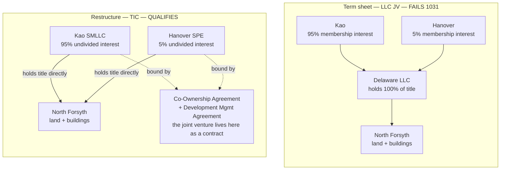
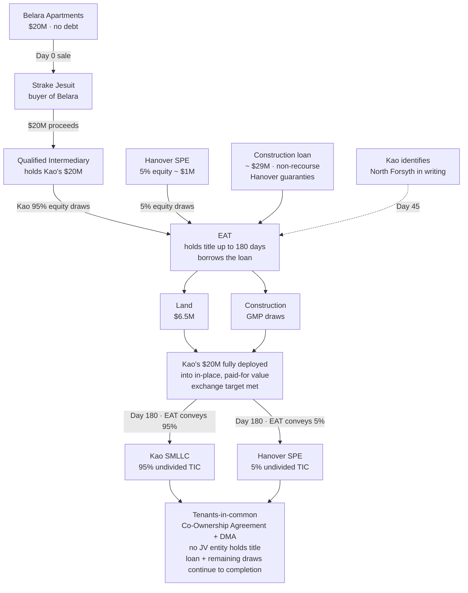
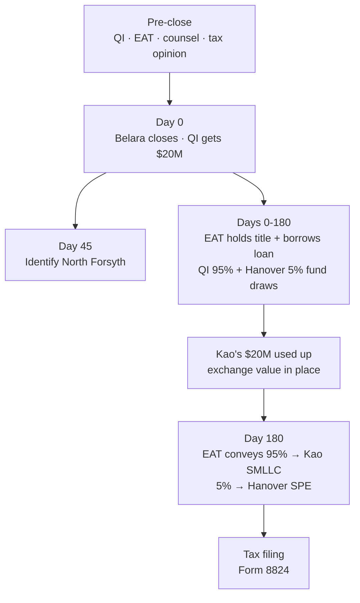
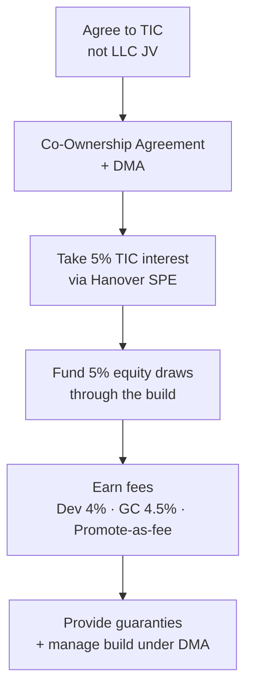
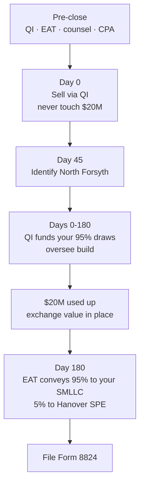

<!-- TAB:overview -->

## The Deal

Sell **Belara Apartments** ($20M, no debt) and defer the gain by reinvesting into **North Forsyth Commerce Center** — a ~$50.3M ground-up industrial development (95% Kao / 5% Hanover equity).

| | |
|---|---|
| **Seller / exchanger** | Kao Management Trust / Titan Management |
| **Buyer** | Strake Jesuit (relinquished side only) |
| **Developer** | Hanover Industrial LLC |
| **Replacement** | ~327,600 SF industrial, Forsyth County GA |
| **Kao equity** | ~$20M via 1031 proceeds |
| **Clocks** | 45-day ID · 180-day completion |

## Key Terms

| Term | Definition |
|---|---|
| **1031 Exchange** | Named after [IRC §1031](https://www.law.cornell.edu/uscode/text/26/1031). A tax-deferred swap: sell investment real estate (Belara) and reinvest the proceeds into like-kind property (North Forsyth) to defer capital gains. Two hard deadlines start at Belara closing: **45 days** to identify the replacement, **180 days** to complete the exchange. |
| **Relinquished property** | The property being sold out of — here, Belara Apartments ($20M, no debt). |
| **Replacement property** | The property being acquired into — here, North Forsyth Commerce Center (~$50.3M ground-up industrial). |
| **Qualified Intermediary (QI)** | **QI** = Qualified Intermediary. A neutral third party engaged *before* Belara closes. The $20M sale proceeds wire to the QI — not to Kao. The QI then directs funds toward land purchase and construction draws at North Forsyth. If Kao touches or controls the money, the IRS treats it as **constructive receipt** and the exchange fails ([Treas. Reg. §1.1031(k)-1](https://www.law.cornell.edu/cfr/text/26/1.1031(k)-1)). |
| **Exchange Accommodation Titleholder (EAT)** | **EAT** = Exchange Accommodation Titleholder. Because North Forsyth is a ground-up build — the buildings don't exist at closing — Kao can't simply buy finished property on day one. The EAT is a special-purpose entity that **holds legal title** to the land and the in-progress project for up to 180 days. During this "parking" period the EAT is also the **borrower on the construction loan** (with Hanover's guaranties), and it pays for the land and construction draws using: (1) Kao's exchange proceeds advanced through the QI (Kao's 95% equity), (2) Hanover's 5% equity, and (3) the construction loan. At day 180 the EAT **conveys the property out as two undivided interests — 95% to Kao's single-member LLC and 5% to Hanover's affiliate** — because in a TIC there is no single entity to deed to. This is the standard IRS structure for development timing under [Rev. Proc. 2000-37](https://www.irs.gov/pub/irs-drop/rp-00-37.pdf). Think of the EAT as a temporary parking spot for title during the build. |
| **Tenancy-in-Common (TIC)** | **TIC** = Tenancy-in-Common. A form of **direct co-ownership of real estate** — each owner holds an undivided percentage of the actual land and buildings (here, 95% Kao / 5% Hanover), not shares in a company. This matters because a TIC interest in real property qualifies for a 1031 exchange, but a **membership interest in an LLC does not** — even if the LLC owns nothing but the project. The Hanover term sheet forms a Delaware LLC JV; this deal restructures it as TIC co-ownership plus a management agreement so Kao receives qualifying replacement property ([Rev. Proc. 2002-22](https://www.irs.gov/pub/irs-drop/rp-02-22.pdf)). |
| **Build-to-suit exchange** | A 1031 variation for properties under construction. The QI/EAT uses Kao's exchange proceeds (alongside Hanover's 5% and the construction loan) to buy land ($6.5M) and fund construction draws during the 180-day window. Only value **actually in place and paid for** with Kao's exchange funds by day 180 counts toward the ~$20M exchange target. Once Kao's $20M is fully deployed into in-place, paid-for value, the exchange target is met; unfinished work beyond day 180 does not qualify and is funded by the loan and ongoing co-owner draws after conveyance. |
| **Boot** | Taxable gain on the portion of the exchange that is not fully deferred. Here, boot arises if Kao receives cash back or if less than ~$20M of qualifying replacement value is in place by day 180. The excess gain is taxed in the year of the exchange. |
| **Promote** | The developer's carried interest — a disproportionate share of profits above IRR hurdles (20% / 30% / 40% over 10% / 14% / 18% in the Hanover term sheet). A TIC must distribute cash **pro-rata** to ownership percentages, so a traditional promote cannot be paid as a TIC distribution without risking partnership reclassification. The workaround: pay Hanover's promote economics as a **fee** to a separate affiliate. |
| **GMP** | **GMP** = Guaranteed Maximum Price. A construction contract in which Hanover's GC affiliate (Hanover's construction company) caps total construction cost at an agreed maximum. The GC's fee is **4.5% of hard costs**, with a $300K advance and a minimum 5% contingency. During the EAT parking period the GMP contract runs with the EAT; after conveyance, with the co-owners. |
| **Single-member LLC (SMLLC) / SPE** | A **single-member LLC** is owned by one taxpayer and is "disregarded" for tax (treated as if the owner holds the asset directly), which preserves the 1031 because Kao is still treated as owning real property — while still being a real entity that provides a **liability shield**. Each co-owner holds its undivided TIC interest through its own **single-purpose entity (SPE)**: Kao's SMLLC holds the 95%, a Hanover affiliate SPE holds the 5%. Disregarded for tax, respected for liability ([Treas. Reg. §301.7701-3](https://www.law.cornell.edu/cfr/text/26/301.7701-3)). |
| **Partition waiver** | Co-tenants normally have a statutory right to force a sale of jointly owned property. To keep the deal stable, the Co-Ownership Agreement includes a (generally enforceable) **waiver of the right to partition**. This is the main exit protection a TIC must add back that an LLC operating agreement provided automatically. Because the dirt sits in Georgia, **Georgia property law** governs the co-ownership and any partition question, even though the SPEs are Delaware entities. |
| **Constructive receipt** | An IRS concept: even if Kao never literally deposits the $20M, if Kao has the unrestricted right to receive or direct it, the exchange is treated as a taxable sale. This is why the QI must hold proceeds from day one. |
| **Day 45 / Day 180** | Federal clocks starting at Belara closing. **Day 45:** Kao must identify North Forsyth in writing (legal description + planned improvements). **Day 180:** the exchange must be completed — the EAT conveys the (likely partially built) property out as undivided interests: **95% to Kao's single-member LLC, 5% to Hanover's affiliate**. By this point Kao's $20M is assumed fully deployed into in-place, paid-for value, so the conveyance simply turns that parked value into direct TIC co-ownership. |

## Why the Term Sheet LLC Fails

The Hanover term sheet gives Kao a **95% LLC membership interest**. Under [IRC §1031(a)(2)(D)](https://www.law.cornell.edu/uscode/text/26/1031), partnership/LLC interests are not like-kind real property — even if the LLC only owns real estate. Same issue in *Gluck v. Commissioner*, T.C. Memo. 2020-66.

## The Fix (Three Parts)

1. **TIC co-ownership** — Kao holds a 95% undivided fee interest in the land/buildings, not an LLC interest; each co-owner holds its slice through its own SPE ([Rev. Proc. 2002-22](https://www.irs.gov/pub/irs-drop/rp-02-22.pdf))
2. **Build-to-suit EAT** — An Exchange Accommodation Titleholder parks title and borrows the construction loan during the build; the QI funds Kao's 95% from the $20M, Hanover funds its 5%, and the loan covers the rest ([Rev. Proc. 2000-37](https://www.irs.gov/pub/irs-drop/rp-00-37.pdf))
3. **Promote as fee** — Hanover's waterfall economics replicate via fees to a separate affiliate, not TIC distributions (requires tax opinion)

Hanover's **net dollars stay the same**. Only the legal wrapper changes.

## Old Structure vs. New Structure

The whole restructure is one idea. The **old deal** put a single box — a Delaware LLC — around the asset and gave each party a slice of the *box* (a membership interest, which is personal property and **fails** 1031). The **new deal** puts each party directly on title for its slice of the *asset* (an undivided real-property interest, which **qualifies**), and the "joint venture" becomes the **contract** binding those slices together rather than the entity that owns them.

## Full Transaction Flow

This is the corrected money-and-title flow. Note who actually pays: the **QI** deploys Kao's $20M (the 95% equity) and **Hanover** funds its 5%, while the **EAT borrows the construction loan** — together paying for the land and the GMP construction draws. Kao never buys the land directly.

**Clocks:** Day 0 = Belara close (clocks start) · Day 45 = identify North Forsyth · Day 180 = EAT conveys 95% to Kao's SMLLC and 5% to Hanover's SPE. Only value in-place and paid for with exchange funds by Day 180 counts (~$20M target). Any shortfall = taxable boot. After conveyance, the construction loan and remaining draws carry on with the two co-owners directly.

## Timeline

## Key Risks

| Risk | Mitigation |
|---|---|
| TIC treated as partnership | Co-ownership formalities, market-rate fees, tax opinion |
| Promote-as-fee challenged | Route to separate affiliate, not manager; get tax opinion |
| Lender won't lend to TIC | Confirm in writing before Belara closes |
| Under $20M in-place by Day 180 | Model draw schedule; plan backup replacement |
| Kao touches proceeds | Never — constructive receipt kills the exchange |

<!-- TAB:strake -->

## Your Role

You are the **buyer of Belara only**. You are not involved in the replacement property, the 1031 structure, or Hanover's development.

## What You Do

- **Close on the agreed date.** Funds go through escrow to the Qualified Intermediary — not to Kao directly. This is required for their 1031 exchange.
- **Coordinate logistics** with Kao and the QI on closing date, escrow instructions, and title.
- **Complete your diligence** — title, survey, environmental, and any institutional/gift-acceptance requirements on your side.

## What You Do Not Do

- North Forsyth, TIC, EAT, or construction loan
- Hanover joint venture or development
- Any 1031 exchange filings

> Gift-acceptance or other Georgia institutional items are your own legal concerns, separate from the exchange.

**Sources:** [Treas. Reg. §1.1031(k)-1](https://www.law.cornell.edu/cfr/text/26/1.1031(k)-1) · [IRS Like-Kind Exchanges](https://www.irs.gov/businesses/small-businesses-self-employed/like-kind-exchanges-real-estate-tax-tips)

<!-- TAB:hanover -->

## Your Role

You are the **developer and 5% co-owner**. Your fee, GC, promote, and guaranty economics stay **identical to the term sheet** — but the deal must be papered as **TIC co-ownership + Development Management Agreement**, not a Delaware LLC JV.

## Which Hanover Entity Does What

The term sheet uses several Hanover entities. In the TIC structure they keep the same jobs — only the 5% holder changes from a JV membership interest to a direct co-owner held through an SPE.

| Entity | Role in the deal |
|---|---|
| **The Hanover Company** (parent, Houston) | Ultimate parent / sponsor organization. Not on title; sits behind the affiliates below. |
| **Hanover Industrial LLC** ("the Sponsor") | The named term-sheet party and deal sponsor; signs the development and co-ownership documents. |
| **Hanover SPE** (single-member LLC) | New: holds the **5% undivided TIC interest** directly on title, in place of the old "Sponsor Member" JV interest. This is the liability box for Hanover's ownership. |
| **Hanover construction affiliate** (General Contractor) | Provides the **GMP contract**; GC fee 4.5% of hard costs, $300K advance. Contracts with the EAT during parking, then with the co-owners. |
| **Hanover development affiliate** | Signs the **Development Management Agreement**; earns the 4.0% development fee and runs day-to-day. |
| **Separate Sponsor affiliate** | Receives the **promote economics as a fee** (kept off the co-ownership manager to satisfy 2002-22). |

## What Changes vs. Term Sheet

| Term sheet (LLC JV) | TIC equivalent | Your economics |
|---|---|---|
| 95/5 LLC membership | 95/5 undivided fee interest | Same |
| Promote waterfall | Fee to Sponsor affiliate | Same dollars |
| Dev fee 4% / GC 4.5% | Unchanged | Same |
| Guaranties | Run to co-owners + lender | Same |
| Preferred equity on default | Co-owner cost advance | Recast only |
| Forced sale buy-sell | Co-ownership buy-sell | Draft around FMV rules |

## What You Do

**Before closing**
- Agree to TIC structure; redraft Operating Agreement as Co-Ownership Agreement
- Add Development Management Agreement for day-to-day control
- Confirm lender will lend to TIC/EAT
- Structure promote as fee to a **separate Sponsor affiliate** (not profit-based fee to the manager)

**During construction**
- Manage build under DMA; GC contracts with EAT during 180-day parking
- Issue monthly capital calls as pro-rata co-owner funding
- Fund 100% of Controllable Cost Overruns; provide lender guaranties

## Liability & Entity Protection (vs. the Delaware LLC)

Part of why the term sheet used a Delaware LLC is liability protection. **You can replicate most of it** in the TIC — through a different mechanism — but a couple of pieces come out slightly weaker. The key move: nobody holds a raw TIC interest in their own name. **Each party holds its undivided interest through its own single-member LLC / SPE.** That SPE is disregarded for tax (which preserves the 1031), but it is a real entity for liability (which throws up the limited-liability wall). Disregarded for tax, respected for liability — that is the trick that keeps both at once.

**What stays the same**

- **Entity-level shield.** A property-level claim hits the SPE that holds title, not the parent (The Hanover Company). Your downside is walled off much as the JV LLC walls it off today.
- **Your loan guaranties** (completion, carry, carve-out, environmental, overrun) are identical in both structures — they are separate undertakings, not a function of entity form.
- **Both can still be Delaware entities**, so you keep Delaware law for the holding vehicles.

**What changes or weakens**

- **Partition risk.** Co-tenants can normally force a sale; an LLC operating agreement controls exit completely. In a TIC you must **waive partition** in the Co-Ownership Agreement — standard and generally enforceable, but a provision you must include (and can't make so airtight it reads like a partnership).
- **Charging-order protection is thinner.** A *multi-member* Delaware LLC strongly limits a member's personal creditor to intercepting distributions. *Single-member* LLCs get weaker treatment in many states; Delaware is more protective than most, so use Delaware SPEs — but this is the one spot a multi-member LLC was simply the gold standard. Matters only if a party's own outside creditors come after it, not for property claims.
- **More moving parts.** The lender, GC, title company, and eventual buyer now deal with two co-owners acting in concert. Lenders usually require every TIC owner on the loan, single-purpose and bankruptcy-remote. Heavier to paper and finance.
- **Governing law at the ownership layer.** The dirt is in Georgia, so **Georgia property law** governs the co-ownership and partition even though the SPEs are Delaware. You lose the "Delaware governs everything" simplicity at the ownership layer.

**Liability vs. control are two different protections.** Liability you can largely preserve. The **control** you enjoy as managing member is the one that genuinely weakens under 2002-22, because Major Decisions now need co-owner consent (see Friction below).

## Friction to Expect

- **Major Decisions** need co-owner consent — not sole Sponsor discretion ([Rev. Proc. 2002-22](https://www.irs.gov/pub/irs-drop/rp-02-22.pdf))
- **Profit-linked fee to the manager** is prohibited — route promote to a separate affiliate
- **Lender approval** of TIC structure must be confirmed early
- **Buy-sell** must be drafted around FMV restrictions in 2002-22
- **Partition** must be expressly waived in the Co-Ownership Agreement

**Sources:** [Rev. Proc. 2002-22](https://www.irs.gov/pub/irs-drop/rp-02-22.pdf) · [Rev. Proc. 2000-37](https://www.irs.gov/pub/irs-drop/rp-00-37.pdf) · [Treas. Reg. §301.7701-3](https://www.law.cornell.edu/cfr/text/26/301.7701-3) · [IRC §1031(a)(2)(D)](https://www.law.cornell.edu/uscode/text/26/1031)

<!-- TAB:kao -->

## Your Role

You are the **exchanger** — selling Belara and acquiring the replacement interest. Every step runs on the **45-day and 180-day clocks**.

## What You Do

**Before Belara closes**
- Engage QI and EAT before closing
- Engage 1031 counsel and CPA; obtain tax opinion on promote-as-fee
- Confirm Hanover papers TIC (not LLC) and lender lends to TIC/EAT
- Form your single-member LLC (disregarded entity) to take title
- Model boot scenarios: full deferral, partial boot, backup replacement

**Day 0** — Sell through QI. Proceeds go to QI only. Never touch the $20M.

**Day 45** — Identify North Forsyth in writing with legal description.

**Days 0–180** — Your $20M (the 95% equity) is drawn through the QI to fund land + construction draws alongside Hanover's 5% and the construction loan the EAT carries. Oversee the build via co-ownership rights. Under the working assumption, your $20M is **fully deployed into in-place, paid-for value before Day 180** — at which point your full exchange value is satisfied.

**Day 180** — The EAT conveys the property out as undivided interests: **95% to your wholly-owned single-member LLC, 5% to Hanover's SPE.** Your parked value becomes direct TIC co-ownership. (It can't be routed through a shared JV entity — receiving a partnership/LLC interest would disqualify the exchange, and in a TIC there is no JV entity to deed to.)

**After** — File Form 8824. Recognize boot on any shortfall below $20M in-place value. The construction loan and remaining draws continue with you and Hanover as direct co-owners.

## Critical Rules

- **Same taxpayer** — Belara seller = replacement title-holder (via disregarded single-member LLC). No new members before closing.
- **No mortgage boot** — Belara has no debt. New construction loan is fine. Must redeploy full ~$20M equity.

| Scenario | In-place by Day 180 | Result |
|---|---|---|
| Full deferral | ≥ $20M | Gain fully deferred |
| Partial | $15M–$19.9M | Boot taxed on shortfall |
| Backup | Dev stalls | Alternate completed asset or DST |

**Sources:** [IRC §1031](https://www.law.cornell.edu/uscode/text/26/1031) · [Treas. Reg. §1.1031(k)-1](https://www.law.cornell.edu/cfr/text/26/1.1031(k)-1) · [Rev. Proc. 2000-37](https://www.irs.gov/pub/irs-drop/rp-00-37.pdf) · [Form 8824](https://www.irs.gov/forms-pubs/about-form-8824)

<!-- TAB:references -->

## Statute and IRS Guidance

- [IRC §1031 — Like-kind exchanges](https://www.law.cornell.edu/uscode/text/26/1031)
- [IRC §1031(a)(2)(D) — Partnership interest exclusion](https://www.law.cornell.edu/uscode/text/26/1031)
- [IRS — Like-Kind Exchanges](https://www.irs.gov/businesses/small-businesses-self-employed/like-kind-exchanges-real-estate-tax-tips)
- [Treas. Reg. §1.1031(k)-1 — QI safe harbor](https://www.law.cornell.edu/cfr/text/26/1.1031(k)-1)
- [Treas. Reg. §301.7701-3 — Disregarded entity](https://www.law.cornell.edu/cfr/text/26/301.7701-3)
- [Form 8824](https://www.irs.gov/forms-pubs/about-form-8824)

## TIC and Build-to-Suit

- [Rev. Proc. 2002-22 — TIC co-ownership](https://www.irs.gov/pub/irs-drop/rp-02-22.pdf)
- [Rev. Proc. 2000-37 — EAT / build-to-suit](https://www.irs.gov/pub/irs-drop/rp-00-37.pdf)

## Case Law

- *Gluck v. Commissioner*, T.C. Memo. 2020-66 — [Tax Notes](https://www.taxnotes.com/research/federal/court-documents/court-opinions-and-orders/tax-court-lacks-jurisdiction-over-like-kind-exchange-determination/2ckgc) · [Briefly Taxing](https://brieflytaxing.com/1275/)

## Disclaimer

Informational only — not legal or tax advice. Promote-as-fee and development-TIC positions are aggressive and require a written Section 1031 counsel opinion before closing.
