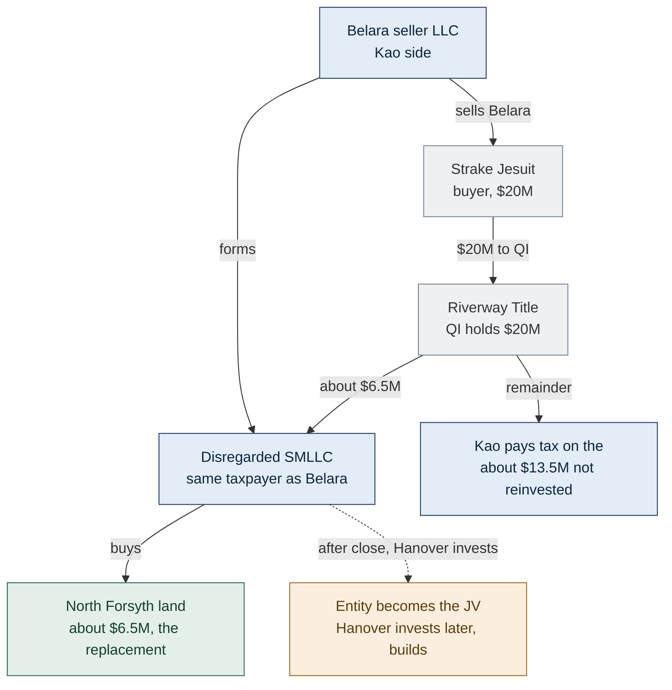
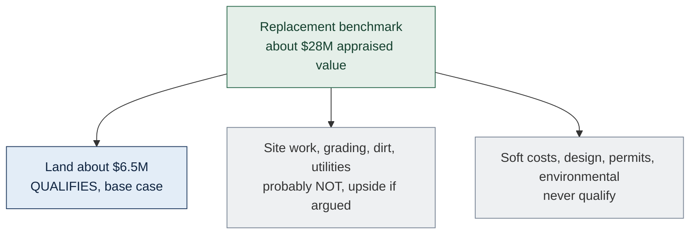
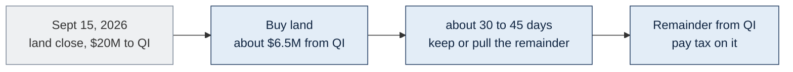
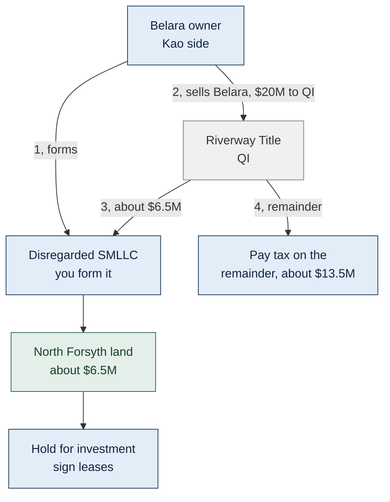
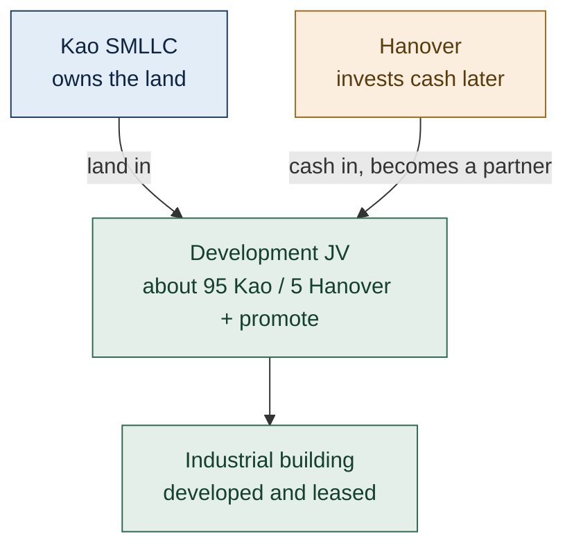
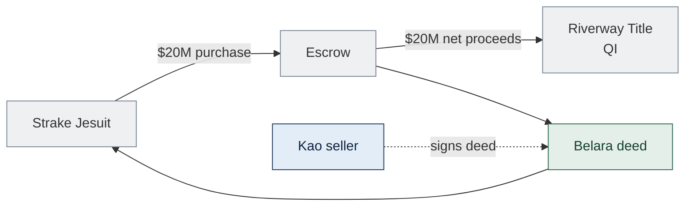

<!-- TAB:starthere -->

> Internal working model. DRAFT, not legal advice. Reflects the **June 17, 2026 §1031 counsel call** (Chamberlain), a preliminary discussion, not a written opinion. Confirm with Hanover's outside tax counsel (Jeff Wallace, Winstead) and get a §1031 opinion before Belara closes.

Sell **Belara Apartments** ($20M) and reinvest into the **North Forsyth Commerce Center** industrial project, deferring capital-gains tax where §1031 allows. After the first counsel call, the realistic picture is a **partial** deferral, planned in two cases.

- **Base case:** the **about $6.5M land** is the §1031 replacement. We defer the slice of gain tied to the land (about a quarter of the deal). The rest of the proceeds come back from the exchange and we pay tax on them.
- **Upside case:** if we can get some early **site work** counted as a qualifying improvement, we defer more. Counsel doubts it qualifies, but trying likely risks only that slice, not the whole exchange.

**The structure counsel recommends:** the entity that sells Belara forms a **disregarded single-member LLC (SMLLC)** that buys the land with the exchange proceeds. For tax it is the same taxpayer buying, so there is **no "drop"** into a partnership. Hanover invests into that entity **later** to develop and co-own the building.

## Terms

| Term | Meaning |
|---|---|
| **§1031 exchange** | Defer tax on selling an investment property if you reinvest into "like-kind" real estate under strict rules. |
| **Like-kind** | For real estate, almost any U.S. investment property swaps for any other. A partnership or LLC interest is **not** like-kind. |
| **Bargain sale** | Selling below appraised value to a charity. Belara sells to Strake for $20M vs. about $28M appraised, about $8M of charitable deduction. Counsel reads the §1031 benchmark off the about $28M value, not the $20M price. |
| **Replacement benchmark** | The value the replacement must reach for full deferral. Here about $28M, out of reach, so the land drives a partial deferral. |
| **Boot** | Value received that is not like-kind real property. Taxable. Here, the proceeds we do not reinvest in the land. |
| **QI (Qualified Intermediary)** | Independent party that holds the sale cash so we never touch it. Identified: Riverway Title. |
| **Constructive receipt** | If we can reach the cash, the IRS treats us as having received it and the exchange fails. The QI prevents this. |
| **SMLLC (disregarded)** | Single-member LLC treated as its owner for tax. The no-drop structure: Belara's owner forms one to buy the land. |
| **Improvement vs. site work** | A qualifying improvement must be physically completed and attached to the land. Counsel's view: clearing, grading, and dirt likely do not count; soft costs (design, permits, environmental) never do. |
| **Hold for investment** | The replacement must be held for investment, not resale. An intent to sell risks "inventory" treatment that disqualifies the exchange. |
| **45 / 180-day clocks** | From the sale: 45 days to identify the replacement, 180 days to receive it and complete any improvements we hope to count. |
| **EAT (Exchange Accommodation Titleholder)** | Independent party that holds title and builds during the exchange. Needed only for the **upside** case if chasing site-work improvements; not needed just to buy the land. |
| **Step-transaction doctrine** | IRS doctrine collapsing pre-arranged steps into one. The reason Hanover invests later, not at closing. |

## The §1031 rules that drive this deal

1. **Same taxpayer.** Whoever sells Belara must own the replacement. The disregarded SMLLC keeps it the same taxpayer.
2. **Never touch the cash.** Proceeds go to the QI, not the family.
3. **The clocks.** Identify within 45 days, receive within 180 days.
4. **Like-kind real property.** Replacement is land or completed improvements, not a company share. This is why we cannot simply join Hanover's JV.
5. **Hold for investment, not resale.** Lease it up; do not paper an intent to sell.
6. **Value.** Full deferral needs replacement at least equal to the relinquished value, here about $28M. We cannot reach it, so we defer the land's share.

## The cast

| Party | Role |
|---|---|
| **Belara seller (Kao side)** | The entity that owns and sells Belara, and forms the disregarded SMLLC that buys the land. Exact entity still to be aligned, see Kao tab. |
| **Strake Jesuit** | Buyer of Belara. Land-constrained school; wants the parcel for parking by its stadium. Wires the price to the QI. |
| **Hanover** | Developer and, later, co-owner. Invests into the SMLLC after the land is bought. (A family member is a salaried Hanover employee, owns zero of Hanover.) |
| **Riverway Title (QI)** | Holds the $20M so we never touch it. |
| **Land seller** | Unaffiliated third party selling the land, about $6.5M, under PSA. |
| **EAT** (upside only) | Independent party that would hold title and build if we chase site-work improvements. |
| **Chamberlain (Hobbs, Marianne)** | Our family's §1031 / tax counsel. First walked the deal on the June 17 call. |
| **Jeff Wallace (Winstead)** | Hanover's outside tax counsel. To confirm the structure before the family decides. |

## The core tension

Three things shape what is possible:

1. **We cannot contribute the proceeds straight into a JV with Hanover.** A partnership interest is not like-kind. The fix is the **no-drop SMLLC**: the seller's own disregarded entity buys the land, and Hanover invests later.
2. **The bargain sale sets a high bar.** Belara is deemed about $28M of value, but only about $6.5M goes into qualifying land, so this is a **partial** deferral, roughly a quarter of the gain.
3. **We intend to lease up and sell.** That cuts against §1031. We manage it with documentation discipline and by signing leases, accepting a modest recharacterization risk.

<!-- TAB:overview -->

> DRAFT, reflects the June 17, 2026 counsel call (preliminary, not a written opinion). Next step: confirm with Jeff Wallace (Winstead). Transcript: `docs/incoming/2026-06-17_chamberlain-hanover-1031-call.md`.

**In one line:** sell Belara through a QI; the seller's own disregarded SMLLC buys the about $6.5M land (the base-case deferral); Hanover invests into that entity later to build and co-own. Try to count some site work for extra deferral (upside). This is a partial deferral, and a good deal even if we just paid the tax.

## At a glance

| | |
|---|---|
| **Sell** | Belara Apartments, $20M, no debt |
| **Belara appraisal** | about $28M (Mar 2026). Sale to Strake at $20M is a bargain sale to a school, about $8M charitable deduction |
| **§1031 benchmark** | about $28M (counsel's read), so full deferral is unreachable, partial only |
| **Buy** | North Forsyth Commerce Center, about $50.3M ground-up industrial, about 327,600 SF, Forsyth County GA |
| **Base-case replacement** | the about $6.5M land |
| **Structure** | seller forms a disregarded SMLLC that buys the land, no drop; Hanover invests later |
| **QI** | Riverway Title |
| **Day 1** | Sept 15, 2026, land close |
| **Decision on the remainder** | about 30 to 45 days after close |

## The base-case structure (no "drop")

Because the SMLLC is disregarded, the IRS treats Belara's seller as both the seller and the buyer, one and the same taxpayer, so there is no "drop" of property into a partnership. Hanover invests into that entity later, which is a lower-risk profile than a classic drop-and-swap.

## What counts toward the benchmark by Day 180

Counsel's read: a qualifying improvement must be physically completed and attached to the land. Site work likely is not, though it sits in tax basis and is arguable. Soft costs are "fees," never improvements.

## Base case: the about $6.5M land is the deferral

Defer only the gain attributable to the land, about a quarter of the about $28M. Counsel framed it loosely as about $6M of gain; the exact gain was not pinned down. The dollar tax benefit was ballparked at roughly $0.75M to $1.2M and is not settled. It is better than nothing, and the deal stands on its own even paying full tax, it is still the family's number-one option versus cleanly 1031-ing into a multifamily deal.

## Upside case: capture some site work

Try to count early site work as qualifying improvement. Counsel leans against it, but a disallowance would likely strike only that portion, not the whole exchange, so the downside of trying is low. The construction contract is about $40M total, about $11M site work; about $8 to 11M of spend falls in the first 180 days, mostly site work. Permit delays of 60 to 90 days could shrink the window to perhaps four months. Chasing the upside also means Hanover enters the entity sooner, see the tension note below.

## Cash sequencing: do not pay the tax first

Route the $20M through the QI, deploy about $6.5M into the land, then pull the remainder back from the QI and pay tax on it. Paying tax outright first blows the exchange. Counsel expects the keep-vs-pay decision within about 30 to 45 days of closing.

## Money flow, base case

| When | From and to | $ | Note |
|---|---|---|---|
| Sept 15 | Strake to QI | 20.0M | Belara sale proceeds |
| Sept 15 | QI to SMLLC to land seller | about 6.5M | Buys the land, the §1031 replacement |
| Within about 30 to 45 days | QI back to Kao | about 13.5M | Remainder, pay tax on this |
| Upside only | QI funds early site work | TBD | Only if chasing site-work improvements |

## Intent-to-sell risk

The plan is to lease up the building and sell, which cuts against §1031, inventory risk. Mitigate:

- Do not document an intent to sell.
- Frame a future sale as a major decision requiring both partners' approval, with a buy-sell.
- Sign leases. Leasing evidences holding for investment and helps the position.

Counsel sized the risk at about 1-in-15 to 1-in-20. If the IRS nullified it, the cost is the deferred tax plus interest, penalty likely waived on a good-faith position. Not a current IRS audit-focus area.

## Ranked risks

1. **Intent-to-sell recharacterization** (about 1-in-15 to 1-in-20). Cost is tax plus interest, penalty likely waived.
2. **Site work disallowed.** Base case already assumes this; the upside risk is only that slice, not the whole exchange.
3. **Step-transaction**, if Hanover enters too soon or the deal looks pre-wired from day one.
4. **Same-taxpayer alignment**, the exact Belara-selling entity must be set before the PSA, see Kao tab.
5. **Constructive receipt**, if proceeds do not go straight to the QI.
6. **Permit delays** shrink the site-work window (upside only).

## The open tension to resolve with counsel

If we chase site work, Hanover wants to enter the entity almost immediately to fund as much qualifying work as possible inside 180 days. That speed pulls against the "more time is better" point that lowers the intent and step-transaction risk. Reconcile the timing of Hanover's entry with counsel before committing.

## Status and next step

Hanover is willing to accommodate the structure. Next is a call with Hanover's outside tax counsel, Jeff Wallace (Winstead), to confirm. Then the family decides whether the deferral is worth the effort, the juice worth the squeeze.

<!-- TAB:kao -->

> DRAFT, reflects the June 17 counsel call. The exchanger's playbook.

Sell Belara through the QI, buy the land via a disregarded SMLLC (the base-case deferral), hold for investment, and let Hanover invest into the entity later.

| | |
|---|---|
| **Sell** | Belara, $20M, no debt |
| **Buyer** | Strake Jesuit |
| **QI** | Riverway Title, you never receive the proceeds |
| **Base-case replacement** | the about $6.5M land, bought by your disregarded SMLLC |
| **Remainder** | about $13.5M comes back from the QI, you pay tax on it |
| **Hanover** | invests into the SMLLC later to build and co-own |

## Step 0: align the selling taxpayer first (gating)

The taxpayer that sells Belara must be the one that forms the SMLLC and buys the land. Belara sits in **Titan Management** today; the intended long-term owner is the **Kao Management Trust**. They are likely different taxpayers, so align this before the PSA.

- **Grantor trust** (invisible to the parents): the move may be between disregarded entities of the same taxpayer, tax-neutral.
- **Non-grantor trust** (its own taxpayer): moving about $20M of Belara in is a gift or a sale, taxable.

Counsel did not resolve this on the June 17 call; the CPA must confirm before the PSA.

## The Kao-side flow

## What the family should do or avoid

- **Base case is the about $6.5M land.** Expect only the land to qualify. Site work probably does not; soft costs do not. Benchmark is about $28M, so this is a partial deferral, about a quarter of the gain.
- **Do not pay the tax first.** Proceeds still go to the QI. Deploy about $6.5M into the land through the QI, then pull the remainder back and pay tax. Decision within about 30 to 45 days of close.
- **Upside is site work, and the downside of trying is low.** Pushing to count site work likely risks only that portion, not the whole exchange.
- **Intent-to-sell discipline.** The goal is to lease up and sell, which cuts against §1031. Do not document an intent to sell. Frame any future sale as a major decision needing both partners' approval, with a buy-sell.
- **Sign leases.** Leasing the building evidences holding for investment and helps the §1031 position.
- **Let Hanover in later.** More time between buying the land and Hanover's investment lowers the step-transaction and intent risk (unless we chase site work, which pulls the other way).

## Key dates

| Milestone | Date | What happens |
|---|---|---|
| Land close, Day 1 | Sept 15, 2026 | Belara closes, $20M to QI; SMLLC buys the land |
| Decision on remainder | about Oct, 30 to 45 days | Keep deferring or pull the remainder and pay tax |
| Site-work window | first about 180 days | Upside only, complete and argue qualifying site work |
| Hanover invests | later (timing OPEN) | Entity becomes the JV; build the industrial facility |

## Critical rules

- Same taxpayer from Belara sale to land purchase, through the disregarded SMLLC.
- Never touch the proceeds, they go straight to the QI.
- No debt on Belara at close.
- Buy the land with exchange funds; pull the remainder and pay tax.
- Hold for investment, do not document an intent to sell, sign leases.
- Keep Hanover out of the entity until after the land is bought.

<!-- TAB:hanover -->

> DRAFT, reflects the June 17 counsel call. Hanover is willing to accommodate the structure; its outside tax counsel, Jeff Wallace (Winstead), to confirm.

Hanover is the developer and, later, the co-owner. To protect Kao's §1031, Hanover does **not** take an interest at closing. It invests into the SMLLC **after** Belara's owner has bought the land.

## Hanover's role, in order

1. **At and just after closing:** none on the exchange. The Kao-side SMLLC buys the land with exchange funds; Hanover assigns the land PSA to that entity (confirm it is assignable without the seller's consent, since the entity is not a Hanover affiliate yet).
2. **Then it invests** cash into that entity, turning it into the development JV, and builds the industrial facility as developer and GC.
3. **Eventual economics** (term sheet, proposed and unsigned): about 95% Kao / 5% Hanover, promote 20/30/40 over 10/14/18% IRR, 4% dev fee, 4.5% GC fee.

## When Hanover comes in

- **Base case, concede site work:** later is better. More time between the land purchase and Hanover's investment lowers the step-transaction and intent risk.
- **Upside case, chase site work:** Hanover comes in almost immediately so the venture funds and completes as much qualifying site work as possible inside 180 days. Speed helps the upside but pressures the 1031, this is the tension to resolve with counsel.

## Conduct (because of the employment tie)

A family member is a salaried Hanover employee and owns zero of Hanover, so this alone does not make the parties tax-related. But the closeness makes a "pre-arranged deal" story easier to tell, so:

- The employee recuses from every Hanover-side decision on this deal.
- Disinterested executives set Hanover's terms; separate counsel per side.
- Hanover does not select, control, or fund the QI.
- Arm's-length pricing of every fee and the eventual investment.

## Commercial terms (term sheet, proposed)

| Item | Term |
|---|---|
| Equity | about 5% Hanover, 95% Kao, when Hanover invests, not at closing |
| Promote | 20/30/40 over 10/14/18% IRR |
| Dev fee | 4% |
| GC / GMP | 4.5% hard, $300K advance, 5% contingency |
| Construction loan | about 60% LTC |

<!-- TAB:strake -->

> Our reference for the Belara closing wire, not a document we send Strake.

Buyer of Belara Apartments only. Strake is a land-constrained school that wants the parcel for parking by its stadium, and is buying at a bargain price.

| | |
|---|---|
| What they buy | Belara Apartments, $20M, no debt |
| Appraised value | about $28M (Mar 2026), so the $20M sale is a bargain sale, about $8M charitable deduction |
| Seller | Kao side, the Belara owner / SMLLC |
| QI | Riverway Title, their wire destination |
| North Forsyth | Not involved |

## Why it matters to us

Kao defers tax only if the proceeds go directly to the QI. If Strake wires to the seller instead of Riverway Title, the exchange fails. And because this is a bargain sale, counsel reads the §1031 replacement benchmark off the about $28M appraised value, not the $20M price, which is what makes full deferral unreachable and drives the partial, land-only base case.

## Day 1: the closing (Sept 15, 2026)

## Escrow checklist

- [ ] Riverway Title named as the proceeds recipient
- [ ] Seller does not receive sale proceeds
- [ ] Closing date coordinated with Kao
- [ ] No side letter directing proceeds elsewhere

<!-- TAB:references -->

> Citations paired with what they do in this deal. DRAFT, not counsel-reviewed. First counsel discussion (Chamberlain + Hanover): `docs/incoming/2026-06-17_chamberlain-hanover-1031-call.md`.

## The exchange (§1031)

- [IRC §1031](https://www.law.cornell.edu/uscode/text/26/1031): like-kind exchange, real property only since the 2017 tax act. Requires holding for investment, not resale.
- [Reg. §1.1031(a)-3](https://www.law.cornell.edu/cfr/text/26/1.1031(a)-3): a partnership or LLC interest is not like-kind, why we cannot just join Hanover's JV.
- [Reg. §1.1031(k)-1](https://www.law.cornell.edu/cfr/text/26/1.1031(k)-1): QI safe harbor, the 45/180 clocks, constructive receipt, the disqualified-person rule.
- [Reg. §301.7701-3](https://www.law.cornell.edu/cfr/text/26/301.7701-3): when an SMLLC is disregarded, the basis for the no-drop structure.
- [Form 8824](https://www.irs.gov/forms-pubs/about-form-8824): reports the exchange and computes the taxable boot.

## Holding for investment, not resale

- The replacement must be held for productive use or investment, not primarily for sale, or it risks "inventory" treatment that disqualifies the exchange. Signing leases supports investment intent. Counsel's practical read: about a 1-in-15 to 1-in-20 recharacterization risk, cost is tax plus interest, penalty likely waived.

## Building during the exchange (upside only)

- [Rev. Proc. 2000-37](https://www.irs.gov/pub/irs-drop/rp-00-37.pdf): the EAT and build-to-suit safe harbor, parking title up to 180 days. Relevant only if we chase site-work improvements.
- [Rev. Proc. 2004-51](https://www.irs.gov/pub/irs-drop/rp-04-51.pdf): the safe harbor breaks if the taxpayer owned the property within 180 days before parking.

## The later partnership

- [IRC §721](https://www.law.cornell.edu/uscode/text/26/721): tax-free contribution of property for a partnership interest, when Hanover invests and the entity becomes the JV.

## Disclaimer

Internal working model only, not legal or tax advice. The June 17 call was a preliminary discussion, not a written opinion, and the structure is not locked. Confirm with Hanover's outside tax counsel and obtain a written §1031 opinion before Belara closes.
