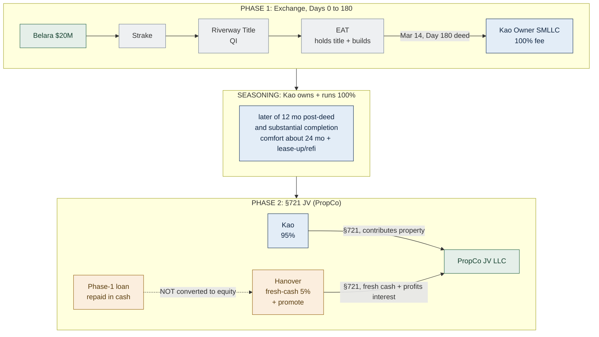
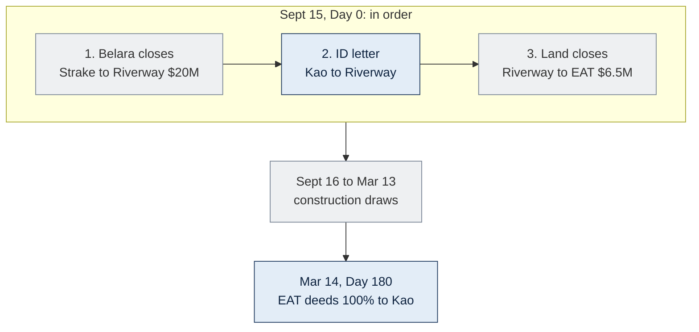
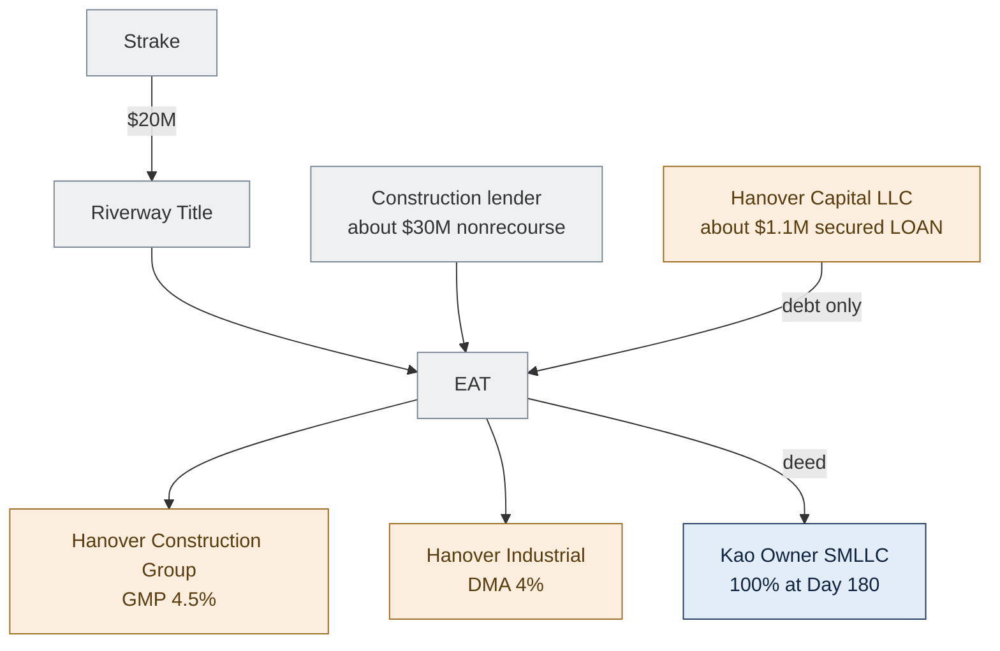
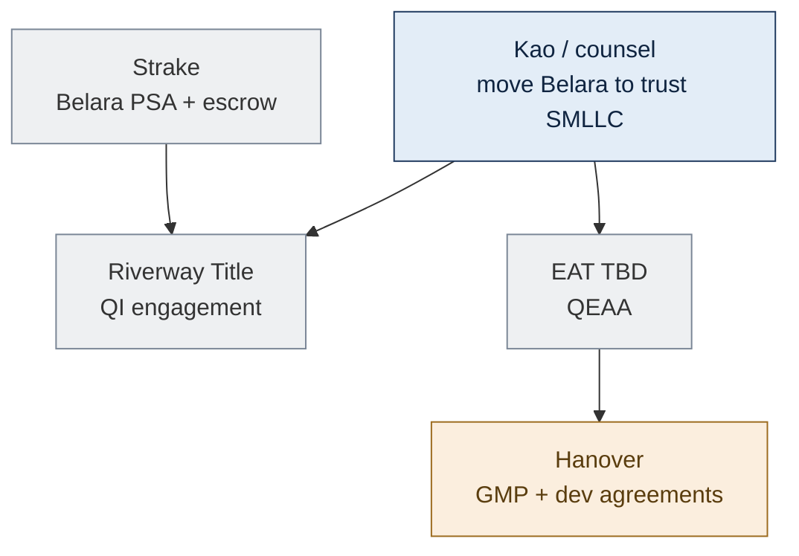
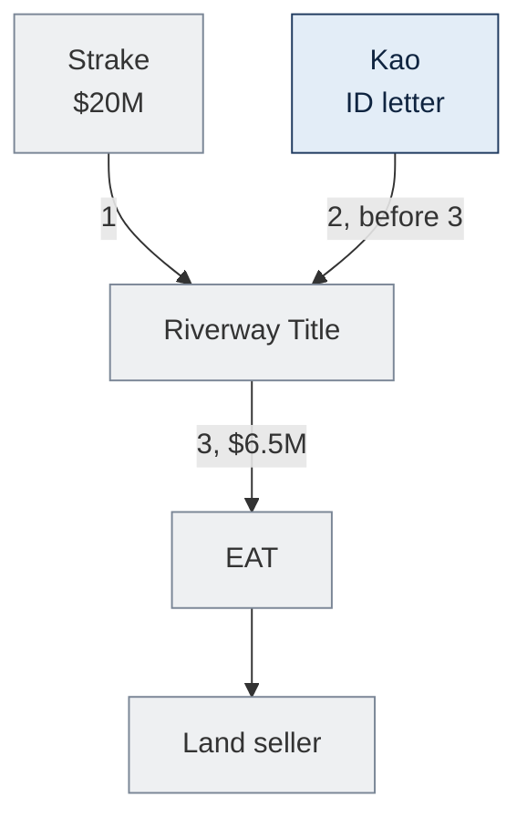
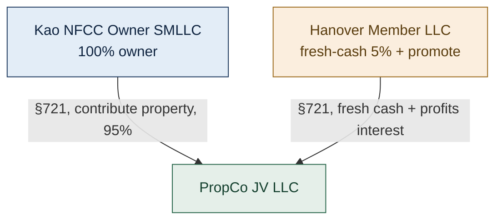
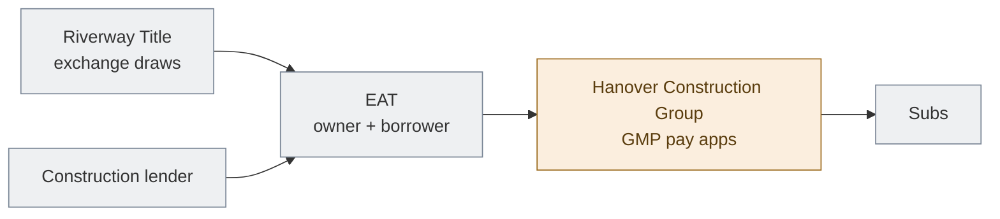
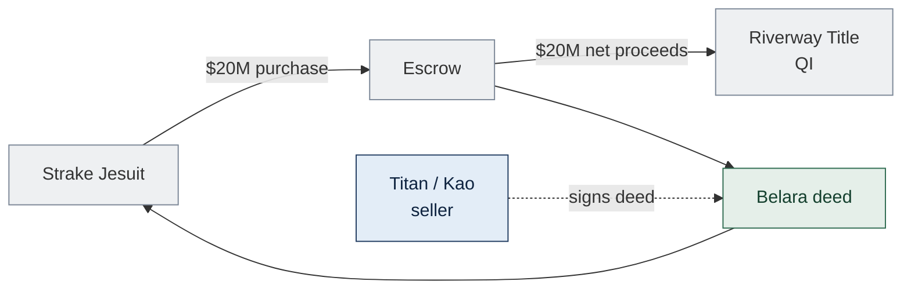

<!-- TAB:starthere -->

> Internal working model. DRAFT, not legal advice. Obtain a §1031 counsel opinion before Belara closes.

Sell **Belara Apartments** ($20M) and reinvest into the **North Forsyth Commerce Center** industrial project without paying capital-gains tax now. The rule that allows this, a **§1031 exchange**, conflicts with how the developer (**Hanover**) wants its profit share taxed. **Structure C-Hybrid** satisfies both: do the tax-free exchange first, form the developer partnership later, with a real gap of time between.

**The one thing to get right:** a waiting period ("seasoning") lowers risk, it is not a legal safe harbor. The plan holds only if our family genuinely could keep North Forsyth forever, and Hanover has no enforceable right to its stake until a separate, later decision.

## Terms

| Term | Meaning |
|---|---|
| **§1031 exchange** | Defer the tax on selling an investment property if you reinvest into "like-kind" real estate under strict rules. |
| **Like-kind** | For real estate, almost any U.S. investment property swaps for any other. A company or partnership interest is not like-kind. |
| **Boot** | Value received that is not like-kind real property (cash, or a reinvestment shortfall). Taxable. |
| **Capital gain vs. ordinary income** | Capital gain is taxed lower. A fee is ordinary income. Hanover wants its promote taxed as capital gain. |
| **QI (Qualified Intermediary)** | Independent party that holds the sale cash so you never touch it. Here: Riverway Title. |
| **Constructive receipt** | If you can reach the cash, the IRS treats you as having received it and the exchange fails. The QI prevents this. |
| **EAT (Exchange Accommodation Titleholder)** | Independent party that temporarily holds title and builds, since you cannot build on land you do not yet own. |
| **QEAA** | The agreement (Rev. Proc. 2000-37) letting the EAT park title up to 180 days. |
| **45 / 180-day clocks** | From the sale: 45 days to identify the replacement, 180 days to receive it. |
| **DST (Delaware Statutory Trust)** | A passive fractional property that qualifies as replacement. Used here as a backup to absorb leftover cash and avoid boot. |
| **§721** | Contribute property into a partnership tax-free for a partnership interest. The Phase-2 move. |
| **JV / PropCo** | The Kao plus Hanover partnership (LLC taxed as a partnership) formed in Phase 2. |
| **Promote / carried interest** | The developer's share of profits above set return hurdles. |
| **Profits interest** | A stake sharing only in future upside (worth $0 if liquidated today). Makes the promote a capital gain. |
| **Capital interest** | A stake backed by real money contributed (Hanover's fresh-cash 5%). |
| **Seasoning** | The real span Kao owns and runs the property 100% before forming the JV. Evidence the steps are separate. |
| **Step-transaction doctrine** | IRS doctrine collapsing pre-arranged steps into one. The main threat. |
| **MLTN (More Likely Than Not)** | A confidence level above 50% for a tax opinion. Our target. |
| **SMLLC** | Single-member LLC. "Disregarded" means treated as its owner for tax. |
| **DMA / GMP / GC** | Hanover's 4% development contract / its 4.5% construction contract / general contractor. |
| **Nonrecourse debt** | Loan where the lender can take only the property, not the borrower personally. Matters for the Phase-2 tax math. |
| **Grantor vs. non-grantor trust** | Whether the trust is tax-invisible to its creators or its own taxpayer. Changes whether moving Belara in is tax-free. |

## The four §1031 rules

1. **Same taxpayer.** Whoever sells Belara must end up owning North Forsyth.
2. **Never touch the cash.** Proceeds go to the QI, not the family.
3. **The clocks.** Identify within 45 days, receive within 180 days.
4. **Like-kind.** Replacement is real property, not a company share.

Miss one and the full gain becomes taxable.

## The cast

| Party | Role |
|---|---|
| **Kao Management Trust** | Our family's trust. The taxpayer doing the exchange and the long-term owner. |
| **Titan Management** | Parents' company holding Belara today. Belara moves under the Trust before sale. |
| **Strake Jesuit** | Buyer of Belara. Wires the price to the QI. |
| **Hanover Industrial LLC** | Developer and sponsor. Later the 5% plus promote partner. (Our family member is a salaried employee, owns zero of Hanover.) |
| **Riverway Title (QI)** | Holds the $20M so we never touch it. |
| **EAT** (TBD) | Holds title and builds during the exchange. |
| **Construction lender** | Bank funding about 60% of cost (about $30M), nonrecourse. |
| **Land seller** | Unaffiliated third party selling the land ($6.5M). |

## The core tension

Two requirements pull opposite ways:

1. Kao's deferral needs Kao to finish owning **100% real property**, not a JV interest.
2. Hanover's capital-gain promote needs a **partnership**, which cannot exist when the exchange finishes.

The fix is sequence: real property first (Phase 1), promoted partnership later (Phase 2), bridged by a genuine seasoning gap.

<!-- TAB:overview -->

> Seasoning lowers risk, it is not a safe harbor. Target opinion MLTN, not certainty. DRAFT, needs §1031 counsel.

**In one line:** Kao exchanges into 100% title via a QI plus EAT (Phase 1), runs it alone through a seasoning gap, then forms the 95/5 promoted JV via tax-free §721 (Phase 2). Same economics as the term sheet, Hanover's promote stays capital gain, no surprise tax to Kao.

## At a glance

| | |
|---|---|
| **Sell** | Belara Apartments, $20M, no debt |
| **Buy** | North Forsyth Commerce Center, about $50.3M ground-up industrial, about 327,600 SF, Forsyth County GA |
| **Exchanger / owner** | Kao Management Trust (one taxpayer throughout) |
| **Belara seller today** | Titan Management, move into a trust-owned SMLLC before sale |
| **Developer** | Hanover Industrial LLC |
| **Land** | $6.5M, third-party, unaffiliated, under PSA |
| **Project cost** | about $50.3M, loan about 60% LTC (about $30M), nonrecourse |
| **QI** | Riverway Title |
| **Day 0 (model)** | Sept 15, 2026 (Belara plus land). Belara timing is flexible, see boot note |
| **45-day ID** | Oct 30, 2026 deadline (letter filed Sept 15) |
| **180-day deed** | Mar 14, 2027 (EAT deeds 100% to Kao) |
| **Phase 2 JV (model)** | Earliest about Mar 2028 (OPEN with counsel) |

## Why not the term sheet as written

It hands Kao a 95% LLC membership at closing, which fails §1031: only real property is like-kind, not a company interest. C-Hybrid moves only the legal wrapper and timing.

| | Term sheet | C-Hybrid |
|---|---|---|
| Kao receives | 95% LLC interest | 100% real property |
| Hanover 5% plus promote | Day 1 in the JV | Phase 2 via §721 |
| Promote tax character | Capital gain only if the exchange survived | Capital gain (clean carry) |
| Exchange viability | Fails | MLTN at best (DRAFT) |

## The three phases

- **Phase 1 (Days 0 to 180):** Belara's $20M goes to the QI. An independent EAT takes title, borrows the loan, builds, then deeds 100% to Kao by Day 180. Hanover is contractor, lender, and guarantor only, never on title.
- **Seasoning:** Kao owns and runs the property alone.
- **Phase 2:** Kao and Hanover form the promoted JV via §721.

## The Phase-2 bifurcation (the key idea)

Hanover's economics split into two separate instruments so the promote is a clean capital gain:

1. **Fresh-cash 5% capital interest:** new cash for a real 5% stake, priced when the JV forms, running 95/5 like the term sheet.
2. **Separate profits interest:** zero value at grant, sharing only in upside above the hurdles (the 20/30/40 promote). Capital gain if held more than 3 years.

The Phase-1 loan (about $1.1M) is **repaid in cash, not converted to equity**. Converting it would reopen valuation and disguised-sale problems.

## Timeline and the two clocks

| Clock | Last day (model) | Meaning |
|---|---|---|
| **45-day identification** | Oct 30, 2026 | Give the QI a written list of the replacement on or before this date |
| **180-day completion** | Mar 14, 2027 | Replacement received (EAT deeds to Kao) on or before this date |

Oct 30 is a deadline, not the day we act. In the model the ID letter is filed Sept 15, the same day as Belara, before the land wire.

## Money in Phase 1

The QI holds about $20M from Belara and cannot disburse more than that pool.

| When | From and to | $ | Source |
|---|---|---|---|
| Sept 15 | Strake to Riverway | 20.0M | Belara sale |
| Sept 15 | Riverway to EAT to land seller | 6.5M | Pool |
| Oct-Nov 2026 | Riverway to EAT (sitework) | 5.0M | Pool |
| Dec 2026 to Feb 2027 | Riverway to EAT (foundations) | 8.5M | Pool (exhausts about $20M) |
| Dec 2026 to Feb 2027 | Lender to EAT (balance) | 1.5M | Loan |
| Mar 14, 2027 | EAT deeds 100% to Kao | n/a | Phase 1 done |

Capital stack: pool (about $20M) plus loan (about $30M) plus Hanover loan (about $1.1M). No Hanover equity until Phase 2.

## Boot risk by Day 180

Only real property in place and paid for by Day 180 counts. $6.5M land plus about $13.5M of improvements is plausible but not bankable. Levers:

- **Belara timing is the strongest lever.** We control the close date, so align it so Day 180 lands after enough construction is in place. Sept 15 is a model, not a commitment.
- **Backup DST by Day 45** absorbs any leftover cash.
- **Model acceptable boot** rather than gamble the exchange.
- **Confirm clean title history** (prior ownership within 180 days breaks the parking safe harbor).

## Seasoning

Runs from the EAT-to-Kao deed, not Day 0. There is no statutory period, these are evidentiary targets:

- **Floor:** later of 12 months post-deed and substantial completion.
- **Comfort:** about 24 months plus lease-up and ideally a refinance.

Kao must genuinely run it alone: signs leases, carries the loan, takes depreciation, funds shortfalls with debt, never Hanover equity. No binding promise to form the JV.

## Kao's no-surprise-tax (timing)

Contributing mortgaged property can trigger tax if Kao's debt share drops. Defused mainly by timing, but the CPA must model it:

- Form the JV after the construction guaranties expire, so only nonrecourse debt remains.
- By then capitalized construction costs have built up Kao's basis.
- No cash or refi distribution to Kao near the contribution.
- CPA confirms the debt-share shift does not exceed Kao's basis.

## Entity map (placeholders, none formed yet)

| Entity | Side | Role |
|---|---|---|
| Kao Management Trust | Kao | Taxpayer and owner (grantor vs. non-grantor TBD, gating) |
| Belara Seller SMLLC | Kao | Holds and sells Belara |
| Kao NFCC Owner SMLLC | Kao | Receives 100% at Day 180, later contributes for 95% |
| Riverway Title (QI) | Neutral | Holds the $20M |
| NFCC Parking Title LLC (EAT) | Neutral | Parks title, borrows, builds. Independent of both sides |
| Construction lender | Neutral | About $30M nonrecourse |
| Backup DST | Neutral | Boot backstop, identified by Day 45 |
| Hanover Industrial LLC | Hanover | Sponsor, 4% dev fee |
| Hanover Construction Group LLC | Hanover | GC on the GMP, not equity |
| Hanover NFCC Capital LLC | Hanover | Phase-1 lender, repaid before Phase 2 |
| Hanover NFCC Member LLC | Hanover | Phase 2: fresh-cash 5% plus profits-interest promote |
| North Forsyth PropCo JV LLC | JV | Operating partnership |

## What can blow it up

1. Wrong taxpayer, or the Belara-to-Trust move is taxable.
2. Phase 2 locked in (binding option, or "done deal" emails).
3. Hanover looks like a Phase-1 owner (title, equity, control of sale or refi).
4. QI or EAT not independent, or Kao touches the cash.
5. Not enough real property in place by Day 180, no DST backup.
6. Distribution or refi to Kao too soon (disguised sale).
7. Debt-shift tax (surviving guaranties or shift above basis).
8. Promote contaminated (value at grant, or bundled with the capital interest).
9. Conflict, the employee appears to control both sides.

## Conduct rules

- No binding contribution agreement, option, fixed-price admission, or exclusivity for Phase 2. Non-binding LOI only, either side free to walk.
- No writings saying "done deal," "guaranteed promote," or "temporary 1031 wrapper."
- The employee recuses from every Hanover-side decision. Separate counsel and disinterested decision-makers per side.
- Independent arm's-length pricing of every fee, the loan, the guaranty, and the break fee.
- Kao behaves as sole owner throughout seasoning.

<!-- TAB:kao -->

> Seasoning lowers risk, it is not a safe harbor. Target MLTN. DRAFT, needs §1031 counsel.

The exchanger. Sell Belara, defer the tax, end up owning North Forsyth at 100%, then contribute it into the 95% JV after seasoning.

| | |
|---|---|
| **Sell** | Belara, seller today Titan Management (move into a trust-owned SMLLC first) |
| **Buyer** | Strake Jesuit |
| **QI** | Riverway Title, you never receive the proceeds |
| **Phase 1 receipt** | Kao NFCC Owner SMLLC, 100% deed at Day 180 |
| **Phase 2** | Contribute for 95% of PropCo, Hanover gets fresh-cash 5% plus promote |
| **Hanover in Phase 1** | Contractor plus secured lender, not your partner yet |

## Step 0: align the taxpayer first (gating)

The taxpayer that sells Belara must be the one that acquires North Forsyth. Belara sits in Titan Management today, the Trust is the intended owner, and they are probably different taxpayers, so move Belara into a trust-owned SMLLC before the PSA.

Whether that move is tax-free depends on the trust:

- **Grantor trust** (invisible to the parents): the move may be between disregarded entities of the same taxpayer, tax-neutral.
- **Non-grantor trust** (its own taxpayer): moving about $20M of Belara in is a gift or a sale, taxable.

This can change whether the whole plan is tax-free. CPA confirms before the PSA.

## Key dates

| Milestone | Date | What happens |
|---|---|---|
| Day 0, Belara | Sept 15, 2026 | Strake closes, $20M to Riverway, clocks start |
| Day 0, ID letter | Sept 15, 2026 | Identify North Forsyth to Riverway, before the land wire |
| Day 0, land | Sept 15, 2026 | Riverway releases $6.5M to the EAT |
| 45-day deadline | Oct 30, 2026 | Last day to identify |
| Construction | Sept 16 2026 to Mar 13 2027 | QI draws (to about $20M) then loan |
| Day 180 | Mar 14, 2027 | EAT deeds 100% to Kao |
| Seasoning | Mar 2027 to about Mar 2028+ | You own 100%, operate, depreciate, carry the loan |
| Phase 2 §721 | about Mar 2028+ (OPEN) | Contribute for 95%, Hanover gets 5% plus promote |

## Pre-close

- Resolve the Titan-to-Trust alignment and the grantor fork first.
- Engage Riverway Title. The PSA wires proceeds to the QI only.
- Select an independent EAT, not a Hanover affiliate.
- Form the Kao NFCC Owner SMLLC for the Day-180 deed.
- Draft the ID letter (value at least $20M) and a real backup DST.

## Day 0: Belara, ID, land (Sept 15)

Same day, fixed order. The QI will not fund North Forsyth until the ID letter is filed.

You sign as seller and exchanger. You do not receive or control the $20M.

## Construction (Sept 16 to Mar 13)

The QI releases pool funds on certified requests. Only improvements paid with exchange funds within 180 days count toward §1031 value.

| Phase | Calendar | $ | Source |
|---|---|---|---|
| Land | Sept 15 | $6.5M | QI |
| Sitework | Oct-Nov 2026 | $5.0M | QI |
| Foundations | Dec 2026 to Feb 2027 | $8.5M | QI (pool out) |
| Foundations (balance) | Dec 2026 to Feb 2027 | $1.5M | Loan |

The remaining about $28.8M of the project is loan-funded.

## Day 180: exchange complete (Mar 14)

1. EAT deeds 100% fee simple to the Kao NFCC Owner SMLLC.
2. Riverway closes the exchange.
3. File Form 8824. Gain deferred to the extent about $20M was reinvested, any shortfall is taxable boot.

Until this deed, Kao does not own North Forsyth for §1031 purposes, the EAT does.

## Seasoning: you own 100% (Mar 2027 to about Mar 2028+)

The clock starts at the deed, not at Belara close.

- 100% title, borrower on the loan, sign leases, take depreciation, control the bank accounts.
- Retain every owner decision: budget, debt and refi, leases, a sale, and forming the JV itself. Hanover runs the build only.
- No binding obligation to form the JV.
- Kao indemnity or LC covers Hanover's guaranty exposure (collateralized, cost-based).

| Target | Model |
|---|---|
| Floor | later of 12 mo post-deed and substantial completion, about Mar 2028 |
| Comfort | about 24 mo plus lease-up/refi, about Mar 2029 |

If Phase 2 looks pre-wired from Day 0, the IRS can collapse both phases. Real time plus real sole ownership is the defense.

## Phase 2: the §721 JV (about Mar 2028+, OPEN)

Term-sheet economics activate: 95/5, the 20/30/40 promote over 10/14/18% IRR. The contribution is designed to be tax-silent, but only with the CPA's §752 and §704(c) schedules.

## Critical rules

- Same taxpayer from Belara sale to replacement deed.
- Never touch the proceeds.
- No debt on Belara at close.
- ID letter on file before the QI funds North Forsyth.
- Deed by Mar 14, 2027.
- Boot if in-place value is below about $20M at Day 180.
- Act as sole owner through seasoning, keep Phase 2 non-binding.

<!-- TAB:hanover -->

> Seasoning lowers risk, it is not a safe harbor. DRAFT, needs §1031 counsel.

Hanover Industrial LLC, the Sponsor. Economics split across two phases so Kao's §1031 survives and the promote stays capital gain.

| Phase | Role | Equity / promote |
|---|---|---|
| Phase 1 (build) | Developer (4% DMA), GC (4.5% GMP), secured lender (about $1.1M), guarantor | None, creditor plus contractor |
| Seasoning | Same fees, loan outstanding, Kao owns 100% | None, non-binding LOI only |
| Phase 2 (§721 JV) | Managing member, fresh-cash 5% plus promote | Capital-gain carry |

## Four Phase-1 roles (all non-owner)

1. Developer under a market 4% DMA.
2. GC under the GMP at 4.5% ($300K advance, 5% contingency), a contract with the EAT.
3. Secured lender of about $1.1M at market interest, a real note, not a preferred return.
4. Guarantor (completion, carry, overrun, carve-out), auto-terminating at Substantial Completion.

Not on title, no equity in Phase 1.

## The control line

Hanover runs the build: permits, design, schedule, subs, draws, and recommends budgets and leasing. Kao keeps every owner decision: budget and material changes, debt and refi, leases above thresholds, a sale, forming the JV, final draw approval, bank-account control.

Crossing it (unilateral control of sale, refi, leasing, or budget, upside beyond fees plus interest, or loss-sharing) makes Hanover look like a Phase-1 owner, which breaks the exchange.

## Phase 2: how you get paid

1. **Fresh-cash 5% capital interest:** new cash for a real 5% stake, priced when the JV forms, running 95/5 like the term sheet.
2. **Separate profits interest:** zero value at grant, sharing only in upside above the hurdles (20/30/40 over 10/14/18% IRR), capital gain if held more than 3 years.

The Phase-1 loan (about $1.1M) is repaid in cash, not converted to equity. Repay the note, then write a fresh equity check.

## Protection in Phase 1 (negotiable, DRAFT)

- Standalone market DMA plus GMP with normal remedies.
- The loan is a true secured note at market interest, not a disguised return.
- Collateralized Kao indemnity or LC, sized to your lender-guaranty exposure.
- Cost-based break fee if Kao declines Phase 2, no promote or IRR-mirroring make-whole.
- Non-binding LOI for Phase 2.

## Conduct (because of the employment tie)

The family member is a salaried Hanover employee, owns zero of Hanover, so this alone does not make the parties tax-related. But the closeness makes a "pre-arranged deal" story easier to tell, and QI/EAT rules disqualify the taxpayer's recent agents. So:

- The employee recuses from every Hanover-side decision.
- Disinterested executives set Hanover's terms, separate counsel per side.
- Hanover does not select, control, or fund the QI or EAT.
- Independent arm's-length pricing of every fee, the loan, the guaranty, and the break fee.

## Key dates

| Milestone | Date | Hanover role |
|---|---|---|
| Pre-close | Before Sept 15 | GMP plus dev agreements with the EAT |
| Day 0 | Sept 15, 2026 | GMP effective after ID plus land close |
| Construction | Sept 16 2026 to Mar 13 2027 | Invoice the EAT, paid from QI draws then loan |
| Day 180 | Mar 14, 2027 | EAT deeds 100% to Kao, you stay GC, no equity deed |
| Seasoning | Mar 2027 to about Mar 2028+ | Creditor, contractor, guarantor |
| Phase 2 §721 | about Mar 2028+ (OPEN) | Loan repaid, fresh cash for 5% plus promote |

## Who pays you

You bill the EAT. Early costs flow QI to EAT to you, then lender to EAT to you once the pool is spent. Controllable overruns are 100% Sponsor.

## Commercial terms (Phase 2 target)

| Item | Term |
|---|---|
| Equity | 5% (95% Kao), at §721, not Day 1 |
| Promote | 20/30/40 over 10/14/18% IRR, capital gain |
| Dev fee | 4%, runs both phases |
| GC / GMP | 4.5% hard, $300K advance, 5% contingency |
| Phase 1 loan | about $1.1M secured, repaid, then fresh 5% cash |
| Overruns / guaranties | Per term sheet, guaranties auto-terminate at Substantial Completion |

<!-- TAB:strake -->

> Our reference for the Belara closing wire, not a document we send Strake.

Buyer of Belara Apartments only. Strake purchases the relinquished property so Kao can run a §1031 exchange. Not a party to North Forsyth, the EAT, or any exchange filing.

| | |
|---|---|
| What they buy | Belara Apartments, $20M, no debt |
| Seller | Titan Management (aligned into a trust-owned SMLLC before close) |
| QI | Riverway Title, their wire destination |
| North Forsyth | Not involved |

## Why it matters to us

Kao defers tax only if the proceeds go directly to the QI. Strake's price is the $20M exchange pool. If it wires to Titan or Kao instead of Riverway Title, the exchange fails.

## Day 0: the closing (Sept 15, 2026)

| From | To | $ | Note |
|---|---|---|---|
| Strake Jesuit | Escrow | $20M | Purchase price |
| Escrow | Riverway Title | $20M net | Required for §1031, not to the seller |
| Seller | Strake | n/a | Deed to Belara |

## Escrow checklist

- [ ] Riverway Title named as the proceeds recipient
- [ ] Seller does not receive sale proceeds
- [ ] Closing date coordinated with Kao
- [ ] No side letter directing proceeds elsewhere

<!-- TAB:references -->

> Citations paired with what they do in this deal. DRAFT, not counsel-reviewed. Full analysis: `docs/research/2026-06-14_structure-C-hybrid-legal-review.md`.

## The exchange (§1031)

- [IRC §1031](https://www.law.cornell.edu/uscode/text/26/1031): like-kind exchange, real property only since the 2017 tax act.
- [Reg. §1.1031(a)-3](https://www.law.cornell.edu/cfr/text/26/1.1031(a)-3): a partnership or LLC interest is not like-kind.
- [Reg. §1.1031(k)-1](https://www.law.cornell.edu/cfr/text/26/1.1031(k)-1): QI safe harbor, the 45/180 clocks, constructive receipt, the disqualified-person rule.
- [Reg. §301.7701-3](https://www.law.cornell.edu/cfr/text/26/301.7701-3): when an SMLLC is disregarded.
- [Form 8824](https://www.irs.gov/forms-pubs/about-form-8824): reports the exchange and computes boot.

## Building during the exchange

- [Rev. Proc. 2000-37](https://www.irs.gov/pub/irs-drop/rp-00-37.pdf): the EAT and QEAA build-to-suit safe harbor (parking up to 180 days).
- [Rev. Proc. 2004-51](https://www.irs.gov/pub/irs-drop/rp-04-51.pdf): the safe harbor breaks if the taxpayer owned the property within 180 days before parking.
- [Rev. Proc. 2002-22](https://www.irs.gov/pub/irs-drop/rp-02-22.pdf): tenant-in-common guidance, why co-ownership-at-Day-180 was rejected.

## The partnership (Phase 2)

- [IRC §721](https://www.law.cornell.edu/uscode/text/26/721): tax-free contribution of property for a partnership interest.
- [Rev. Proc. 93-27](https://www.irs.gov/pub/irs-drop/rp-93-27.pdf) and [Rev. Proc. 2001-43](https://www.irs.gov/pub/irs-drop/rp-01-43.pdf): a zero-value profits interest is generally not taxed when received.
- [IRC §1061](https://www.law.cornell.edu/uscode/text/26/1061): carried interest needs more than 3 years for long-term treatment.

## No surprise tax (Phase-2 math)

- [IRC §752](https://www.law.cornell.edu/uscode/text/26/752) and [Reg. §1.752-3](https://www.law.cornell.edu/cfr/text/26/1.752-3): how partnership debt is allocated. Needs a CPA outside-basis schedule.
- [IRC §707 / Reg. §1.707-3](https://www.law.cornell.edu/cfr/text/26/1.707-3): disguised-sale rules, the 2-year window.
- IRC §704(c): keeps Belara's built-in gain with Kao.
- IRC §263A: capitalized construction costs build Kao's basis.

## Related-party

- [IRC §267(b)](https://www.law.cornell.edu/uscode/text/26/267), [§707(b)](https://www.law.cornell.edu/uscode/text/26/707), [§1031(f)](https://www.law.cornell.edu/uscode/text/26/1031): key off family, ownership, and control, not salaried employment.

## Case law

- *Gluck v. Commissioner*, T.C. Memo. 2020-66: an LLC interest is not like-kind real property.
- *Magneson* (753 F.2d 1490, 9th Cir. 1985): exchange-then-contribute survived. Pre-1984, 9th Cir., not binding in the 11th.
- *Bolker* (760 F.2d 1039): related held-for analysis, not a §721 case.
- *Bergford* (12 F.3d 166): co-ownership recharacterized as a partnership.

## Disclaimer

Internal working model only, not legal or tax advice. No structure here is locked or counsel-approved. Target opinion MLTN, not certainty. Obtain a written §1031 opinion before Belara closes.
