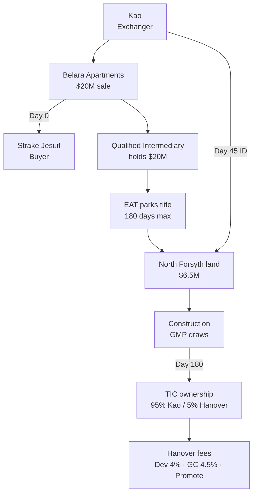
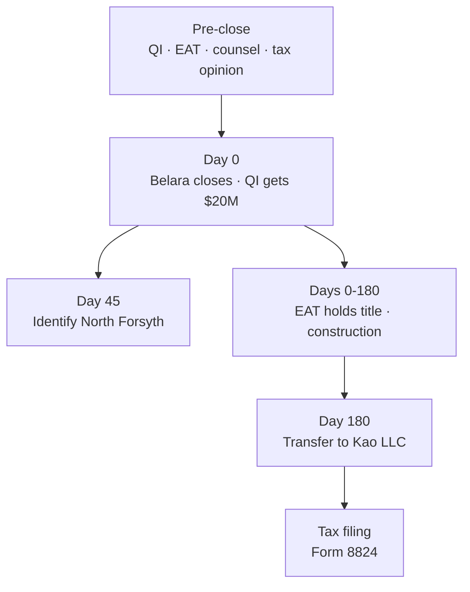
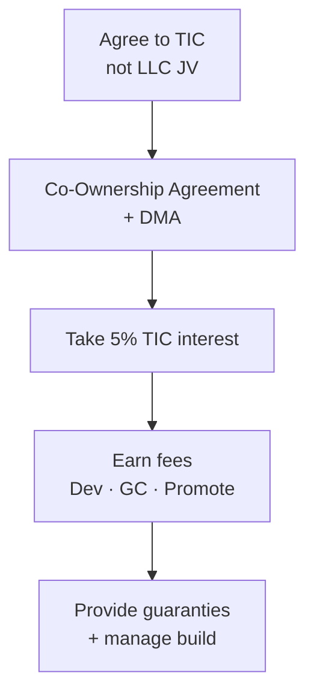
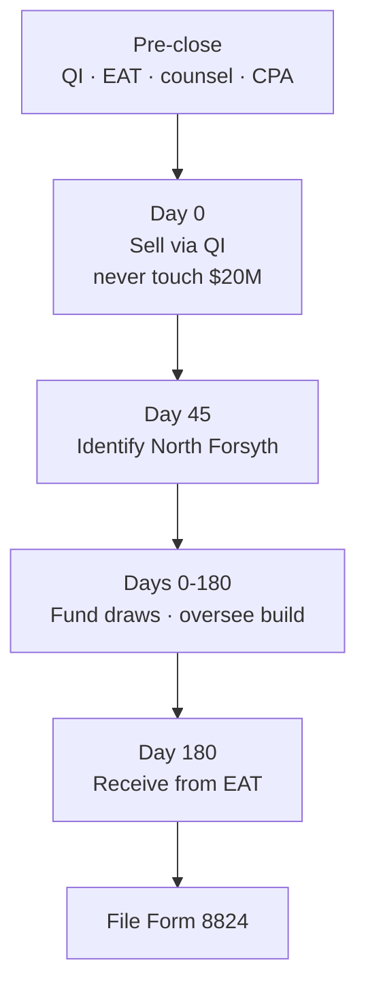

<!-- TAB:overview -->

## The Deal

Sell **Belara Apartments** ($20M, no debt) and defer the gain by reinvesting into **North Forsyth Commerce Center** — a ~$50.3M ground-up industrial development (95% Kao / 5% Hanover equity).

| | |
|---|---|
| **Seller / exchanger** | Kao Management Trust / Titan Management |
| **Buyer** | Strake Jesuit (relinquished side only) |
| **Developer** | Hanover Industrial LLC |
| **Replacement** | ~327,600 SF industrial, Forsyth County GA |
| **Kao equity** | ~$20M via 1031 proceeds |
| **Clocks** | 45-day ID · 180-day completion |

## Key Terms

| Term | Definition |
|---|---|
| **1031 Exchange** | A tax-deferred swap under [IRC §1031](https://www.law.cornell.edu/uscode/text/26/1031): sell investment real estate and reinvest in like-kind property to defer capital gains. Strict 45-day identification and 180-day completion deadlines apply. |
| **Relinquished property** | The property being sold — here, Belara Apartments ($20M). |
| **Replacement property** | The property being acquired — here, North Forsyth Commerce Center. |
| **Qualified Intermediary (QI)** | A third party that holds the $20M sale proceeds between the Belara closing and reinvestment into North Forsyth. Kao never touches the money directly; doing so would trigger **constructive receipt** and defeat the exchange ([Treas. Reg. §1.1031(k)-1](https://www.law.cornell.edu/cfr/text/26/1.1031(k)-1)). |
| **Exchange Accommodation Titleholder (EAT)** | A special-purpose entity that temporarily holds title to North Forsyth during ground-up construction, giving the exchange time to fund land and building costs within the 180-day window ([Rev. Proc. 2000-37](https://www.irs.gov/pub/irs-drop/rp-00-37.pdf)). |
| **Tenancy-in-Common (TIC)** | Direct co-ownership of real estate — each owner holds an undivided percentage of the fee (here, 95% Kao / 5% Hanover). A TIC interest in land or buildings qualifies as like-kind replacement property; an LLC membership interest does not ([Rev. Proc. 2002-22](https://www.irs.gov/pub/irs-drop/rp-02-22.pdf)). |
| **Build-to-suit exchange** | A variation for ground-up development: the QI/EAT funds land acquisition and construction draws from exchange proceeds during the 180-day period. Only value actually built and paid for by day 180 counts. |
| **Boot** | Taxable gain triggered when the exchange is incomplete — e.g., Kao receives cash back, or less than $20M of qualifying replacement value is in place by day 180. |
| **Promote** | The developer's disproportionate share of profits above IRR hurdles (20% / 30% / 40% in the term sheet). In a TIC, this cannot be paid as a distribution; it is replicated via a fee to a separate Hanover affiliate. |
| **Day 45 / Day 180** | Federal deadlines starting at Belara closing: identify replacement property within 45 days; complete the exchange (acquire replacement property) within 180 days. |

## Why the Term Sheet LLC Fails

The Hanover term sheet gives Kao a **95% LLC membership interest**. Under [IRC §1031(a)(2)(D)](https://www.law.cornell.edu/uscode/text/26/1031), partnership/LLC interests are not like-kind real property — even if the LLC only owns real estate. Same issue in *Gluck v. Commissioner*, T.C. Memo. 2020-66.

## The Fix (Three Parts)

1. **TIC co-ownership** — Kao holds a 95% undivided fee interest in the land/buildings, not an LLC interest ([Rev. Proc. 2002-22](https://www.irs.gov/pub/irs-drop/rp-02-22.pdf))
2. **Build-to-suit EAT** — An Exchange Accommodation Titleholder parks title during construction; QI funds land + draws from the $20M ([Rev. Proc. 2000-37](https://www.irs.gov/pub/irs-drop/rp-00-37.pdf))
3. **Promote as fee** — Hanover's waterfall economics replicate via fees to a separate affiliate, not TIC distributions (requires tax opinion)

Hanover's **net dollars stay the same**. Only the legal wrapper changes.

## Full Transaction Flow

**Clocks:** Day 0 = Belara close (clocks start) · Day 45 = identify North Forsyth · Day 180 = EAT transfers to Kao's LLC. Only value in-place and paid for by Day 180 counts (~$20M target). Any shortfall = taxable boot.

## Timeline

## Key Risks

| Risk | Mitigation |
|---|---|
| TIC treated as partnership | Co-ownership formalities, market-rate fees, tax opinion |
| Promote-as-fee challenged | Route to separate affiliate, not manager; get tax opinion |
| Lender won't lend to TIC | Confirm in writing before Belara closes |
| Under $20M in-place by Day 180 | Model draw schedule; plan backup replacement |
| Kao touches proceeds | Never — constructive receipt kills the exchange |

<!-- TAB:strake -->

## Your Role

You are the **buyer of Belara only**. You are not involved in the replacement property, the 1031 structure, or Hanover's development.

## What You Do

- **Close on the agreed date.** Funds go through escrow to the Qualified Intermediary — not to Kao directly. This is required for their 1031 exchange.
- **Coordinate logistics** with Kao and the QI on closing date, escrow instructions, and title.
- **Complete your diligence** — title, survey, environmental, and any institutional/gift-acceptance requirements on your side.

## What You Do Not Do

- North Forsyth, TIC, EAT, or construction loan
- Hanover joint venture or development
- Any 1031 exchange filings

> Gift-acceptance or other Georgia institutional items are your own legal concerns, separate from the exchange.

**Sources:** [Treas. Reg. §1.1031(k)-1](https://www.law.cornell.edu/cfr/text/26/1.1031(k)-1) · [IRS Like-Kind Exchanges](https://www.irs.gov/businesses/small-businesses-self-employed/like-kind-exchanges-real-estate-tax-tips)

<!-- TAB:hanover -->

## Your Role

You are the **developer and 5% co-owner**. Your fee, GC, promote, and guaranty economics stay **identical to the term sheet** — but the deal must be papered as **TIC co-ownership + Development Management Agreement**, not a Delaware LLC JV.

## What Changes vs. Term Sheet

| Term sheet (LLC JV) | TIC equivalent | Your economics |
|---|---|---|
| 95/5 LLC membership | 95/5 undivided fee interest | Same |
| Promote waterfall | Fee to Sponsor affiliate | Same dollars |
| Dev fee 4% / GC 4.5% | Unchanged | Same |
| Guaranties | Run to co-owners + lender | Same |
| Preferred equity on default | Co-owner cost advance | Recast only |
| Forced sale buy-sell | Co-ownership buy-sell | Draft around FMV rules |

## What You Do

**Before closing**
- Agree to TIC structure; redraft Operating Agreement as Co-Ownership Agreement
- Add Development Management Agreement for day-to-day control
- Confirm lender will lend to TIC/EAT
- Structure promote as fee to a **separate Sponsor affiliate** (not profit-based fee to the manager)

**During construction**
- Manage build under DMA; GC contracts with EAT during 180-day parking
- Issue monthly capital calls as pro-rata co-owner funding
- Fund 100% of Controllable Cost Overruns; provide lender guaranties

## Friction to Expect

- **Major Decisions** need co-owner consent — not sole Sponsor discretion ([Rev. Proc. 2002-22](https://www.irs.gov/pub/irs-drop/rp-02-22.pdf))
- **Profit-linked fee to the manager** is prohibited — route promote elsewhere
- **Lender approval** of TIC structure must be confirmed early
- **Buy-sell** must be drafted around FMV restrictions in 2002-22

**Sources:** [Rev. Proc. 2002-22](https://www.irs.gov/pub/irs-drop/rp-02-22.pdf) · [Rev. Proc. 2000-37](https://www.irs.gov/pub/irs-drop/rp-00-37.pdf) · [IRC §1031(a)(2)(D)](https://www.law.cornell.edu/uscode/text/26/1031)

<!-- TAB:kao -->

## Your Role

You are the **exchanger** — selling Belara and acquiring the replacement interest. Every step runs on the **45-day and 180-day clocks**.

## What You Do

**Before Belara closes**
- Engage QI and EAT before closing
- Engage 1031 counsel and CPA; obtain tax opinion on promote-as-fee
- Confirm Hanover papers TIC (not LLC) and lender lends to TIC/EAT
- Model boot scenarios: full deferral, partial boot, backup replacement

**Day 0** — Sell through QI. Proceeds go to QI only. Never touch the $20M.

**Day 45** — Identify North Forsyth in writing with legal description.

**Days 0–180** — Fund 95% pro-rata capital calls via QI/EAT. Oversee build via co-ownership rights.

**Day 180** — EAT transfers property to your wholly-owned single-member LLC.

**After** — File Form 8824. Recognize boot on any shortfall below $20M in-place value.

## Critical Rules

- **Same taxpayer** — Belara seller = replacement title-holder (via disregarded single-member LLC). No new members before closing.
- **No mortgage boot** — Belara has no debt. New construction loan is fine. Must redeploy full ~$20M equity.

| Scenario | In-place by Day 180 | Result |
|---|---|---|
| Full deferral | ≥ $20M | Gain fully deferred |
| Partial | $15M–$19.9M | Boot taxed on shortfall |
| Backup | Dev stalls | Alternate completed asset or DST |

**Sources:** [IRC §1031](https://www.law.cornell.edu/uscode/text/26/1031) · [Treas. Reg. §1.1031(k)-1](https://www.law.cornell.edu/cfr/text/26/1.1031(k)-1) · [Rev. Proc. 2000-37](https://www.irs.gov/pub/irs-drop/rp-00-37.pdf) · [Form 8824](https://www.irs.gov/forms-pubs/about-form-8824)

<!-- TAB:references -->

## Statute and IRS Guidance

- [IRC §1031 — Like-kind exchanges](https://www.law.cornell.edu/uscode/text/26/1031)
- [IRC §1031(a)(2)(D) — Partnership interest exclusion](https://www.law.cornell.edu/uscode/text/26/1031)
- [IRS — Like-Kind Exchanges](https://www.irs.gov/businesses/small-businesses-self-employed/like-kind-exchanges-real-estate-tax-tips)
- [Treas. Reg. §1.1031(k)-1 — QI safe harbor](https://www.law.cornell.edu/cfr/text/26/1.1031(k)-1)
- [Treas. Reg. §301.7701-3 — Disregarded entity](https://www.law.cornell.edu/cfr/text/26/301.7701-3)
- [Form 8824](https://www.irs.gov/forms-pubs/about-form-8824)

## TIC and Build-to-Suit

- [Rev. Proc. 2002-22 — TIC co-ownership](https://www.irs.gov/pub/irs-drop/rp-02-22.pdf)
- [Rev. Proc. 2000-37 — EAT / build-to-suit](https://www.irs.gov/pub/irs-drop/rp-00-37.pdf)

## Case Law

- *Gluck v. Commissioner*, T.C. Memo. 2020-66 — [Tax Notes](https://www.taxnotes.com/research/federal/court-documents/court-opinions-and-orders/tax-court-lacks-jurisdiction-over-like-kind-exchange-determination/2ckgc) · [Briefly Taxing](https://brieflytaxing.com/1275/)

## Disclaimer

Informational only — not legal or tax advice. Promote-as-fee and development-TIC positions are aggressive and require a written Section 1031 counsel opinion before closing.
