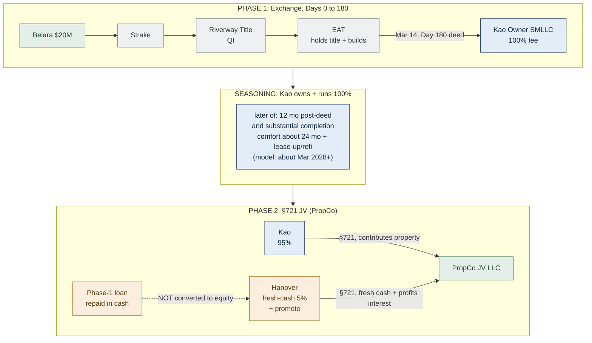
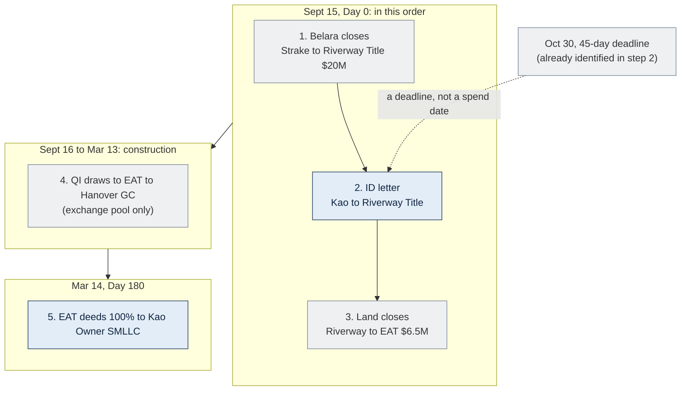
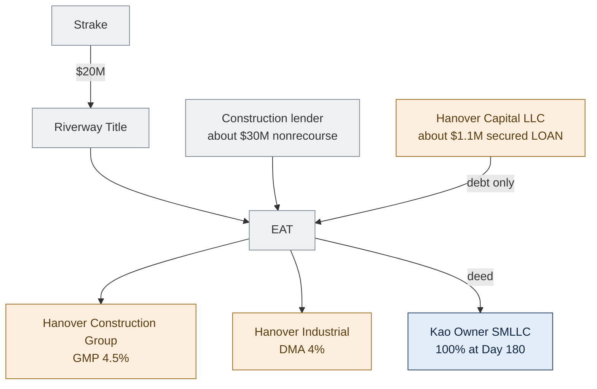
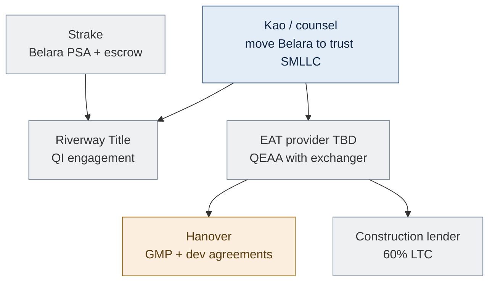
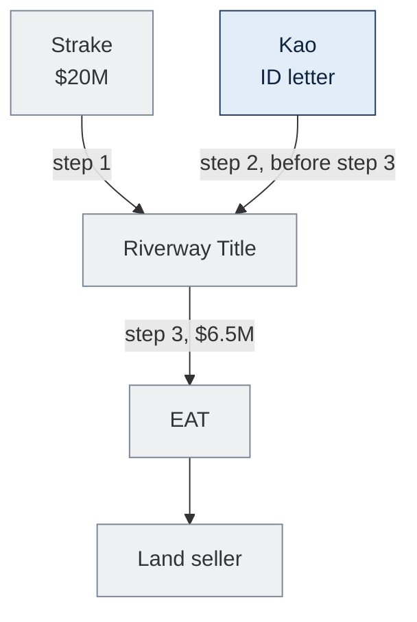
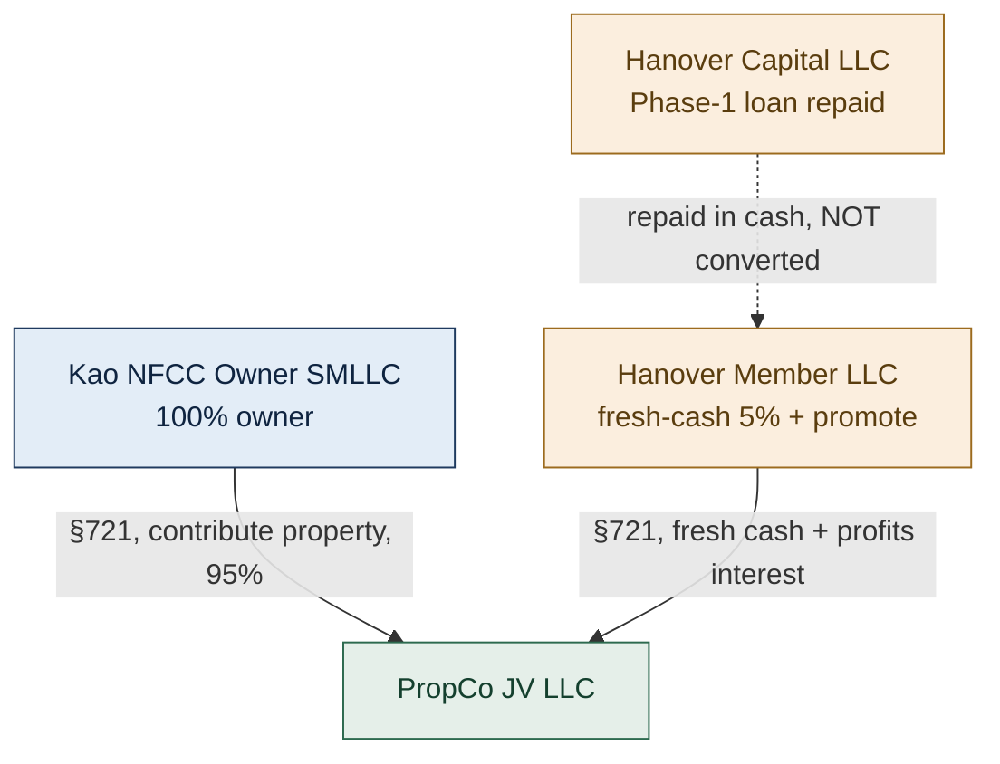
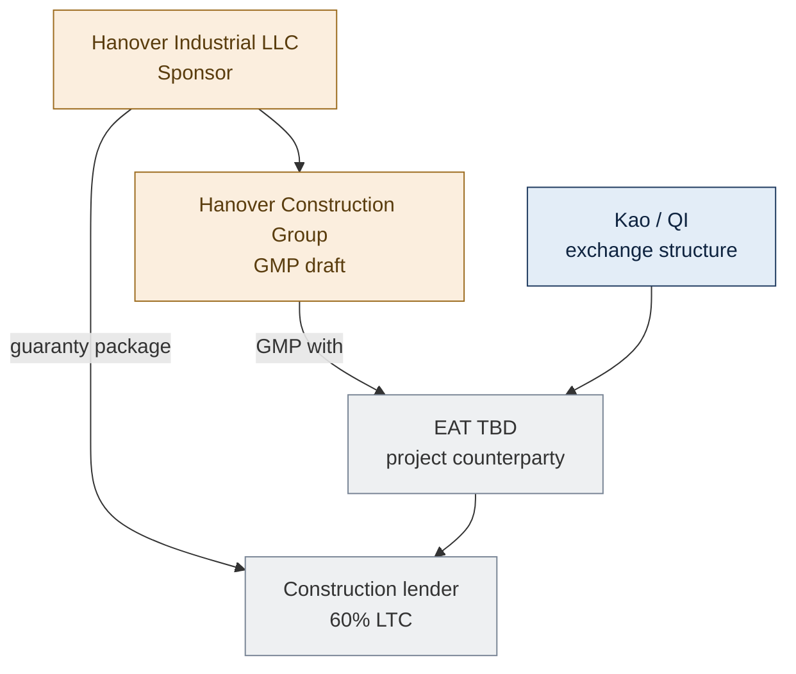
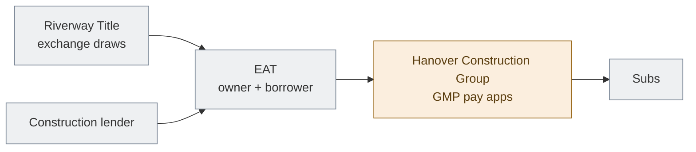
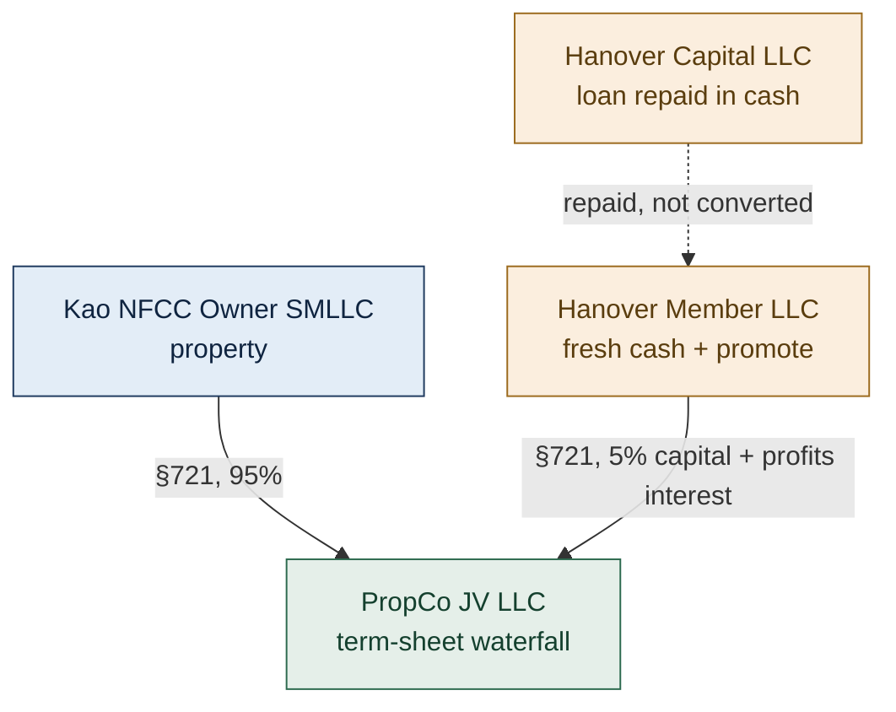
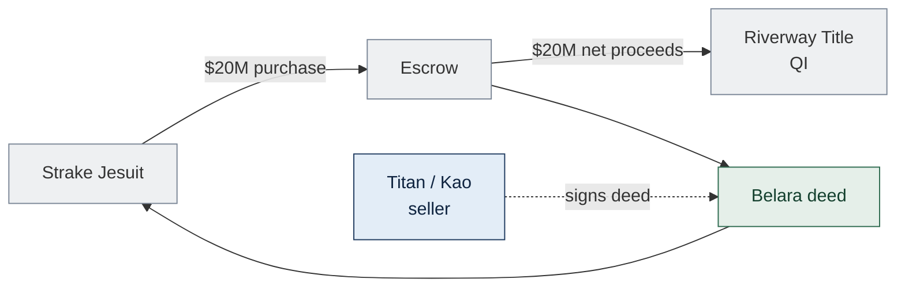

<!-- TAB:starthere -->

> **Internal working model. Read this tab first.** Plain-English explainer for anyone in the deal who has never dealt with a §1031 exchange. No tax background assumed. Working structure: Structure C-Hybrid (DRAFT). Nothing here is locked or counsel-approved. Obtain a written §1031 opinion before Belara closes.

## What this is, in three sentences

Our family is selling **Belara Apartments** for **$20M** and wants to roll the money into a new **North Forsyth Commerce Center** industrial project without paying capital-gains tax now. The tax rule that allows this, a **§1031 exchange**, has strict requirements that clash with the way the developer (**Hanover**) wants to structure its profit share. **Structure C-Hybrid** is our plan to satisfy both: do the tax-free real-estate exchange first, then form the developer partnership later, with a real gap of time in between.

### The one thing to get right

A waiting period ("seasoning") lowers risk. It is **not** a legal safe harbor. There is no rule that says "wait N months and you are safe." This works only if our family genuinely could keep North Forsyth forever, and Hanover has **no enforceable right** to its partnership stake or promote until a separate, later decision. If the file looks like Phase 2 was a done deal from Day 1, the whole exchange can collapse. This point repeats on every tab on purpose.

## Acronyms and terms, laid out before anything else

| Term | Plain meaning |
|---|---|
| **§1031 exchange** | IRS rule: defer the tax on selling an investment property if you reinvest the proceeds into "like-kind" real estate under strict rules. |
| **Like-kind** | For real estate, almost any U.S. investment property swaps for any other. A share in a company or partnership is **not** like-kind. |
| **Boot** | Any value you receive that is **not** like-kind real property (cash, or a shortfall in reinvested value). Boot is taxable. |
| **Capital gain vs. ordinary income** | Capital gain is taxed at a lower rate. A fee is ordinary income. Hanover wants its promote taxed as capital gain. |
| **QI (Qualified Intermediary)** | Independent middleman that holds the sale cash so you never touch it. Here: **Riverway Title**. |
| **Constructive receipt** | If you can get at the sale cash, the IRS treats you as having received it, and the exchange fails. The QI exists to prevent this. |
| **EAT (Exchange Accommodation Titleholder)** | Independent party that temporarily holds title and builds the new property, because exchange rules will not let you build on land you do not yet own. |
| **QEAA** | The written agreement (Rev. Proc. 2000-37) that lets the EAT "park" title for up to 180 days. |
| **Build-to-suit / improvement exchange** | Using an EAT so newly-built improvements count as replacement property. |
| **45-day / 180-day clocks** | From the sale: 45 days to identify the replacement property, 180 days to receive it. |
| **DST (Delaware Statutory Trust)** | A passive fractional real-estate investment that qualifies as §1031 replacement property. Used here as a backup to absorb leftover cash and avoid boot. |
| **§721** | IRS rule: contribute property into a partnership tax-free in exchange for a partnership interest. The Phase-2 move. |
| **JV (Joint Venture)** | The Kao plus Hanover partnership (an LLC taxed as a partnership) formed in Phase 2. Here called **PropCo**. |
| **Promote / carried interest** | The developer's share of profits above set return hurdles, as a reward for performance. |
| **Profits interest** | A partnership stake that shares only in future upside (worth $0 if the partnership were liquidated today). This is what makes the promote a capital gain. |
| **Capital interest** | A partnership stake backed by real money contributed (Hanover's fresh-cash 5%). |
| **Seasoning** | A real gap of time during which our family owns and operates the property 100% before forming the JV. Evidence the two steps are separate. |
| **Step-transaction doctrine** | IRS doctrine that collapses a series of pre-arranged steps into one. The main threat here. |
| **MLTN (More Likely Than Not)** | A confidence level above 50% for a tax opinion. Our target, not "should," not certainty. |
| **SMLLC** | Single-member LLC. "Disregarded" means invisible for tax, treated as its owner. |
| **DMA** | Development Management Agreement. Hanover's 4% developer-fee contract. |
| **GMP** | Guaranteed Maximum Price. Hanover's general-contractor contract, 4.5%. |
| **GC** | General Contractor (Hanover Construction Group). |
| **LTC** | Loan-to-Cost. Construction loan about 60% of project cost. |
| **Nonrecourse debt** | A loan where the lender can only take the property, not pursue the borrower personally. Matters for the Phase-2 tax math. |
| **Grantor vs. non-grantor trust** | Whether the trust is tax-invisible to its creators (grantor) or its own taxpayer (non-grantor). Changes whether moving Belara in is tax-free. |

## §1031 in plain English

Selling Belara for **$20M** (with no mortgage) creates a large taxable capital gain. A **§1031 exchange** lets our family pay $0 tax now, deferring it, if the $20M is reinvested into like-kind real estate (North Forsyth) and we follow four rules:

1. **Same taxpayer.** Whoever sells Belara must be the same taxpayer that ends up owning North Forsyth.
2. **Never touch the cash.** Sale proceeds go straight to an independent QI, not to the family.
3. **The clocks.** Identify the replacement property within 45 days, receive it within 180 days.
4. **Like-kind.** The replacement must be real property, not a share in a company.

Miss any one and the deferral fails, and the full gain becomes taxable. Everything in Structure C-Hybrid is built around protecting these four.

## The cast: who is who

| Party | Plain role |
|---|---|
| **Kao Management Trust** | Our family's trust. The taxpayer doing the exchange and the long-term owner of North Forsyth. |
| **Titan Management** | The parents' company that holds Belara today. Belara must be moved under the Trust before the sale (same-taxpayer rule). |
| **Strake Jesuit** | The buyer of Belara. Their only job that matters to us: wire the price to the QI. |
| **Hanover Industrial LLC** | The developer and sponsor building North Forsyth. Later, the 5% plus promote partner. (Our family member works here as a salaried employee but owns zero of Hanover.) |
| **Riverway Title (QI)** | Independent intermediary that holds the $20M so we never touch it. |
| **EAT** (to be selected) | Independent titleholder that builds North Forsyth during the exchange. |
| **Construction lender** | Bank funding about 60% of cost (about $30M), nonrecourse. |
| **Land seller** | Unaffiliated third party selling the North Forsyth land ($6.5M). |

## The core tension (why this needs a careful structure)

Two requirements pull in opposite directions:

1. **Kao's deferral** needs Kao to finish the exchange owning 100% real property, directly or through a disregarded Kao-owned LLC. Kao cannot receive a 95% interest in the JV partnership as the replacement, because that is a company share, not real estate.
2. **Hanover's promote-as-capital-gain** needs a partnership, because a carried interest only exists inside one, and that partnership does not exist at the moment the exchange finishes.

You cannot have both at the same instant. The reconciliation is sequence. Kao takes 100% real property first (Phase 1), the promoted partnership forms later (Phase 2), and a genuine seasoning gap keeps the IRS from treating the two as one pre-arranged deal.

For how that actually works, with money and dates, see the **Overview** tab. For your specific role, see the **Kao**, **Hanover**, or **Strake** tab.

<!-- TAB:overview -->

> **Seasoning lowers risk. It is not a safe harbor.** No rule says "wait N months and you are safe." This works only if Kao genuinely could keep North Forsyth forever and Hanover has no enforceable right to equity or promote until a later, independent decision. Target opinion: MLTN (more likely than not), not "clean." DRAFT, needs a §1031 counsel opinion. Source: `docs/research/2026-06-14_structure-C-hybrid-legal-review.md`.

## Structure C-Hybrid in one line

Kao exchanges into 100% fee title of North Forsyth via a QI plus EAT (Phase 1), owns and runs it alone through a genuine seasoning gap, then forms the term-sheet 95/5 promoted JV via a tax-free §721 contribution (Phase 2). Same commercial economics as the term sheet, Hanover's promote stays a capital gain, and the restructure itself creates no surprise tax for Kao.

## The deal at a glance

| | |
|---|---|
| **Working structure** | Structure C-Hybrid: exchange first, §721 JV after seasoning (DRAFT) |
| **Sell (relinquished)** | Belara Apartments, $20M, no debt |
| **Buy (replacement)** | North Forsyth Commerce Center, about $50.3M ground-up industrial, about 327,600 SF, Forsyth County GA |
| **Belara seller today** | Titan Management, must move Belara into a trust-owned SMLLC before sale |
| **Exchanger / long-term owner** | Kao Management Trust (one taxpayer, start to finish) |
| **Belara buyer** | Strake Jesuit |
| **Developer** | Hanover Industrial LLC |
| **Land** | $6.5M, third-party seller, under PSA, unaffiliated |
| **Project cost** | about $50.3M, construction loan about 60% LTC (about $30M), nonrecourse |
| **QI** | Riverway Title |
| **EAT** | TBD (independent of both Kao and Hanover) |
| **Model Day 0** | Sept 15, 2026 (Belara plus NFCC land / construction start). Belara timing is flexible, see boot note |
| **45-day ID deadline** | Oct 30, 2026, letter on file Sept 15, before the land wire |
| **180-day completion** | Mar 14, 2027, EAT deeds 100% to Kao's LLC |
| **Phase 2 JV (model)** | Earliest about Mar 2028 (seasoning floor, OPEN with counsel) |

## Why not just sign the term sheet?

Hanover's unsigned term sheet would hand Kao a 95% LLC membership at closing. That fails §1031, because only real property is like-kind, and an LLC or partnership interest is not. A promote living inside the exchange vehicle makes it partnership economics, not replacement real estate.

| | Term sheet (as written) | Structure C-Hybrid |
|---|---|---|
| What Kao receives at the exchange | 95% LLC interest | 100% real property (direct or disregarded LLC) |
| Hanover 5% plus promote | Day 1, inside the JV | Phase 2, via §721 after seasoning |
| Hanover promote tax character | Capital gain only if the exchange survived | Capital gain (clean carried interest) |
| Exchange viability | Fails | MLTN at best, seasoning-dependent (DRAFT) |
| Ground-up build | No mechanism | QI plus EAT build-to-suit |

Same commercial deal. We move only the legal wrapper and the timing.

## The three phases

**Phase 1, the exchange (Days 0 to 180).** Belara's $20M goes to the QI, never to the family. An independent EAT takes title to North Forsyth, borrows the construction loan, and builds. By Day 180 the EAT deeds 100% fee title to a Kao-owned LLC. Hanover plays four non-owner roles here (developer, GC, secured lender, guarantor), described on the Hanover tab. Hanover is not on title and holds no equity.

**Seasoning, the gap that makes or breaks it.** Kao owns and operates North Forsyth as a true 100% owner. Detail below.

**Phase 2, the §721 JV (the C-Hybrid innovation).** Detail below.

## The Phase-2 bifurcation (the key innovation)

To keep Hanover's promote a clean capital gain, Hanover's economics are split into two separate things:

1. **A real, fresh-cash 5% capital interest.** Hanover pays new cash for a genuine 5% ownership stake, priced as a real investment at the time the JV forms. It participates 95/5 just like the term sheet (return of capital plus pro-rata returns). This is normal co-investment.
2. **A separate "profits interest" for the promote.** Hanover also receives a partnership stake that has no value if the partnership were liquidated the day it is granted. It only shares in future upside above the hurdles (the 20/30/40 promote). Because it starts at zero value, the grant is not a taxable event, and later promote dollars can be capital gain if the partnership earns capital gain and the holding-period rules are met.

Important: Hanover's roughly $1.1M Phase-1 money is a loan that gets repaid in cash. It is **not** converted into equity. Converting a loan into a partnership interest would re-open valuation and disguised-sale tax problems. Repay it, then contribute fresh cash separately.

This is the upgrade over the older draft (Structure A), which had Hanover "convert its loan" into the 5%. That bundled the capital and the promote together and muddied the capital-gain analysis.

## Timeline and the two IRS clocks

Day 0 is the Belara close (the clocks start). Modeled Sept 15, 2026, aligned with the NFCC land close.

| Clock | Starts | Last day (model) | What it means |
|---|---|---|---|
| **45-day identification** | Belara close | Oct 30, 2026 | Kao must give the QI a written list of the replacement property on or before this date |
| **180-day completion** | Belara close | Mar 14, 2027 | The replacement property must be received (EAT deeds to Kao's LLC) on or before this date |

Oct 30 is a deadline, not the day we identify. The QI cannot spend Belara proceeds on North Forsyth until North Forsyth is identified. In our model the identification letter is delivered Sept 15, the same day as Belara, before the land wire. Oct 30 is just cushion if Belara slips.

### Sept 15: order of operations (same calendar day)

### Money in Phase 1: sources and uses

The QI holds about $20M from Belara (no debt). It cannot disburse more than that pool for exchange-funded work.

| Order | When | From and to | $ | Source |
|---|---|---|---|---|
| 1 | Sept 15 | Strake to escrow to Riverway Title | 20.0M | Belara sale |
| 2 | Sept 15 | Kao to Riverway Title (no wire) | n/a | ID letter on file |
| 3 | Sept 15 | Riverway Title to EAT to land seller | 6.5M | Exchange pool |
| 4 | Oct-Nov 2026 | Riverway Title to EAT to Hanover GC | 5.0M | Exchange pool |
| 5 | Dec 2026 to Feb 2027 | Riverway Title to EAT to Hanover GC | 8.5M | Exchange pool (exhausts about $20M) |
| 5b | Dec 2026 to Feb 2027 | Lender to EAT to Hanover GC | 1.5M | Construction loan |
| 6 | Mar 14, 2027 | EAT to Kao Owner SMLLC (100% deed) | n/a | Phase 1 complete |
| 7 | Mar 2027 to about Mar 2028+ | Seasoning, Kao sole owner | n/a | Hanover is loan plus fees only |
| 8 | about Mar 2028+ (OPEN) | §721, PropCo JV LLC | n/a | Hanover fresh-cash 5% plus promote |

Phase 1 capital stack: exchange pool (about $20M) plus construction loan (about $30M) plus Hanover secured loan (about $1.1M). No Hanover equity and no promote until Phase 2.

## Boot and Day-180 feasibility (an honest risk)

Only real property physically in place and paid for by Day 180 counts toward the roughly $20M target. $6.5M land plus about $13.5M of in-place improvements on a $50.3M ground-up project is plausible but not bankable, a real risk worth managing:

- **Belara timing is the strongest lever.** Our family controls when Belara closes. Aligning it, or slightly delaying it, so Day 180 lands after enough construction is in place is the cleanest fix. This is why "Sept 15" is a model, not a commitment.
- **Identify a real, closable backup DST by Day 45.** If construction lags, the DST absorbs the leftover cash and prevents boot.
- **Model acceptable boot.** Knowingly recognize a quantified shortfall as taxable 2026 gain rather than gamble the whole exchange.
- **Confirm clean title history.** If Kao ever owned the North Forsyth land within 180 days, the parking safe harbor breaks.

## Seasoning: evidence, not a timer

Seasoning runs from the EAT-to-Kao deed date (about Day 180), not from Day 0.

- **Risk floor (not a legal minimum):** the later of 12 months post-deed and substantial completion.
- **Comfort, toward a stronger opinion:** about 24 months plus meaningful lease-up and ideally a refinance into permanent nonrecourse debt.

There is no statutory seasoning period. These are evidentiary targets. What matters is that Kao is genuinely able and willing to own North Forsyth alone, indefinitely, and behaves that way: signs the leases, carries the loan, takes depreciation, controls the bank accounts, and funds any shortfall with debt, never Hanover equity. There must be no binding promise to form the JV, only a non-binding letter either side can walk away from.

## Kao's "no surprise tax": why timing matters

Contributing mortgaged property into a partnership can itself trigger a tax bill if your share of the debt drops (a "deemed distribution"). C-Hybrid defuses this mainly by timing, but it is not self-executing. The CPA must model it:

- Form the JV after the construction guaranties have burned off, so only ordinary nonrecourse mortgage debt remains.
- By then, capitalized construction costs have built up Kao's tax basis well above the starting figure.
- No cash or refinance distribution to Kao near the contribution (that looks like a disguised sale).
- The CPA confirms in writing that the debt-share shift does not exceed Kao's basis.

Done in that order, the contribution is designed to be tax-silent for Kao, but only with the schedules to prove it.

## The entity map (all to-be-formed placeholders)

| Entity | Side | Plain role |
|---|---|---|
| **Kao Management Trust** | Kao | The taxpayer and long-term owner (grantor vs. non-grantor is TBD and gating) |
| **Belara Seller SMLLC** | Kao | Trust-owned LLC that holds and sells Belara (Belara moved in pre-close) |
| **Kao NFCC Owner SMLLC** | Kao | Receives 100% title at Day 180, later contributes to the JV for 95% |
| **Strake Jesuit** | Neutral | Buyer of Belara only |
| **Riverway Title (QI)** | Neutral | Holds the $20M, independent of both sides |
| **NFCC Parking Title LLC (EAT)** | Neutral | Parks title, borrows the loan, builds. Independent of Kao and Hanover |
| **Construction lender** | Neutral | About $30M nonrecourse loan |
| **Land seller** | Neutral | Unaffiliated third party (verify) |
| **Backup DST** | Neutral | Boot backstop, identified by Day 45 |
| **Hanover Industrial LLC** | Hanover | Sponsor and 4% developer fee |
| **Hanover Construction Group LLC** | Hanover | GC on the GMP (4.5%), not an equity holder |
| **Hanover NFCC Capital LLC** | Hanover | Phase-1 secured lender (about $1.1M), repaid before Phase 2 |
| **Hanover NFCC Member LLC** | Hanover | Phase 2: fresh-cash 5% capital interest plus a separate promote profits interest |
| **North Forsyth PropCo JV LLC** | JV | The operating partnership (Phase 2) |

## What can blow this up (ranked), plus the conduct rules

Ranked risks:

1. **Wrong taxpayer or entity alignment is taxable.** The Belara-to-Trust move is not tax-free, or the wrong entity sells Belara.
2. **Phase 2 is locked in.** A binding option or contribution right, or emails proving a "done deal."
3. **Hanover looks like an owner in Phase 1.** Title, equity, capital account, or controlling sale, refi, or leasing before seasoning.
4. **QI or EAT not independent, or Kao touches the cash.** Constructive receipt.
5. **Not enough real property in place by Day 180** (boot) with no DST backup.
6. **A distribution or refi to Kao too soon.** Disguised sale.
7. **Debt-shift tax to Kao.** Surviving guaranties or a liability shift above Kao's basis.
8. **Promote contaminated.** It has value at grant, or is bundled with the capital interest.
9. **Conflict or process failure.** The employee appears to control both sides.

Conduct rules (non-negotiable):

- No signed contribution agreement, option, put/call, fixed-price admission, or exclusivity for Phase 2. A non-binding LOI only, either party free to walk for any reason, cost-based consequences only.
- No writings saying "done deal," "guaranteed promote," "temporary 1031 wrapper," or "we will paper it after seasoning."
- The employee recuses from every Hanover-side decision on this deal. Separate counsel for each side. Disinterested decision-makers set each side's terms.
- Independent, arm's-length pricing of every fee, the loan interest, the guaranty or indemnity, and the break fee.
- Kao behaves as sole owner throughout seasoning.

> **What changed from the earlier draft (Structure A):** the loan is now repaid, not converted. Hanover's 5% is fresh cash plus a separate zero-value profits interest (cleaner capital-gain carry). The §752 "surprise tax" is handled primarily by timing (contribute after guaranties expire), not by special guaranties. And the employment, step-transaction, and boot/Day-180 issues are addressed head-on. Full memo: `docs/research/2026-06-14_structure-C-hybrid-legal-review.md` (DRAFT, not counsel-reviewed).

<!-- TAB:kao -->

> **Seasoning lowers risk. It is not a safe harbor.** This works only if our family genuinely could keep North Forsyth forever and Hanover has no enforceable right to equity or promote until a later, independent decision. Target: MLTN (more likely than not). DRAFT, needs a §1031 counsel opinion.

## Your role: the exchanger (our family)

New to this? Read the **Start Here** tab first. In short: we sell Belara, defer the tax, and roll into North Forsyth. Under Structure C-Hybrid you receive 100% real property in Phase 1, then contribute it into the 95% JV after seasoning.

| Role | Party |
|---|---|
| **Working structure** | Structure C-Hybrid: exchange first, §721 JV after seasoning (DRAFT) |
| **Sell** | Belara, seller today is Titan Management, move into a trust-owned SMLLC before sale |
| **Buyer of Belara** | Strake Jesuit |
| **QI** | Riverway Title, you never receive the sale proceeds |
| **EAT** | TBD, holds title and builds during Days 0 to 180 |
| **Phase 1 receipt** | Kao NFCC Owner SMLLC, 100% deed at Day 180 |
| **Phase 2** | Contribute the property for 95% of PropCo JV, Hanover gets fresh-cash 5% plus promote via §721 |
| **Hanover in Phase 1** | Contractor plus secured lender (about $1.1M), not your partner yet |

## Step 0: align the taxpayer before anything else (gating)

The taxpayer that sells Belara must be the taxpayer that acquires North Forsyth, the same taxpayer start to finish. Belara sits in Titan Management today. The Kao Management Trust is the intended owner. These are probably different taxpayers, so Belara must be moved into a trust-owned disregarded SMLLC before the Belara PSA.

Gating CPA fork, confirm first. Whether that move is tax-free depends on the trust's classification:

- **Grantor trust** (tax-invisible to the parents) plus Titan owned by the parents means moving Belara may be between disregarded entities of the same taxpayer, which is tax-neutral.
- **Non-grantor trust** (its own taxpayer) means moving about $20M of Belara in is a gift (gift-tax exposure) or a sale (current income tax).

This single classification can change whether the whole plan is even tax-free. The CPA confirms before the PSA.

## Why a §1031 exchange (not just "buying North Forsyth")

Selling Belara for $20M triggers a large capital gain. §1031 defers that tax if you reinvest into like-kind real property and follow the rules:

1. **Strake's price wires to Riverway Title (QI),** not to you. Touching the cash is constructive receipt, and the exchange fails.
2. **Within 45 days,** give the QI a written identification of North Forsyth. Oct 30, 2026 is the last day. In our model the letter goes in Sept 15, before any North Forsyth spend.
3. **Within 180 days,** the EAT deeds 100% real property to your LLC, not a 95% JV interest. The promote and Hanover's equity come later, in Phase 2.

## Key dates (model)

| Milestone | Date | What happens |
|---|---|---|
| **Day 0, step 1, Belara** | Sept 15, 2026 | Strake closes, $20M to Riverway Title, clocks start |
| **Day 0, step 2, ID letter** | Sept 15, 2026 | Written identification of North Forsyth to Riverway, before the land wire |
| **Day 0, step 3, Land** | Sept 15, 2026 | Riverway releases $6.5M to EAT, land seller paid |
| **45-day deadline** | Oct 30, 2026 | Last day to identify, not when we act in this model |
| **Construction** | Sept 16, 2026 to Mar 13, 2027 | QI draws (to about $20M) then loan, to EAT, to Hanover GC |
| **Day 180, Phase 1 done** | Mar 14, 2027 | EAT deeds 100% to Kao NFCC Owner SMLLC |
| **Seasoning** | Mar 2027 to about Mar 2028+ | You own 100%, operate, depreciate, carry the loan |
| **Phase 2 §721** | about Mar 2028+ (OPEN) | Contribute for 95% JV, Hanover gets fresh-cash 5% plus promote |

## Step 1: pre-close (before Sept 15)

- **Same taxpayer** from Belara through replacement, resolve the Titan-to-Kao-Trust alignment (and the grantor fork) first.
- **Engage Riverway Title.** The Belara PSA must wire proceeds to the QI only.
- **Select an independent EAT.** Not a Hanover affiliate, and Hanover must not select, control, fund, or indemnify it.
- **Form the Kao NFCC Owner SMLLC,** which receives the Day-180 deed.
- **Land PSA** with the third-party seller ($6.5M).
- **Draft the identification letter** (land plus improvements, value at least $20M), ready to deliver before any QI disbursement.
- **Identify a real, closable backup DST** to protect against a Day-180 shortfall.

## Step 2: Day 0, Belara, identification, land (Sept 15, 2026)

The clocks start at Belara close. Same calendar day, fixed order. The QI will not fund North Forsyth until step 2 is done.

| Step | From | To | $ | Note |
|---|---|---|---|---|
| **1** | Strake Jesuit | Riverway Title | $20M | Belara proceeds, not to you |
| **2** | You (exchanger) | Riverway Title | n/a | ID letter, no wire |
| **3** | Riverway Title | EAT, then land seller | $6.5M | Only after step 2, EAT on title |

You sign as seller and exchanger. You do not receive or control the $20M.

## Step 3: construction (Sept 16, 2026 to Mar 13, 2027)

The QI releases exchange-pool funds on certified requests. The pool is about $20M total (after land, about $13.5M left for improvements). Only improvements complete and paid with exchange funds within 180 days count toward §1031 value. Loan-funded work does not add exchange credit.

| Phase | Calendar | $ | Source | Pool cumulative |
|---|---|---|---|---|
| Land | Sept 15 | $6.5M | QI | $6.5M |
| Sitework | Oct-Nov 2026 | $5.0M | QI | $11.5M |
| Foundations | Dec 2026 to Feb 2027 | $8.5M | QI | $20.0M (pool exhausted) |
| Foundations (balance) | Dec 2026 to Feb 2027 | $1.5M | Loan | n/a |

After the pool is out, the remaining about $28.8M of the about $50.3M project is construction-loan funded (about 60% LTC).

## Step 4: Day 180, what "exchange complete" means (Mar 14, 2027)

Three concrete events:

1. **EAT deeds 100% fee simple** (land plus in-place improvements) to the Kao NFCC Owner SMLLC (disregarded to the Trust).
2. **Riverway Title** closes the exchange per final disbursement instructions.
3. **You file Form 8824.** Gain is deferred to the extent about $20M of qualifying value was reinvested. Any shortfall is taxable boot.

Until this deed, you do not own North Forsyth for §1031 purposes. The EAT does. That is the whole reason the EAT exists.

## Step 5: seasoning, you own 100% (Mar 2027 to about Mar 2028+)

The seasoning clock starts at the deed (Mar 14, 2027), not at Belara close. You must actually own and operate before any §721:

- 100% fee title, borrower on the loan, sign the leases, take depreciation, control the bank accounts.
- No binding obligation to form the JV, non-binding LOI only.
- You retain all owner Major Decisions: approve the budget and material changes, debt and refi, leases above thresholds, a sale, and the decision to form the JV itself. Hanover runs the build. You bear the upside and the downside as 100% owner.
- Hanover remains lender plus contractor plus guarantor. Its promote is not active.
- Kao indemnity or LC covers Hanover's guaranty exposure (collateralized, cost-based, not promote-mirroring).

| Target | Model |
|---|---|
| Risk floor (not a legal minimum) | later of 12 mo post-deed and substantial completion, about Mar 2028 |
| Comfort | about 24 mo post-deed plus lease-up/refi, about Mar 2029 |

> **Step-transaction risk:** if Phase 2 looks pre-wired from Day 0, the IRS can collapse both phases. Real time and real sole ownership are the defense. DRAFT, needs a counsel opinion.

## Step 6: Phase 2, the §721 JV (about Mar 2028+, OPEN)

Term-sheet economics activate here: 95/5, the 20/30/40 promote over 10/14/18% IRR. Your contribution is designed to be tax-silent (see the Overview "no surprise tax" section), but only with the CPA's §752 and §704(c) schedules in hand. Hanover's promote is capital gain, not an ordinary-income fee.

## Critical rules (exchanger)

- **Same taxpayer** from Belara sale to replacement deed. Resolve the Titan/Kao-Trust alignment before the PSA.
- **Never touch the proceeds.** Constructive receipt ends the exchange.
- **No debt on Belara** at close. No mortgage boot.
- **45-day identification.** Letter on file before the QI funds North Forsyth. Oct 30 is the last day, not the action day.
- **180-day completion.** Deed by Mar 14, 2027.
- **Form 8824.** Boot if documented in-place value is below about $20M at Day 180.
- **Act like a sole owner** through seasoning. Keep Phase 2 non-binding.

## Before Belara closes: checklist

- [ ] Lock the exchanger entity (Kao Trust) and confirm the grantor or non-grantor classification
- [ ] Engage Riverway Title, select an independent EAT
- [ ] §1031 counsel opinion on Structure C-Hybrid (Phase 1 plus Phase 2), target MLTN
- [ ] Non-binding Phase 2 LOI, no fixed-price equity option
- [ ] Draft the identification letter plus a real backup DST
- [ ] Belara PSA, proceeds to the QI only

<!-- TAB:hanover -->

> **Seasoning lowers risk. It is not a safe harbor.** Your Phase-2 promote works only if Kao genuinely could keep North Forsyth forever and you have no enforceable right to equity or promote until a later, independent decision. DRAFT, needs a §1031 counsel opinion.

## Your role: Structure C-Hybrid

New to this? Read the **Start Here** tab first. Hanover Industrial LLC is the Sponsor. Structure C-Hybrid splits your economics across two phases so Kao's §1031 survives and your promote stays a capital gain.

| Phase | Your role | Equity / promote |
|---|---|---|
| **Phase 1** (Days 0 to 180 plus build) | Developer (4% DMA), GC (4.5% GMP), secured lender (about $1.1M), guarantor | None. You are creditor plus contractor, not on title |
| **Seasoning** (about Mar 2027 to Mar 2028+) | Same fees, loan outstanding, Kao owns 100% | Still none, non-binding LOI only |
| **Phase 2** (§721 JV) | Managing member, fresh-cash 5% plus promote | Capital-gain carry in the Delaware JV |

## Your four Phase-1 roles (all non-owner)

1. **Developer** under a market 4% DMA.
2. **General contractor** under the GMP at 4.5% ($300K advance, 5% contingency), a contract with the EAT, not an equity stake.
3. **Secured, interest-bearing lender** of about $1.1M, a real note at market interest, not a "preferred return" and not equity.
4. **Guarantor** (completion, carry, overrun, carve-out), all designed to auto-terminate at Substantial Completion.

You are not on title and hold no equity in Phase 1.

## The control line (stay on the right side of it)

You run the build: permits, design team, schedule, subs, draw packages, day-to-day, and you recommend budgets and leasing. Kao keeps every owner Major Decision during Phase 1 and seasoning: budget and material changes, debt and refi, leases above thresholds, a sale, forming the JV, final draw approval, and bank-account control.

The line is crossed if you get unilateral authority over sale, refi, leasing, or budget, economic upside beyond your fees plus interest, loss-sharing, or owner-style vetoes. Cross it and you look like a Phase-1 owner, which breaks Kao's exchange.

## Phase 2: how you get paid (the bifurcation)

Your economics are deliberately split into two separate instruments so the promote is a clean capital gain:

1. **Fresh-cash 5% capital interest.** You contribute new cash for a genuine 5% stake, priced as a real investment when the JV forms. It runs 95/5 exactly like the term sheet (return of capital plus pro-rata returns up to the LP's 10% IRR).
2. **Separate profits-interest promote.** A second stake with zero liquidation value at grant that shares only in future upside above the hurdles (20/30/40 over 10/14/18% IRR). Starting at zero value, the grant is not taxable, and the promote can be capital gain, provided you hold more than 3 years (the carried-interest holding rule).

Your Phase-1 roughly $1.1M loan is repaid in cash, not converted into equity. Converting it would re-create valuation and disguised-sale problems and muddy the capital-gain analysis. Repay the note, then write a fresh equity check.

## Hanover protection in Phase 1 (neutrality package, negotiable, DRAFT)

1. Standalone market DMA plus GMP, arm's-length fees with normal remedies.
2. The roughly $1.1M is a true secured loan at market interest, not a disguised return.
3. Collateralized Kao indemnity or LC, sized to your actual lender-guaranty exposure.
4. Cost-based break fee if Kao declines Phase 2, with no promote or IRR-mirroring make-whole (that reads as disguised equity).
5. Non-binding LOI for Phase 2, either party can walk for any reason, cost-based consequences only.

## Conduct and conflict governance (because of the employment tie)

Our family member is a salaried Hanover employee who owns zero of Hanover. That alone does not make Kao and Hanover tax "related parties." But the relationship makes a "this was all one pre-arranged deal" story easier for the IRS to tell, and a separate set of QI/EAT rules disqualifies anyone who recently served as the taxpayer's agent, broker, or advisor. So:

- The employee recuses from every Hanover-side decision on this deal (investment committee, pricing, guaranty, credit, approval).
- Disinterested Hanover executives set Hanover's terms. Separate counsel for each side.
- Hanover must not select, control, fund, or direct the QI or EAT.
- Independent, arm's-length pricing of every fee, the loan, the guaranty, and the break fee, documented.

## Key dates (Hanover, model)

| Milestone | Date | Hanover role |
|---|---|---|
| **Pre-close** | Before Sept 15 | Execute GMP plus dev agreements with the EAT, lender guaranty docs |
| **Day 0, step 1, Belara** | Sept 15, 2026 | GMP effective after Kao's ID plus land close to the EAT |
| **Construction** | Sept 16, 2026 to Mar 13, 2027 | Invoice the EAT, paid from QI draws, then the loan |
| **Day 180** | Mar 14, 2027 | EAT deeds 100% to Kao's LLC, you stay GC, no equity deed |
| **Seasoning** | Mar 2027 to about Mar 2028+ | Creditor plus contractor plus guarantor, loan outstanding |
| **Phase 2 §721** | about Mar 2028+ (OPEN) | Loan repaid, contribute fresh cash for 5% plus promote |
| **Full build** | about Aug 2027 | Construction completes under Kao ownership |

## Step 1: pre-close (before Sept 15)

| Who | What |
|---|---|
| **Hanover Industrial** | Negotiate restructured economics, 4% DMA with the EAT |
| **Hanover Construction Group** | Finalize the GMP, 4.5% hard, $300K advance, 5% contingency, contractor to the EAT |
| **Hanover Capital LLC** | Draft secured loan docs (about $1.1M): subordination, interest, collateral |
| **EAT** | QEAA, holds title, borrows the construction plus Hanover loans |
| **Phase 2** | Non-binding LOI only, full JV docs after seasoning |

## Step 2: construction, who pays you

You bill the EAT. Early costs flow Riverway Title to EAT to you. After the about $20M exchange pool is spent, lender to EAT to you.

| Phase | Calendar | $ | Paid from | You receive |
|---|---|---|---|---|
| Sitework | Oct-Nov 2026 | $5.0M | QI to EAT | GMP progress payments |
| Foundations (exchange) | Dec 2026 to Feb 2027 | $8.5M | QI to EAT | Same |
| Foundations (balance) | Dec 2026 to Feb 2027 | $1.5M | Lender to EAT | Same |
| Dev management | Ongoing | per DMA | EAT | 4% dev fee |

- **Controllable overruns:** 100% Sponsor, per the term sheet.
- After the exchange pool is exhausted (about $20M), the construction lender advances to the EAT, and you guaranty per the term sheet (auto-terminating at Substantial Completion).

## Step 3: Day 180 (Mar 14, 2027)

| Event | Hanover |
|---|---|
| **EAT to Kao LLC deed** | 100% to Kao, exchange done, you are not on title |
| **GMP / DMA** | Continue, Kao is owner, you remain the vendor |
| **Your loan** | Still outstanding, repaid at Phase 2, not at Day 180 |
| **Promote** | Does not start, Phase 2 only |

## Step 4: Phase 2, the §721 JV (about Mar 2028+, OPEN)

| Item | Phase 2 |
|---|---|
| **Kao** | Contributes the property for 95% |
| **Hanover** | Fresh-cash 5% plus a 20/30/40 promote over 10/14/18% IRR |
| **Tax character** | Promote is capital gain (hold more than 3 years), not an ordinary-income fee |
| **Phase-1 loan** | Repaid in cash, not rolled into the membership |

## Commercial terms (term sheet, Phase 2 target)

| Item | Term |
|---|---|
| Equity | 5% (95% Kao), at §721, not Day 1 |
| Promote | 20/30/40 over 10/14/18% IRR, capital gain in the JV |
| Dev fee | 4%, runs Phase 1 plus 2 |
| GC / GMP | 4.5% hard, $300K advance, 5% contingency |
| Phase 1 loan | about $1.1M secured, repaid, then fresh 5% cash in |
| Overruns / guaranties | Per term sheet, guaranties auto-terminate at Substantial Completion |

Sources: term sheet 06.12.2026, and `docs/research/2026-06-14_structure-C-hybrid-legal-review.md` (DRAFT).

<!-- TAB:strake -->

> **For our reference only, not a document we send Strake.** This tab maps where the Belara buyer fits, so we get the closing wire right.

## Strake's role

Buyer of Belara Apartments only, Strake Jesuit. They purchase the relinquished property so our family can run a §1031 exchange into North Forsyth. Strake is not a party to North Forsyth, the EAT, Hanover's development, or any exchange filing.

| Role | Party |
|---|---|
| **What they buy** | Belara Apartments, $20M, no debt |
| **Seller** | Titan Management today (aligned into a trust-owned SMLLC before close) |
| **Their counsel** | Strake's attorneys, PSA, diligence, institutional requirements |
| **Escrow / title** | Closing agent per PSA |
| **QI (exchange)** | Riverway Title, their wire destination at closing |
| **North Forsyth** | Not involved, different property, different parties |

## Why their closing matters to us

Kao defers tax only if the Belara proceeds go directly to the QI, not to the seller. Strake's purchase price is the $20M exchange pool that funds North Forsyth land and construction. If proceeds wire to Titan or Kao instead of Riverway Title, the exchange fails. Strake does not need to understand EATs or replacement property, but the closing must send net proceeds to Riverway Title.

## Key dates (Strake's involvement only)

| Milestone | Date (model) | Strake's action |
|---|---|---|
| **PSA signed** | Before Sept 15 | Agree price, diligence, closing logistics |
| **Day 0, Belara close** | Sept 15, 2026 | Wire $20M through escrow to Riverway Title, receive the Belara deed |
| **After Day 0** | n/a | Nothing on North Forsyth, construction, or §1031 |

## Day 0: the Belara closing (Sept 15, 2026)

This is Strake's only day in the transaction.

| From | To | $ | Note |
|---|---|---|---|
| **Strake Jesuit** | Escrow | $20M | Purchase price per PSA |
| **Escrow** | Riverway Title | $20M (net) | Required for §1031, not to the seller |
| **Seller** | Strake | n/a | Deed to Belara |

## What Strake does NOT do

| Topic | Strake involvement |
|---|---|
| North Forsyth / NFCC | None |
| EAT, construction, 180-day clock | None, Kao's exchange |
| Hanover JV, GMP, promote | None |
| Form 8824 / IRS filings | None, the exchanger's return |
| Day 45 identification | None |
| Construction loan | None |

## Escrow checklist (for our and Strake counsel)

- [ ] QI (Riverway Title) named in escrow instructions as the proceeds recipient
- [ ] Seller does not receive sale proceeds at closing
- [ ] Closing date coordinated with Kao (modeled Sept 15, 2026)
- [ ] No side letter directing proceeds elsewhere

<!-- TAB:references -->

> **Plain-English everywhere else. The legal citations live here.** Each item below is paired with what it does in this deal. DRAFT, not counsel-reviewed, not a covered opinion. Full analysis: `docs/research/2026-06-14_structure-C-hybrid-legal-review.md`.

## The exchange itself (§1031)

- [IRC §1031](https://www.law.cornell.edu/uscode/text/26/1031): like-kind exchange, real property only since the 2017 tax act.
- [Reg. §1.1031(a)-3](https://www.law.cornell.edu/cfr/text/26/1.1031(a)-3): defines real property, a partnership or LLC interest is not like-kind.
- [Reg. §1.1031(k)-1](https://www.law.cornell.edu/cfr/text/26/1.1031(k)-1): QI safe harbor, the 45/180-day clocks, constructive receipt, and the "disqualified person" rule (why the QI and EAT must be independent of the taxpayer).
- [Reg. §301.7701-3](https://www.law.cornell.edu/cfr/text/26/301.7701-3): "check-the-box," when an SMLLC is disregarded (treated as its owner).
- [Form 8824](https://www.irs.gov/forms-pubs/about-form-8824): the IRS form that reports the exchange and computes any boot.

## Building during the exchange (EAT / parking)

- [Rev. Proc. 2000-37](https://www.irs.gov/pub/irs-drop/rp-00-37.pdf): the EAT and QEAA build-to-suit safe harbor (parking title up to 180 days).
- [Rev. Proc. 2004-51](https://www.irs.gov/pub/irs-drop/rp-04-51.pdf): narrows it, the parking safe harbor breaks if the taxpayer owned the property within 180 days before parking (confirm clean title history).
- [Rev. Proc. 2002-22](https://www.irs.gov/pub/irs-drop/rp-02-22.pdf): tenant-in-common guidance, background on why co-ownership-at-Day-180 was rejected here.

## Forming the partnership (Phase 2)

- [IRC §721](https://www.law.cornell.edu/uscode/text/26/721): tax-free contribution of property into a partnership for an interest (the Phase-2 move).
- [Rev. Proc. 93-27](https://www.irs.gov/pub/irs-drop/rp-93-27.pdf) and [Rev. Proc. 2001-43](https://www.irs.gov/pub/irs-drop/rp-01-43.pdf): a profits interest (zero liquidation value at grant) is generally not taxed when received, the basis for Hanover's promote.
- [IRC §1061](https://www.law.cornell.edu/uscode/text/26/1061): carried-interest holding rule of more than 3 years for long-term capital-gain treatment.

## Why Kao incurs no surprise tax (the Phase-2 math)

- [IRC §752](https://www.law.cornell.edu/uscode/text/26/752) and [Reg. §1.752-3](https://www.law.cornell.edu/cfr/text/26/1.752-3): how partnership debt is allocated, the rules that prevent a contribution from acting like Kao received cash. Needs a CPA outside-basis schedule, not automatic.
- [IRC §707 / Reg. §1.707-3](https://www.law.cornell.edu/cfr/text/26/1.707-3): disguised-sale rules, why no distribution or refi to Kao near the contribution (2-year window).
- IRC §704(c): keeps Belara's built-in gain allocated to Kao (remedial method).
- IRC §263A: capitalized construction costs build Kao's basis during the build.

## Related-party and conduct

- [IRC §267(b)](https://www.law.cornell.edu/uscode/text/26/267), [IRC §707(b)](https://www.law.cornell.edu/uscode/text/26/707), [IRC §1031(f)](https://www.law.cornell.edu/uscode/text/26/1031): the related-party tests, which key off family, ownership, and control, not salaried employment.

## Case law

- *Gluck v. Commissioner*, T.C. Memo. 2020-66: an LLC or partnership interest is not like-kind real property.
- *Magneson* (753 F.2d 1490, 9th Cir. 1985): exchange-then-contribute survived. Pre-1984, 9th Cir., not binding in the 11th (Georgia).
- *Bolker* (760 F.2d 1039): related "held for" analysis, not a §721 case.
- *Bergford* (12 F.3d 166): co-ownership recharacterized as a partnership.

## Disclaimer

Internal working model only, not legal or tax advice. No structure on this site is locked or counsel-approved. The target opinion level is MLTN (more likely than not), not "should" and not certainty. Obtain a written §1031 opinion on the executed documents before Belara closes.
