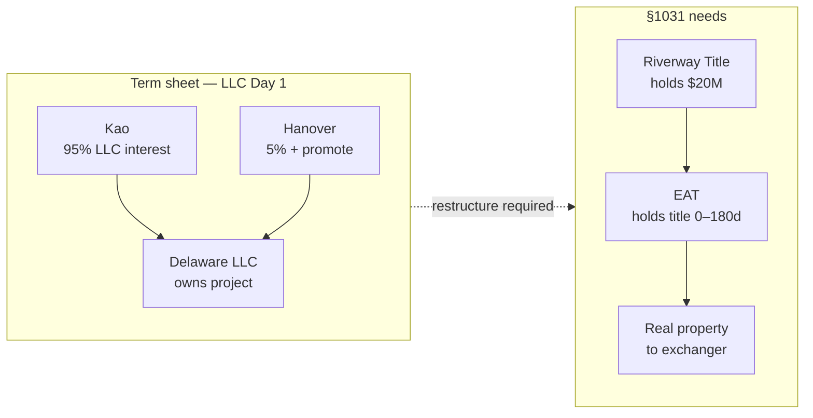
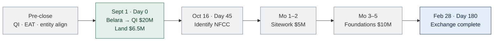
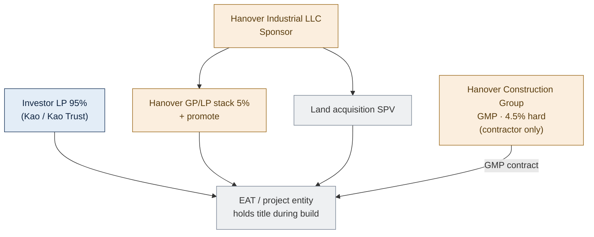
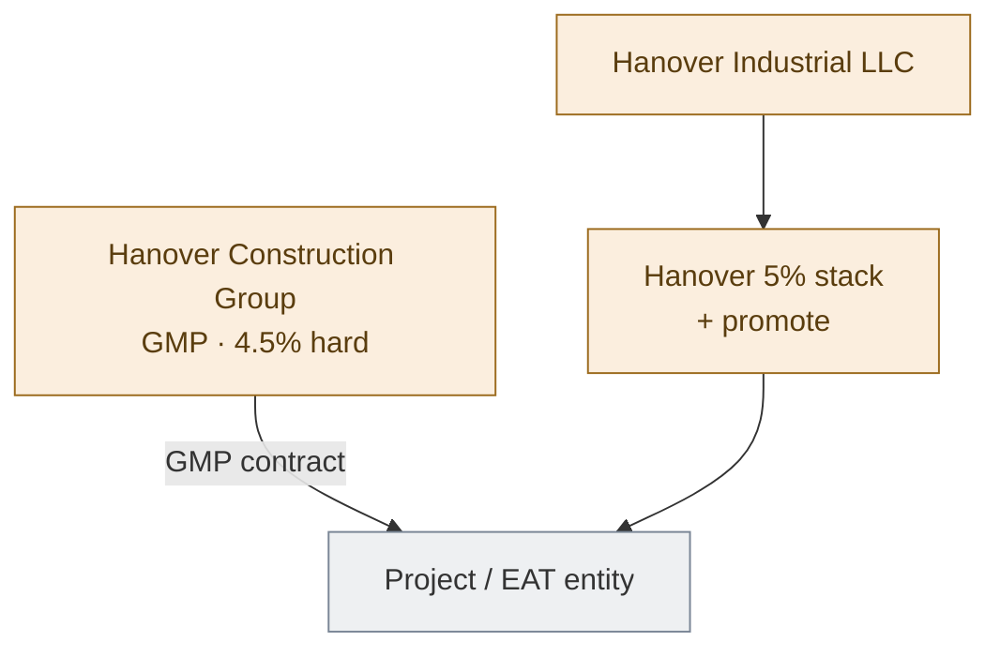
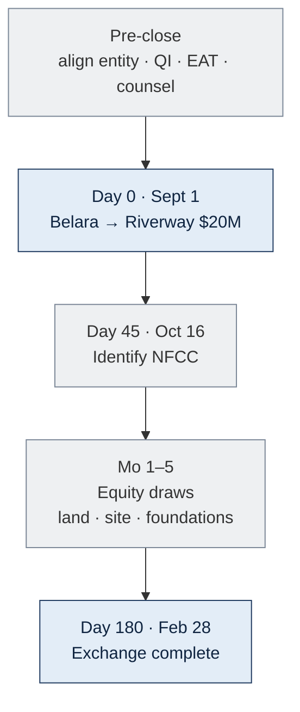

<!-- TAB:overview -->

> **Internal working model only** — not legal advice, not client-facing. No structure is locked; obtain §1031 counsel opinion before Belara closes.

## The deal

Sell **Belara Apartments** ($20M, no debt) and defer gain by reinvesting into **North Forsyth Commerce Center** — ≈$50.3M ground-up industrial (≈327,600 SF, Forsyth County GA) with **Hanover Industrial LLC** as developer.

| | |
|---|---|
| **Belara seller (today)** | Titan Management — **must align with exchanger** (prefer **Kao Management Trust**) |
| **Belara buyer** | Strake Jesuit |
| **Commercial LP (term sheet)** | Kao Management Trust — 95% economics |
| **Developer** | Hanover Industrial LLC |
| **Land** | $6.5M · third-party seller · **under PSA** · unaffiliated |
| **Project cost** | ≈$50.3M · construction loan **≈60% LTC** |
| **QI** | **Riverway Title** |
| **EAT** | TBD |
| **Model Day 0** | **Sept 1, 2026** (Belara + land aligned) |
| **Clocks** | Day 45 ≈ Oct 16 · Day 180 ≈ Feb 28, 2027 |

## Commercial term sheet (unsigned — economics to preserve)

| Item | Term |
|---|---|
| Equity | **95% / 5%** |
| Promote | **20 / 30 / 40%** over **10 / 14 / 18%** IRR |
| Dev fee | **4%** · GC **4.5%** of hard ($300K GMP advance) |
| Overruns | **100% controllable** → Sponsor · **shared** → pro rata |
| Guaranties | Sponsor → lender + JV |
| Close intent | **Simultaneous:** JV + GMP + loan + land + permit |

Hanover has **not signed**. We will submit a **restructured term sheet** — same dollars, different legal sequencing for §1031.

## Why the term sheet LLC (Day 1) conflicts with §1031

The term sheet gives Kao a **95% LLC membership interest** at closing. Post-TCJA, §1031 applies only to **real property** — a partnership/LLC interest is **not** like-kind ([IRC §1031(a)(1)](https://www.law.cornell.edu/uscode/text/26/1031), [Reg. §1.1031(a)-3](https://www.law.cornell.edu/cfr/text/26/1.1031(a)-3)). A ground-up build also requires **QI + EAT** parking — not in the term sheet's simultaneous JV close.

## Structure paths — compared (none locked)

| Path | What it is | Exchange (draft view) | Hanover gets equity |
|---|---|---|---|
| **A. Term sheet LLC** | JV Day 1 as written | **Fails** — LLC interest | Day 1 |
| **B. TIC + EAT** | Direct co-ownership at Day 180; promote as fee | Uncertain — counsel | Day 180 |
| **C. Exchange then §721** | 100% fee to Kao, then JV after seasoning | MLTN at best | After 12–24+ mo |
| **D. 100% + fee** | Kao owns forever; promote as incentive fee | Strongest exchange | Never (fee) |

**Our stance:** Whatever works — pick with counsel, not by label.

## Timeline & exchange equity draw

**Day 0 = Belara close** (clocks start). Model: **Sept 1, 2026**.

| Draw (exchange equity first) | Timing | $ | Running total |
|---|---|---|---|
| Land | Day 0 | 6.5M | 6.5M |
| Sitework | Months 1–2 | 5M | 11.5M |
| Foundations | Months 3–5 | 10M | **21.5M** |

Full build ≈**11 months**. ≈$20M §1031 target is met by ≈month 5 on this schedule if work is **in place, paid through QI/EAT, and documented** at Day 180. Remaining ≈$30M of project → construction loan (+ structure-dependent Hanover role).

## Hanover entity map (roles — names TBD at formation)

Pattern from Hanover's example deals + term sheet. **Hanover Construction Group** is the **GMP contractor** — not a JV equity holder on this chart.

## Key terms (short)

| Term | Meaning |
|---|---|
| **QI** | **Riverway Title** — holds $20M; Kao never touches proceeds |
| **EAT** | Holds title during build (up to 180 days) — provider TBD |
| **Boot** | Taxable if less than ≈$20M qualifying value in place by Day 180 |
| **Like-kind** | Real property only — not LLC/partnership interests |
| **Same taxpayer** | Belara seller = replacement recipient (resolve Titan vs Kao Trust) |

## Open before Belara PSA

1. **Exchangor entity** — align Titan Management → **Kao Management Trust** (preferred)  
2. **Structure path** — B, C, or D above — counsel review  
3. **EAT** provider · lender approval of chosen structure  
4. **Belara PSA** — QI/escrow language (Riverway Title)

<!-- TAB:strake -->

## Your Role

You are the **buyer of Belara only**. You are not involved in the replacement property, the 1031 structure, or Hanover's development.

## What You Do

- **Close on the agreed date.** Funds go through escrow to **Riverway Title** (Qualified Intermediary) — not to the seller directly. Required for the §1031 exchange.
- **Coordinate logistics** with Kao and the QI on closing date, escrow instructions, and title.
- **Complete your diligence** — title, survey, environmental, and any institutional/gift-acceptance requirements on your side.

## What You Do Not Do

- North Forsyth, TIC, EAT, or construction loan
- Hanover joint venture or development
- Any 1031 exchange filings

> Gift-acceptance or other Georgia institutional items are your own legal concerns, separate from the exchange.

**Sources:** [Treas. Reg. §1.1031(k)-1](https://www.law.cornell.edu/cfr/text/26/1.1031(k)-1) · [IRS Like-Kind Exchanges](https://www.irs.gov/businesses/small-businesses-self-employed/like-kind-exchanges-real-estate-tax-tips)

<!-- TAB:hanover -->

## Your role

**Hanover Industrial LLC** is Sponsor — developer, guarantor, and **5% + promote** economics per the unsigned term sheet. **Legal structure is not locked** (LLC Day 1, TIC, or phased JV — TBD with counsel). **Commercial terms** (fees, promote, guaranties) are what we aim to preserve in a restructured deal.

## Hanover entities (roles)

| Entity | Role |
|---|---|
| **Hanover Industrial LLC** | Term-sheet Sponsor; signs development / JV docs |
| **Land acquisition SPV** | Acquires land (example: HCI DP Land Acquisition LLC) |
| **Investor LP (95%)** | Kao / Kao Management Trust side |
| **Hanover GP/LP + capital** | 5% + promote stack |
| **Hanover Construction Group** | **GMP contractor only** — 4.5% of hard costs, $300K advance, 5% contingency. **Not a JV equity holder** on the org chart; contracts with project entity / EAT |

## Commercial terms (term sheet — unsigned)

| Item | Term |
|---|---|
| Equity | 5% (95% Kao) |
| Promote | 20/30/40 @ 10/14/18 IRR |
| Dev fee | 4% |
| GC / GMP | 4.5% hard · $300K advance |
| Overruns | 100% controllable → Sponsor |
| Guaranties | Lender + JV completion / overrun |

## What changes for §1031

| Term sheet | Likely restructure |
|---|---|
| LLC JV Day 1 | Phased — real property / EAT first, JV or co-ownership later |
| Simultaneous close | Land + build via **QI/EAT**; equity/promote timing TBD |
| Promote inside LLC | May move to **fee** or **Phase-2 partnership** — counsel |

**Your dollars stay the same in intent** — legal sequencing and documents change.

## What you do (commercial)

- Development management (4%) · GMP/GC (4.5%) · loan guaranties · fund controllable overruns  
- Negotiate restructured term sheet once our family and counsel pick a legal path  

**Sources:** Term sheet 06.12.2026 · `docs/incoming/Hanover-Org-Chart-Example-Project.pdf`

<!-- TAB:kao -->

## Your role

**Exchangor** — sell Belara, reinvest ≈$20M into North Forsyth, defer gain. Runs on **45-day** and **180-day** clocks from Belara close.

| Item | Detail |
|---|---|
| **Belara seller today** | **Titan Management** |
| **Preferred exchanger** | **Kao Management Trust** — align before PSA |
| **QI** | **Riverway Title** — never touch proceeds |
| **Model Day 0** | **Sept 1, 2026** |
| **Structure** | **Not locked** — counsel picks path |

## Exchange equity draw (your model)

| Phase | $ | Cumulative |
|---|---|---|
| Land (Day 0) | 6.5M | 6.5M |
| Sitework (mo 1–2) | 5M | 11.5M |
| Foundations (mo 3–5) | 10M | **21.5M** |

Exchange equity funds **first**. ≈$20M target met by ≈month 5 if in-place and documented at Day 180.

## Critical rules

- **Same taxpayer** from Belara sale through replacement — resolve Titan vs Kao Trust **before PSA**
- **Never touch proceeds** — constructive receipt kills the exchange
- **No debt on Belara** — no mortgage boot
- Identify NFCC in writing by Day 45; complete exchange by Day 180
- File **Form 8824**; boot on any documented shortfall below ≈$20M in-place

## Before Belara closes

- [ ] Lock **exchangor entity** (Kao Trust preferred)  
- [ ] Engage **Riverway Title**; select **EAT**  
- [ ] §1031 counsel + CPA; pick structure path (Overview tab)  
- [ ] Draft Belara PSA with QI/escrow language  

**Sources:** [IRC §1031](https://www.law.cornell.edu/uscode/text/26/1031) · [Reg. §1.1031(k)-1](https://www.law.cornell.edu/cfr/text/26/1.1031(k)-1) · [Rev. Proc. 2000-37](https://www.irs.gov/pub/irs-drop/rp-00-37.pdf)

<!-- TAB:references -->

## Statute and IRS Guidance

- [IRC §1031 — Like-kind exchanges (real property only)](https://www.law.cornell.edu/uscode/text/26/1031)
- [Treas. Reg. §1.1031(a)-3 — Real property; partnership interest excluded](https://www.law.cornell.edu/cfr/text/26/1.1031(a)-3)
- [Treas. Reg. §1.1031(k)-1 — QI safe harbor](https://www.law.cornell.edu/cfr/text/26/1.1031(k)-1)
- [Treas. Reg. §301.7701-3 — Disregarded entity](https://www.law.cornell.edu/cfr/text/26/301.7701-3)
- [Form 8824](https://www.irs.gov/forms-pubs/about-form-8824)

## Build-to-suit and co-ownership

- [Rev. Proc. 2000-37 — EAT / build-to-suit](https://www.irs.gov/pub/irs-drop/rp-00-37.pdf)
- [Rev. Proc. 2002-22 — TIC guidance (not a safe harbor)](https://www.irs.gov/pub/irs-drop/rp-02-22.pdf)
- [IRC §721 — Contribution to partnership](https://www.law.cornell.edu/uscode/text/26/721)

## Case law

- *Gluck v. Commissioner*, T.C. Memo. 2020-66 — LLC interest / exchange issues

## Disclaimer

Internal working model only — not legal or tax advice. No structure on this site is locked or counsel-approved. Obtain a written §1031 opinion before Belara closes.
