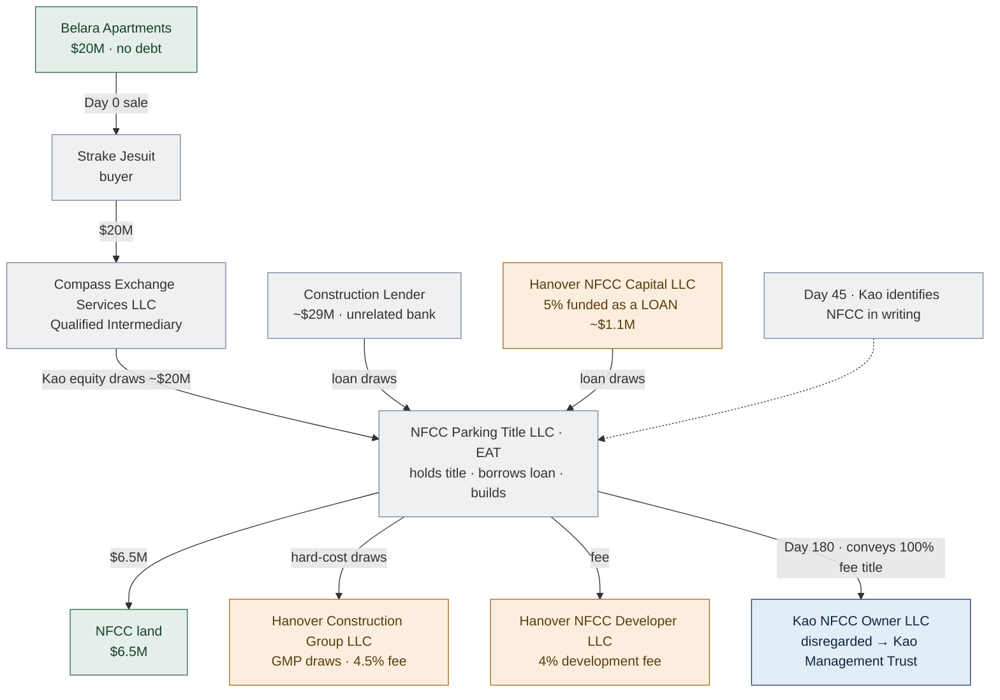
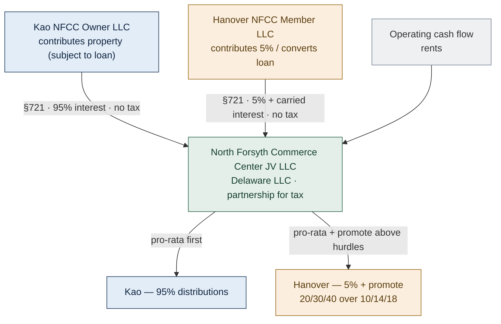

<!-- TAB:overview -->

> **Privileged & Confidential — Attorney Work Product.** Illustrative diagrams and planning content. Not legal or tax advice and not a covered opinion. A written §1031 opinion should be rendered on the executed transaction documents before Belara closes. Entity names are placeholders. Figures are rounded planning numbers, not verified deal terms.

**One-sentence thesis:** Kao exchanges Belara into **100% direct ownership** of North Forsyth, then — **after a genuine seasoning period** — the parties form the promoted Hanover joint venture by a tax-free **§721** contribution, delivering the term-sheet economics to both sides while keeping the exchange defensible.

> **How strong is this position?** Honestly: **more likely than not (MLTN)**, not "clean" and not automatic. The §721 step is supported by *Magneson* and *Bolker*, but those are pre-1984, Ninth Circuit cases with real limitations (see the Structure tab), and the IRS can attack the two phases under the **step-transaction doctrine**. The position **strengthens toward "should"** as seasoning lengthens and the combination is supported by an independent business purpose. If the parties want the strongest possible exchange, **Structure B** (Kao 100% forever + an ordinary-income incentive fee) is the safer trade. This document keeps **A primary** as an informed choice, but presents both honestly.

---

## Facts & Assumptions (the numbers used throughout)

| Item | Value | Notes |
|---|---|---|
| Relinquished property | **Belara Apartments**, Houston, TX | Multifamily; held for investment |
| Belara sale price | **~$20.0M** | Stated **no debt** (no mortgage boot) |
| Belara buyer | **Strake Jesuit** | Relinquished side only; not part of the replacement structure |
| Replacement property | **North Forsyth Commerce Center** | ~**327,600 SF** ground-up industrial, Forsyth County (Cumming), GA |
| Total project cost | **~$50.3M** | Land + improvements |
| Land cost | **$6.5M** | Acquired by the EAT |
| Improvements budget | **~$43.8M** | Built during/after the exchange window |
| Construction loan | **~$29M** | Third-party (unrelated) lender; Hanover guaranties |
| Equity / capital | **~$21.3M** | **Kao ≈ $20.2M** (the exchange equity). **Hanover ≈ $1.1M is funded in Phase 1 as a *secured, interest-bearing loan*, not equity** — it converts to a 5% interest via §721 only in Phase 2 |
| Hanover development fee | **4%** | FMV service fee (not profit-linked); standalone DMA |
| Hanover GC fee | **4.5% of hard costs** | Cost-based, via GMP/GC contract |
| Hanover promote | **20% / 30% / 40%** over **10% / 14% / 18%** IRR | Carried interest; lives **only** in the Phase-2 partnership |
| §1031 clocks | **45-day** ID, **180-day** completion | Completion = earlier of 180 days or the extended return due date — **extend the 2026 return** |
| **Day-180 reinvestment target** | **~$20.0M = $6.5M land + ~$13.5M of *completed* improvements** | Only improvements physically **in place** by Day 180 count. Stored materials, prepaid contracts, deposits, and post-transfer work do **not** count toward the exchange |
| **Seasoning clock** | Runs from the **EAT→Kao deed date**, not Day 0 | Working floor: later of **12 months after the deed** *and* substantial completion; ~**24 months + lease-up/refi** for a path to "should" |

**Stated assumptions (confirm before closing):** Belara was held for investment (not primarily for sale) and is debt-free at closing; Kao has never owned North Forsyth; the QI, the EAT, the land seller, and the construction lender are all unrelated to Kao and Hanover (disqualified-person/independence tested); and the figures above are accurate. **These are assumptions, not verified facts** — see Open Items.

---

## Overview — The deal in one screen

| $20.0M | ~$50.3M | 95 / 5 | ~$29M |
|---|---|---|---|
| Belara sale (no debt) → deferred | North Forsyth project cost | Kao / Hanover economics | Construction loan |

**Why this works where the term sheet failed.** A promote cannot live inside the vehicle Kao receives in the exchange. A profit share turns a co-ownership into a partnership, and a partnership interest is **not** "real property" — §1031 now applies **only to real property** (§1031(a)(1)), and Reg. §1.1031(a)-3 confirms a partnership interest does not qualify — so the exchange would fail. Structure A keeps the promote **out** of the exchange: Kao receives **100% real property**, then — **after the exchange has seasoned** — the parties form the promoted JV, inside a partnership where a promote is perfectly legal and keeps capital-gain treatment.

**Two phases:**

1. **Phase 1 — The Exchange (Days 0–180).** Belara proceeds park with a Qualified Intermediary (QI). An Exchange Accommodation Titleholder (EAT) takes title to North Forsyth, borrows the construction loan, and builds. By Day 180 the EAT deeds **100% fee title** to Kao's single-member LLC. The exchange completes against direct real estate, so there is no partnership to recharacterize **on the entity-classification axis**.
2. **Phase 2 — The JV (after genuine seasoning).** Once the exchange has **seasoned** (see the Seasoning tab), Kao contributes the property to a new operating partnership ("PropCo JV") under **§721** (tax-free). Hanover converts its loan into a 5% interest and takes the promote. The JV carries the full term sheet: 95/5, the 20/30/40 promote, the 4% and 4.5% fees, and the guaranties.

> **The honest residual risk.** Even with a clean single-owner Phase 1, the IRS can argue the two phases were always **one integrated plan** and collapse them under the **step-transaction doctrine** — taxing Kao as if it had acquired a partnership interest from the start. That is why the seasoning gap, the absence of any binding contribution obligation, and an independent business purpose are not "nice to have" — they are what moves the opinion from "fails" to **MLTN** and, with enough time, toward "should." This is a **conditional** structure, not a clean one.

**What changed from the old GitHub diagrams:** no development-TIC, no partition waiver, and no "promote-as-fee." Those were the three high-risk positions. Here the replacement is taken as 100% fee ownership, and the promote is delivered through a partnership formed **after** a seasoned exchange.

<!-- TAB:structure -->

## Structure A — How it works, and why it survives §1031

### The core trade-off (state it plainly)
You **cannot** put a true tenancy-in-common and an enforceable promote in the same vehicle at the same time. A clean TIC (what §1031 needs) requires pro-rata economics and bars any fee tied to income or profits (Rev. Proc. 2002-22 §§6.08, 6.11, 6.12, 6.15). A promote is, by definition, a profit share. Force both into one vehicle and the IRS recharacterizes it as a partnership, which means Kao received a partnership interest, not real property, and the exchange fails. The fix is to **separate them in time**: clean real-property acquisition first, promoted partnership second.

### Why Phase 1 is strong on entity classification
Kao receives **100% fee title** in the exchange, so on the **entity-classification** axis there is nothing to attack: a single owner cannot be a partnership, and Rev. Proc. 2002-22 never comes into play. (This is necessary but **not sufficient** — see step-transaction, below.) A partnership interest is not "real property" for §1031 (post-TCJA, §1031(a)(1) limits like-kind exchanges to **real property**, and **Reg. §1.1031(a)-3** defines real property so as to exclude a partnership interest), so taking 100% real property — rather than an interest in a co-ownership the IRS could recast as a partnership — is the whole point.

### Why a later §721 contribution *can* be respected — and the limits of the case law
The leading authorities are **Magneson v. Commissioner** (81 T.C. 767 (1983), aff'd 753 F.2d 1490 (9th Cir. 1985)) and **Bolker v. Commissioner** (81 T.C. 782 (1983), aff'd 760 F.2d 1039 (9th Cir. 1985)). They support the idea that continuing an investment (rather than cashing out) can satisfy §1031's "held for" requirement notwithstanding a planned subsequent transaction.

**Read them honestly — do not overstate them:**
- **They are old and circuit-limited.** Both are **pre-1984** decisions from the **Ninth Circuit**. Georgia sits in the **Eleventh Circuit**, which is not bound by them; there is no on-point Eleventh Circuit or Supreme Court holding blessing this exact fact pattern.
- **Bolker is *not* a §721 case.** *Bolker* involved a **liquidating distribution** of property to a sole shareholder who then exchanged it — it speaks to "held for productive use/investment," not to a §721 partnership contribution following a build-to-suit exchange. Citing it as direct §721 authority overstates it.
- **Magneson involved an immediate, modest, general-partnership rollover**, not a leveraged ground-up build parked with an EAT and then dropped into a promoted LLC. The economics and timing here are materially more aggressive.
- **The IRS does not concede the point.** It can argue the "held for" test is failed where the taxpayer's pre-existing plan was always to land in the partnership, or it can deploy the **step-transaction doctrine** (below) to treat Kao as having acquired a partnership interest from the outset — which is **not** like-kind.

### The real residual risk: step-transaction
The genuine exposure is not entity classification in Phase 1; it is whether the IRS **collapses Phase 1 and Phase 2** into a single integrated acquisition of a partnership interest. Courts apply three tests — the **binding-commitment**, **mutual-interdependence**, and **end-result** tests — and any one can sink the structure if the phases look pre-wired. Structure A manages (does not eliminate) this risk through: **no binding contribution obligation** at the exchange; a **genuine seasoning gap** measured from the deed date; **Kao operating as 100% owner** in the interim with real benefits and burdens; a **documented independent business purpose** for combining later; and avoidance of a **§707 disguised sale**. With these, the position is realistically **MLTN**, improving toward "should" as seasoning lengthens.

### Scorecard (Structure A vs. the alternatives)

| Criterion | Term sheet (as drafted) | **Structure A (recommended)** | Structure B (fallback) |
|---|---|---|---|
| Does the §1031 exchange survive? | **No — fails** | **MLTN; → "should" with seasoning** | **Yes — strongest** |
| Kao economic position | 95% | ~100% in Phase 1, 95% after Phase 2 | ~100% less incentive fee (≈95%) |
| Hanover economics (pre-tax) | 5% + promote + fees | Same | Same |
| Hanover promote tax character | Capital gain (carry) | **Capital gain (carry)** | **Ordinary fee (gross-up)** |
| Hanover is a legal owner? | Yes | Yes (after Phase 2 only) | No (contractual only) |
| Main residual risk | Exchange fails outright | **Step-transaction / "held for"** | Disguised equity (low) |
| Opinion level (realistic) | N/A (fails) | **MLTN → should** (seasoning-dependent) | **Should** (the strongest available here) |
| Complexity | Low | Medium–High | Low |

<!-- TAB:bigpicture -->

## The Big Picture

Legend: **Kao = blue**, **Hanover = amber**, **neutral/third party = grey**, **asset/JV = green**.

Read it left-to-right in time: a clean real-property acquisition first, a normal promoted partnership second. The **seasoning gap** between them is what keeps the IRS from collapsing the two steps.

<!-- TAB:phase1 -->

## Phase 1 — The Exchange (Days 0–180)

Every dollar and the title movement during the build-to-suit window. Kao never touches the proceeds; the EAT is the borrower and builder; Kao receives **100%** at the end.

### The build-to-suit math (the hard constraint)
To defer the full ~$20M of Belara gain, Kao must reinvest ~$20M in **completed real property by Day 180**:

| Component | Amount | Counts toward the exchange? |
|---|---|---|
| Land (acquired by the EAT) | **$6.5M** | ✅ Yes — real property in place |
| **Completed improvements physically in place by Day 180** | **~$13.5M** | ✅ Yes — only the portion actually constructed |
| Stored materials, deposits, prepaid contracts, off-site fabrication | — | ❌ **No** |
| Work performed **after** the EAT→Kao transfer | — | ❌ **No** |
| **Day-180 reinvestment target** | **~$20.0M** | This is the number that must be *built and in place* |

For a ~$50.3M ground-up project, getting **$13.5M of verifiable, in-place improvements** on top of the land within 180 days is the central feasibility risk. **Any shortfall is boot, taxed in 2026.**

**Three clocks and a real cushion.**
- **Day 45:** identify North Forsyth in writing **and** identify a **backup replacement** (a finished asset or a **DST interest**) — the DST should be identified within the 45 days and be **closable within 180 days** if the build lags.
- **Day 180:** the EAT must convey by Day 180 **or the extended return due date, whichever is earlier — so extend the 2026 return.**
- **Valuation:** commission a **Day-180 cost-to-complete / in-place valuation** so the amount actually reinvested is documented (see the Money Flow tab for the boot schedule).

### Equity exhaustion (what funds the rest of the build)
Kao's ~$20M is fully deployed into land + the first ~$13.5M of improvements **before** Day 180. **Everything after that — the remaining ~$30M of the $50.3M project — is funded by the construction loan (~$29M) and Hanover's ~$1.1M, both as DEBT with guaranties, never as equity contributed by Hanover.** Treating any of that remaining funding as Hanover *equity* in Phase 1 would create the partnership the exchange cannot have. Keep the capital stack during Phase 1 strictly: **Kao equity (exchanged) + third-party construction loan + Hanover secured loan.**

**Who does what in Phase 1**
- **Kao** sells through the QI and never controls the cash. Forms `Kao NFCC Owner LLC` (disregarded SMLLC; sole member = the exact Belara seller) to receive **100% title**.
- **The EAT** (`NFCC Parking Title LLC`) is the legal owner / borrower / builder during parking under **Rev. Proc. 2000-37**. It must be **independent** (not a disqualified person as to Kao or Hanover), **bankruptcy-remote**, party to a written **QEAA**, and there must be **no agency language** making it Kao's agent.
- **Hanover** builds under a **standalone FMV Development Management Agreement (4%)** and a **GMP/GC contract (4.5%)**, and gives the loan guaranties. Its 5% goes in **now as a secured, interest-bearing loan** (note + collateral), converting to equity only in Phase 2. Hanover is **not on title** during the exchange.

### Phase-1 mechanics to nail down (with counsel)
- **QI and EAT independence:** confirm neither is a **disqualified person** (Reg. §1.1031(k)-1(k)); document independence.
- **QEAA + timeline (Rev. Proc. 2000-37 discipline):** a **written QEAA executed within 5 business days** of the EAT taking title; the EAT must hold **"qualified indicia of ownership"** (legal title or equivalent) throughout; identify the relinquished property within **45 days** of the EAT acquiring the parked property; and the **combined parking period must not exceed 180 days**. Keep the parking clock and the exchange clock reconciled.
- **Lender consent (twice):** written consent to lend to the **EAT**, and consent to the **later transfer** to Kao and to the **Phase-2 JV** — addressing **due-on-sale** and any change-of-control triggers.
- **Title:** EAT-to-Kao deed chain, owner's policy and **endorsements**, and recording handled by **Georgia counsel**.
- **Guaranty routing:** Hanover's guaranties and Kao's collateralized indemnity documented so the at-risk party is protected without creating equity.
- **EAT bankruptcy-remoteness** and clean separateness covenants.

<!-- TAB:phase2 -->

## Phase 2 — The Joint Venture (§721, after seasoning)

Once the exchange has closed and seasoned, the parties form the real JV. Both contributions are tax-free under §721, and the promote now sits where it belongs.

**The guardrails that make Phase 2 safe** (see the Legal Rationale appendix for detail):
- **No binding obligation at the exchange.** Do not sign a contribution agreement before the exchange completes; use a **non-binding LOI** only — **no fixed-price equity option** in Hanover's favor.
- **Season the gap.** Let real time pass; avoid same-closing mechanics. No bright-line period; longer and more genuine is safer.
- **Operate as owner in the interim.** Kao holds and operates as 100% owner, bearing real benefits and burdens.
- **Document an independent business purpose** for combining later (e.g., completion and lease-up milestones).
- **Watch the §707 disguised-sale rule.** Hanover cash in plus a Kao distribution out within ~2 years can be recharacterized as a sale. Sequence carefully.

<!-- TAB:seasoning -->

## Seasoning — the clock that makes or breaks Structure A

Seasoning is the single most important variable in this structure. It is the real time, real ownership, and real risk-bearing that sits between the exchange and the §721 contribution and defeats a step-transaction argument. **There is no statutory safe-harbor period** — longer and more genuine is always safer.

### When the clock starts (this is commonly gotten wrong)
The seasoning clock runs from the **date the EAT deeds the property to Kao** (the completion of the exchange), **not from Day 0** of the exchange. The 180-day parking period is *part of the exchange*, not part of seasoning. Starting the count at Day 0 to claim "six months seasoned at Day 180" is exactly the kind of pre-wiring the IRS looks for.

### Working thresholds (planning targets, confirm with opinion counsel)

| Target | Threshold | Rationale |
|---|---|---|
| **Absolute floor** | The **later of** (a) **12 months** after the EAT→Kao deed **and** (b) **substantial completion** of the building | A full tax year of genuine ownership across two returns; nothing contributed while still mid-construction |
| **Comfort / path to "should"** | ~**24 months** after the deed, **plus** meaningful **lease-up** and/or a **refinance** of the construction loan | Demonstrates Kao held and operated as a real owner, bearing benefits and burdens, before any combination |
| **Hard "don'ts"** | No same-closing mechanics; no contribution while the building is incomplete; no contribution dated off a pre-signed plan | Each is a step-transaction red flag |

### What "operating as owner" must actually look like during the gap
- Kao (through its disregarded SMLLC) holds **100% fee title** and is the named owner on title, the loan, leases, and insurance.
- Kao bears the **economic benefits and burdens**: it funds shortfalls (via debt, not Hanover equity), receives net cash flow, and takes depreciation.
- **No binding obligation to contribute** exists. Any forward understanding is a **non-binding LOI** with a **non-binding** JV term sheet attached — never a signed contribution agreement, and never a fixed-price equity option in Hanover's favor.
- An **independent business purpose** for combining later is documented in real time (e.g., completion and lease-up de-risking, refinancing, bringing in the operating/development partner once the asset is stabilized).

> **Bottom line:** the longer the gap and the more genuinely Kao behaves as the 100% owner, the closer the opinion moves to "should." A short or mechanical gap pushes it back toward "fails." Do not let construction or financing pressure compress the gap.

<!-- TAB:neutrality -->

## Neutrality & Hanover Protection — making Phase 1 stand on its own

The hostile review's central critique: it is **not** neutral to let Hanover do all the building and funding in Phase 1 on a handshake that it will get its ownership and promote in Phase 2. If Hanover's Phase-1 role looks like disguised equity or a pre-wired partnership, the step-transaction argument gets much stronger. The fix is to make **every Phase-1 relationship a standalone, arm's-length, market commercial contract** that would make sense even if Phase 2 never happened — and to protect Hanover with real creditor and contractual remedies instead of an unenforceable promise.

**The five-part fix (all of these, together):**

1. **Standalone market Phase-1 contracts.** Hanover's development role is a **Development Management Agreement at a market 4% fee**; its construction role is a **GMP/GC contract at a market 4.5%** of hard costs; both include normal **reimbursement, lien rights, and default remedies**. These are priced and documented as if to a third party — not as consideration for future equity.

2. **Hanover's 5% goes in as a true secured LOAN — bearing interest — *not* a "preferred return."** In Phase 1 Hanover funds ~$1.1M as **debt** (`Hanover NFCC Capital LLC`), evidenced by a **promissory note at a market interest rate**, **secured** (e.g., subordinate lien / pledge), with stated maturity and default remedies. Call it a **loan with interest**, never a "preferred return" (preferred return is equity language and undercuts the debt characterization). The loan **converts to a 5% interest via §721 in Phase 2.**

3. **Kao guaranty-indemnity, backed by collateral/LC.** Because Hanover is providing loan guaranties and doing at-risk work before it owns anything, Kao gives Hanover a **guaranty/indemnity for Hanover's Phase-1 exposure**, and that indemnity is **collateralized** (pledged collateral or a **letter of credit**) so it is a real, fundable obligation — not a bare promise.

4. **Fixed / cost-based termination fee if Kao walks — *not* promote-mirroring.** If Kao declines to proceed to Phase 2, Hanover is made whole through a **fixed or cost-based break/termination fee** (its documented costs, fees earned, and a reasonable margin). It must **not** be a payment that replicates the promote/IRR waterfall — a promote-mirroring "walk-away" payment would itself look like disguised equity and re-import the very profit-linkage Structure A is built to avoid.

5. **LOI expressly non-binding; no fixed-price equity option.** Any Phase-2 understanding is a **non-binding LOI** (with a non-binding JV term sheet attached). Hanover gets **no enforceable right to acquire equity at a fixed price**, and Kao has **no binding obligation to contribute**. The parties' protection comes from the commercial contracts and the secured loan above — not from a pre-signed partnership.

> **Why this matters for the opinion:** done this way, Phase 1 is economically coherent on its own (market fees + a secured, interest-bearing loan + collateralized indemnity), Hanover is genuinely protected as a **contractor and creditor**, and there is no binding commitment that lets the IRS argue the partnership existed from Day 0. This is what keeps "neutrality via commercial leverage" honest.

<!-- TAB:entities -->

## Entities — who they are, their type, and how they're taxed

> Names are illustrative placeholders; swap in the real entities. The **pattern** is what matters.

| Entity | Color | Type | Owned by | Role | Tax status |
|---|---|---|---|---|---|
| **Kao Management Trust** | Kao | Family / grantor trust | Kao family | The exchanger and ultimate taxpayer | Pass-through to the Kao family |
| **Belara Holdings LLC** | Kao | TX single-member LLC | Kao Management Trust | Holds & sells Belara | Disregarded |
| **Kao NFCC Owner LLC** | Kao | DE single-member LLC | Kao Management Trust | Receives 100% replacement (Phase 1); becomes 95% JV member (Phase 2) | Disregarded → partner |
| **Strake Jesuit** | Neutral | Institution | — | Buyer of Belara only | n/a to the exchange |
| **Compass Exchange Services LLC** | Neutral | Qualified Intermediary | Independent QI firm | Holds proceeds; runs the safe harbor | Unrelated; not a tax party |
| **NFCC Parking Title LLC** | Neutral | Single-member LLC (EAT) | EAT provider (unrelated) | Parks title, borrows the loan, builds | Beneficial owner under Rev. Proc. 2000-37 |
| **Construction Lender** | Neutral | Bank | — | ~$29M construction loan | Unrelated / arm's length |
| **NFCC Land Seller** | Neutral | LLC | **Unrelated third party (recommended)** | Sells land to the EAT | Arm's length; Kao never owned it (Rev. Proc. 2004-51). **Must verify non-affiliation** — if ever a Hanover affiliate, §1031(f) related-party rules and Rev. Proc. 2004-51 must be re-analyzed |
| **The Hanover Company** | Hanover | Corporation / parent | Hanover principals | Sponsor parent | — |
| **Hanover NFCC Developer LLC** | Hanover | LLC | The Hanover Company | Development manager (4% fee) | Ordinary fee income |
| **Hanover Construction Group LLC** | Hanover | LLC | The Hanover Company | GC under the GMP (4.5% of hard costs) | Ordinary fee income |
| **Hanover NFCC Capital LLC** | Hanover | LLC | The Hanover Company | Phase 1: funds the 5% as a **secured, interest-bearing loan** (note + collateral) — **not** a "preferred return" | Lender (interest income); converts via §721 in Phase 2 |
| **Hanover NFCC Member LLC** | Hanover | LLC | The Hanover Company | Phase 2: 5% member + promote holder | Partner; promote = carried interest (capital gain, §1061) |
| **North Forsyth Commerce Center JV LLC** | Asset/JV | DE LLC, partnership for tax | Kao NFCC Owner (95%) + Hanover NFCC Member (5%) | The operating joint venture (Phase 2) | Partnership (pass-through) |

<!-- TAB:moneyflow -->

## Money Flow — every dollar

### Phase 1 — funding the build

| From | To | Amount | Purpose |
|---|---|---|---|
| Strake Jesuit | Compass Exchange Services (QI) | $20.0M | Belara sale proceeds (parked) |
| QI | EAT | ~$20.0M | Kao's exchange equity (Kao owns **100%** in Phase 1), drawn for land + construction |
| Construction Lender | EAT | up to ~$29M | Construction loan draws (debt; Hanover guaranties) |
| Hanover NFCC Capital LLC | EAT | ~$1.1M | The 5%, funded as a **secured, interest-bearing loan** (note + collateral) — **not** equity, **not** a "preferred return" |
| EAT | NFCC Land Seller (unrelated 3rd party) | $6.5M | Land purchase |
| EAT | Hanover Construction Group | hard-cost draws | GMP construction (4.5% GC fee inside) |
| EAT | Hanover NFCC Developer | 4% of cost | Development fee (standalone DMA) |
| EAT | Kao NFCC Owner LLC | 100% title | Day 180 conveyance (no cash — deed) |

> **Equity exhaustion / capital stack discipline.** Kao's ~$20M exchange equity funds **land + the first ~$13.5M of completed improvements** by Day 180. The remaining ~$30M of the $50.3M project is funded **only** by the **construction loan (~$29M)** and **Hanover's ~$1.1M loan** — both **debt with guaranties**, never Hanover equity. No Hanover equity exists until the Phase-2 §721 conversion.

### Day-180 valuation & boot schedule

Boot is recognized in 2026 to the extent Kao does **not** reinvest the full ~$20M in real property **in place** by Day 180. Commission an independent **Day-180 in-place valuation** and reconcile:

| Line | Amount | Notes |
|---|---|---|
| Belara net proceeds to reinvest (target) | **~$20.0M** | Full deferral requires reinvesting all of it |
| Land in place | **$6.5M** | Counts |
| Completed improvements physically in place by Day 180 | **~$13.5M (goal)** | Only the constructed-and-in-place portion counts |
| **Total qualifying replacement value** | **= land + in-place improvements** | If **< $20.0M → the shortfall is boot** |
| **Boot (taxable in 2026)** | **= $20.0M − qualifying value** | Capital gain + unrecaptured §1250 on the shortfall (§1031(b)) |
| Mitigant | Backup **DST** interest | Identified ≤ Day 45, closable ≤ Day 180 to absorb any shortfall |

### Phase 2 — forming & running the JV

| From | To | Amount | Purpose |
|---|---|---|---|
| Kao NFCC Owner LLC | JV | property (≈95%) | §721 contribution (no tax); built-in gain tracked under §704(c) |
| Hanover NFCC Member LLC | JV | ~$1.1M loan converts | §721 conversion of the Phase-1 loan into a 5% interest + promote (watch §707 disguised-sale timing) |
| JV operations | Members | pro-rata 95/5 | Distributions per the operating agreement |
| JV (above hurdles) | Hanover | 20 / 30 / 40% | Promote over 10 / 14 / 18% IRR (carried interest) |
| JV | Construction Lender | debt service | Principal & interest |

<!-- TAB:tax -->

## Tax Treatment — event by event

Color key: **green = deferred / no tax**, **red = taxable now**, **amber = ordinary income / cost**.

| Event | Tax result | Notes & authority |
|---|---|---|
| Sale of Belara to Strake (Day 0) | 🟢 **Gain deferred** | §1031, if proceeds reinvested in like-kind real property; QI holds the cash |
| Depreciation recapture on Belara | 🟢 **Deferred** | Carryover basis rolls into the replacement (unrecaptured §1250 deferred) |
| EAT parks & builds (Days 0–180) | 🟢 **No tax event to Kao** | EAT is beneficial owner under Rev. Proc. 2000-37 |
| EAT conveys 100% to Kao NFCC Owner LLC (Day 180) | 🟢 **Completes exchange — no gain** | Same taxpayer via disregarded SMLLC (Reg. §301.7701-3) |
| Cash boot, or < ~$20M in place by Day 180 | 🔴 **Taxable in 2026** | §1031(b); capital gain + unrecaptured §1250 on the shortfall |
| Georgia transfer tax on the deed | 🟠 **Transfer tax due** | GA real-estate transfer tax (~$1 per $1,000); confirm intangibles tax on the security deed |
| §721 contribution to the JV (Phase 2) | 🟢 **Nonrecognition — but check overlays** | §721 nonrecognition of the contribution itself, **subject to the §707 (disguised sale) and §752 (liability shift) overlays below**, which can create current gain; built-in gain tracked to Kao under §704(c) (remedial method) |
| Liability shift on contribution (Hanover guaranties) | 🔴 **Possible gain** | §752(b): if Kao's share of the ~$29M debt drops below basis, the decrease is a deemed distribution → gain. **Model this** (Reg. §1.752-2) |
| Loan-to-equity conversion / cash near contribution | 🔴 **Possible deemed sale** | §707 disguised-sale 2-yr presumption (Reg. §1.707-3); sequence to avoid |
| Hanover development & GC fees (4% / 4.5%) | 🟠 **Ordinary income to Hanover** | Capitalized / deducted by the project |
| Hanover promote (carried interest) | 🟢 **Capital gain when realized** | Profits interest; §1061 requires > 3-year hold for long-term rates |
| Ongoing JV operations | 🟠 **Pass-through** | Kao 95% taxed at trust/beneficiary level; GA-source income (state filing) |
| Future sale of North Forsyth (no further exchange) | 🔴 **Deferred + new gain taxed** | §704(c) allocates the built-in Belara gain to Kao; or roll again under §1031 |

**The one tax decision.** Hanover's promote keeps capital-gain treatment **only** because it is a partnership profits interest (Phase 2). If you use the simpler "Kao 100% + fee developer" fallback (Structure B), the same dollars become an **ordinary-income** fee, which you would gross up to keep Hanover whole.

<!-- TAB:taxmechanics -->

## Tax Mechanics — the partnership questions the exchange overview skips

The §1031 analysis is necessary but not the whole story. The Phase-2 §721 contribution and the debt structure raise four partnership-tax issues that must be modeled before relying on this structure. Each can create **current gain** even if the exchange itself succeeds.

### §707 — disguised sale (the timing trap)
Contributing property to a partnership and receiving cash/relief from debt within a window can be recharacterized as a **taxable sale** rather than a tax-free §721 contribution.
- **The 2-year presumption (Reg. §1.707-3):** transfers between a partner and a partnership within **two years** of each other are **presumed** to be a sale; outside two years, presumed **not** a sale. The presumption is rebuttable but sets the planning baseline.
- **The live issue here:** how Hanover's **Phase-1 loan → Phase-2 equity** conversion is treated, and whether Kao's funding/distribution pattern around the contribution looks like a sale. If Hanover's cash effectively funds a distribution to Kao within two years, §707 can bite.
- **The conversion is not just a label.** "Hanover's loan converts via §721" hides real mechanics that need modeling: whether Hanover contributes the **note** (or cash) for its interest, how the JV's assumption/cancellation of the debt is treated, any **§108 cancellation-of-debt** consequences, and the resulting **basis** to each partner. Do not paper this as a one-line conversion — analyze it.
- **Plan:** sequence the loan conversion and any distributions to avoid a deemed sale; document non-sale intent; keep the seasoning gap long.

### §752 — liability shifts (this one can surprise Kao)
When Kao contributes the property subject to the ~$29M construction loan and Hanover (or its affiliates) **guarantees** that debt, the **allocation of partnership liabilities** shifts.
- A guaranty can make debt **recourse** to the guarantor and shift a share of liabilities **away from Kao** (Reg. §1.752-2). A decrease in Kao's share of partnership liabilities is treated as a **deemed cash distribution** to Kao under §752(b).
- **Consequence:** that deemed distribution can **exceed Kao's basis** and trigger **current gain** — potentially undoing part of the deferral the exchange achieved.
- **Plan:** model Kao's basis and liability share **before** finalizing who guarantees what; consider bottom-dollar/vertical-slice limits, a Kao guaranty of a sufficient slice, or debt-financed distribution planning so Kao's §752 share doesn't drop below basis.

### §704(c) — built-in gain (keeping Belara's deferred gain with Kao)
The property goes into the JV with a **built-in gain** (FMV over Kao's carryover basis). §704(c) requires that built-in gain be **allocated back to Kao** on later sale or depreciation.
- **Recommended method: "remedial."** It is generally the cleanest for keeping the deferred Belara gain with Kao and giving Hanover correct (non-distorted) depreciation; confirm with the CPA against the specific basis/FMV spread.
- This is what makes Hanover's 5% economically fair without shifting Kao's deferred gain onto Hanover.

### Basis & depreciation (the long tail)
- **Carryover basis:** Kao's low Belara basis carries into North Forsyth (§1031(d)); the exchange defers, it does not erase, the gain.
- **Unrecaptured §1250 gain** from Belara's depreciation rides along and is taxed at up to 25% whenever gain is finally recognized.
- **§263A** uniform capitalization applies to the ground-up construction — interest and carrying costs during construction are largely capitalized, not currently deducted.
- **Later-sale waterfall:** on an eventual taxable sale, expect this order of pain — (1) §704(c) built-in Belara gain allocated to **Kao**; (2) unrecaptured §1250 at 25%; (3) remaining capital gain split 95/5 with the promote layered on above the hurdles; (4) state (Georgia) tax on GA-source gain. Or roll again under §1031 to keep deferring.

> **None of these are reasons not to do Structure A** — they are reasons to **model §752 and §707 with the CPA before signing**, because either can create cash tax in a year with no liquidity event. Build the §752 basis model and the §707 timeline early.

<!-- TAB:timeline -->

## Timeline

```mermaid
flowchart LR
  A["Pre-close<br/>QI · EAT · entities<br/>lender consent · opinion"]:::neutral
  B["Day 0<br/>Belara → QI<br/>$20M parked"]:::asset
  C["Day 45<br/>Identify NFCC<br/>in writing"]:::neutral
  D["Days 0-180<br/>EAT builds<br/>QI + loan fund draws"]:::neutral
  E["Day 180<br/>EAT deeds 100%<br/>to Kao SMLLC"]:::kao
  F["Seasoning<br/>Kao owns and operates<br/>file Form 8824"]:::kao
  G["Phase 2<br/>§721 into PropCo JV<br/>Hanover 5% + promote"]:::han
  H["Exit / refi<br/>promote paid<br/>§1061 > 3-yr hold"]:::asset
  A --> B --> C --> D --> E --> F --> G --> H
  classDef kao fill:#e3edf7,stroke:#1f3a5f,color:#0f2440;
  classDef han fill:#fbeede,stroke:#9c6b1e,color:#5a3d0e;
  classDef neutral fill:#eef0f2,stroke:#7a8696,color:#333;
  classDef asset fill:#e5efe9,stroke:#2d6a4f,color:#14402e;
```

<!-- TAB:kao -->

## Role — Kao (the Exchanger)

You sell Belara and acquire the replacement. Everything runs on the 45-day and 180-day clocks, and you must **never** touch the proceeds.

**Before Belara closes**
- Engage the QI and the EAT provider.
- Form `Kao NFCC Owner LLC`; the sole member must be the exact taxpayer that sells Belara. Admit no second member before the exchange completes.
- Confirm you have never owned North Forsyth (Rev. Proc. 2004-51).
- Engage §1031 counsel + CPA; obtain the written opinion on the final documents. Model boot scenarios; line up a backup replacement.

**During the exchange (Days 0–180)**
- Day 0: Belara closes; proceeds wire to the QI (never to you).
- Day 45: identify North Forsyth in writing (legal description + planned improvements).
- Day 180: the EAT deeds **100% fee title** to `Kao NFCC Owner LLC`. Extend the 2026 return to preserve the full 180 days. File Form 8824.

**After (Phase 2)**
- Let the exchange **season**; hold and operate as 100% owner; do not pre-sign the JV contribution.
- Contribute the property to the JV under §721; you become the **95%** member. Your deferred Belara gain stays with you under §704(c).

<!-- TAB:hanover -->

## Role — Hanover (Developer, GC, and 5% Promoted Partner)

Your economics are identical to the term sheet: 5% ownership, the 20/30/40 promote over 10/14/18, the 4% development fee, the 4.5% GC fee, and the guaranties. Only the **sequencing** changes — you take your ownership and promote in **Phase 2**, after Kao's exchange closes.

**Phase 1 (during the build)**
- Build under an FMV Development Management Agreement (4%) and a GMP contract (4.5% of hard costs).
- Provide the loan guaranties (completion, carry, overrun, carve-out).
- Fund your 5% as a **loan** (`Hanover NFCC Capital LLC`) now; it converts to equity in Phase 2. You are **not** on title during the exchange.

**Phase 2 (the JV)**
- Contribute / convert into `North Forsyth Commerce Center JV LLC` under §721; receive your **5% membership + the promote** (carried interest).
- Your promote is **capital gain** because it is a partnership **profits interest** (not because of §1061). §1061 doesn't create capital gain — it just requires a **> 3-year hold** for that gain to be taxed at long-term rates. Your dev and GC fees remain ordinary income, as always.

> If you would rather avoid the Phase-2 sequencing, see **Structure B**: you stay a fee-based developer with a promote-replicating **incentive fee**. Same pre-tax dollars, but the promote becomes **ordinary income** (gross it up to stay whole).

<!-- TAB:strake -->

## Role — Strake Jesuit (Buyer of Belara only)

You are the buyer of Belara and nothing else. You are not involved in North Forsyth, the EAT, the construction loan, or the joint venture.

- **Close on the agreed date.** Funds go through escrow to the **Qualified Intermediary**, not to Kao directly. This is required for Kao's 1031 exchange.
- **Coordinate logistics** with Kao and the QI on closing date, escrow instructions, and title.
- **Complete your own diligence** (title, survey, environmental, and any institutional / gift-acceptance items). Those are your own concerns, separate from the exchange.

<!-- TAB:checklist -->

## Everything to Do (master checklist)

**Before Belara closes**
- [ ] Engage the QI and the EAT provider.
- [ ] Form `Kao NFCC Owner LLC`; sole member = the exact Belara seller. Admit no second member.
- [ ] Get **written lender consent** to lend to the EAT and to the go-forward JV.
- [ ] Confirm Kao has never owned North Forsyth (Rev. Proc. 2004-51).
- [ ] Engage §1031 counsel + CPA; obtain the written opinion on the final documents.
- [ ] Model boot scenarios; line up a backup replacement (finished asset or DST).

**Phase 1 — the exchange**
- [ ] Day 0: Belara closes; proceeds wire to the QI (never to Kao).
- [ ] Day 45: identify North Forsyth in writing (legal description + improvements).
- [ ] Days 0–180: EAT builds under FMV DMA + GMP; Hanover guaranties; Hanover 5% in as a loan.
- [ ] Day 180: EAT deeds 100% to `Kao NFCC Owner LLC`.
- [ ] Extend the 2026 return so the deadline is the full 180 days.
- [ ] File Form 8824; recognize boot only on any shortfall.

**Phase 2 — the JV**
- [ ] Let the exchange **season**; Kao holds and operates as 100% owner.
- [ ] Do not pre-sign the contribution — **non-binding LOI only; no fixed-price equity option.**
- [ ] Form `North Forsyth Commerce Center JV LLC`; make the §721 contribution.
- [ ] Convert Hanover's loan to its 5% + promote; adopt the operating agreement (95/5, 20/30/40 over 10/14/18, fees, guaranties).
- [ ] Confirm no §707 disguised sale (watch cash in/out within 2 years).

**Ongoing & exit**
- [ ] Run the JV as a partnership; file Form 1065 + K-1s.
- [ ] Kao reports 95% (GA-source income); Hanover its 5% + fees.
- [ ] Hold > 3 years so Hanover's promote is long-term (§1061).
- [ ] At exit, plan another §1031 if continued deferral is wanted.

<!-- TAB:terms -->

## Key Terms

| Term | What it means here |
|---|---|
| **§1031 exchange** | Defer gain by reinvesting Belara's proceeds into like-kind real property (North Forsyth). 45-day ID, 180-day completion. |
| **Qualified Intermediary (QI)** | Independent party that holds the $20M so Kao avoids constructive receipt (Reg. §1.1031(k)-1). |
| **EAT / QEAA** | Exchange Accommodation Titleholder parks title and builds during the 180-day window (Rev. Proc. 2000-37). The build-to-suit fix. |
| **Disregarded SMLLC** | Single-member LLC ignored for tax, so Kao is treated as owning the real estate directly — preserves "same taxpayer." |
| **§721 contribution** | Tax-free contribution of property to a partnership for a partnership interest. The bridge from clean ownership to the promoted JV. |
| **Promote / carried interest** | Hanover's disproportionate profit share above IRR hurdles (20/30/40 over 10/14/18). Legal inside a partnership; capital gain because it is a **profits interest** — §1061 then requires a > 3-year hold for long-term rates (it limits, it does not create, capital gain). |
| **§704(c)** | Keeps the deferred Belara gain allocated to Kao after the §721 contribution. |
| **Seasoning** | The real time gap between the exchange and the §721 contribution that defeats a step-transaction argument. |
| **Step-transaction doctrine** | IRS doctrine that can collapse pre-arranged steps. Structure A's main residual risk; managed by the Phase 2 guardrails. |
| **§707 disguised sale** | Cash into a partnership plus a distribution out within ~2 years can be recharacterized as a taxable sale. Sequence carefully. |
| **§752 liability shift** | A partner's share of partnership debt is part of basis. If Hanover's guaranties shift the ~$29M loan away from Kao, the decrease is a deemed distribution that can trigger gain. Model before signing. |
| **Boot** | Cash back or value not reinvested by Day 180 — taxed in 2026. |
| **GMP** | Guaranteed Maximum Price construction contract with Hanover's GC affiliate (4.5% of hard costs). |
| **Build-to-suit / improvement exchange** | A §1031 variation where improvements are built during the exchange window; only value in place by Day 180 counts. |

<!-- TAB:references -->

## References (with holdings)

**Statute & regulations**
- [IRC §1031](https://www.law.cornell.edu/uscode/text/26/1031) — like-kind exchanges; post-TCJA this is **real-property only** (§1031(a)(1)), so a partnership interest cannot qualify (see Reg. §1.1031(a)-3, below). Completion is the **earlier of 180 days or the extended return due date** (§1031(a)(3)(B)). Note on citations: **current §1031(a)(2)** is the "property held primarily for sale" exception, **not** a partnership-interest exclusion; the old list that expressly excluded partnership interests at **"(a)(2)(D)" was removed/repealed by the 2017 TCJA** when §1031 became real-property-only. The conclusion (no partnership interests) is correct; cite §1031(a)(1) + Reg. §1.1031(a)-3, not the dead (a)(2)(D).
- [Treas. Reg. §1.1031(a)-3](https://www.law.cornell.edu/cfr/text/26/1.1031(a)-3) — **definition of "real property"** for §1031; confirms a **partnership interest is not real property** (the core reason the promote cannot live inside the exchanged vehicle).
- [IRC §721](https://www.law.cornell.edu/uscode/text/26/721) — no gain or loss on contributing property to a partnership for a partnership interest.
- [IRC §704(c)](https://www.law.cornell.edu/uscode/text/26/704) — built-in gain on contributed property is allocated back to the contributing partner (keeps the deferred Belara gain with Kao); **recommend the remedial method.**
- [IRC §707(a)(2)(B)](https://www.law.cornell.edu/uscode/text/26/707) — disguised-sale rule.
- [Treas. Reg. §1.707-3](https://www.law.cornell.edu/cfr/text/26/1.707-3) — disguised-sale mechanics; the **2-year presumption** for contributions and related distributions.
- [IRC §752](https://www.law.cornell.edu/uscode/text/26/752) — treatment of partnership liabilities; a decrease in a partner's share of liabilities is a deemed distribution (possible gain to Kao).
- [Treas. Reg. §1.752-2](https://www.law.cornell.edu/cfr/text/26/1.752-2) — **recourse liability allocation**; how Hanover's guaranties shift debt away from Kao.
- [IRC §1061](https://www.law.cornell.edu/uscode/text/26/1061) — 3-year holding period for carried interests to get long-term rates.
- [Treas. Reg. §1.1031(k)-1](https://www.law.cornell.edu/cfr/text/26/1.1031(k)-1) — deferred-exchange / QI & constructive-receipt safe harbor; **disqualified-person** rules at (k).
- [Treas. Reg. §301.7701-3](https://www.law.cornell.edu/cfr/text/26/301.7701-3) — entity classification / disregarded entities.
- [IRS — About Form 8824](https://www.irs.gov/forms-pubs/about-form-8824) — reporting like-kind exchanges.

**Revenue procedures**
- [Rev. Proc. 2000-37](https://www.irs.gov/pub/irs-drop/rp-00-37.pdf) — QEAA / reverse & build-to-suit "parking" safe harbor; EAT holds title up to 180 days and may build.
- [Rev. Proc. 2004-51](https://www.irs.gov/pub/irs-drop/rp-04-51.pdf) — modifies 2000-37; no safe harbor if the taxpayer owned the replacement within the prior 180 days.
- [Rev. Proc. 2002-22](https://www.irs.gov/pub/irs-drop/rp-02-22.pdf) — TIC co-ownership **ruling guidelines** (note §3: "not intended to be substantive rules and are not to be used for audit purposes"). Explains why the old development-TIC was offside.

**Case law** — *(read with the limitations in the Structure tab: both are **pre-1984, Ninth Circuit** cases; Georgia is in the **Eleventh Circuit** and not bound by them.)*
- [Magneson v. Commissioner, 753 F.2d 1490 (9th Cir. 1985)](https://openjurist.org/753/f2d/1490/magneson-v-commissioner-of-internal-revenue) — a §1031 exchange followed by a §721 contribution to a partnership, even pre-arranged, still satisfied the "held for investment" requirement. **Core support for Structure A — but it involved an immediate, modest general-partnership rollover, not a leveraged EAT build-to-suit dropped into a promoted LLC.**
- [Bolker v. Commissioner, 760 F.2d 1039 (9th Cir. 1985)](https://law.justia.com/cases/federal/appellate-courts/F2/760/1039/) — supports "held for investment" despite a planned subsequent transaction. **Caveat: Bolker is *not* a §721 case** — it involved a liquidating distribution to a sole shareholder who then exchanged; it should **not** be cited as direct authority that a post-exchange §721 contribution qualifies.
- [Bergford v. Commissioner, 12 F.3d 166 (9th Cir. 1993)](https://law.justia.com/cases/federal/appellate-courts/F3/12/166/) — a co-ownership with a manager's profit/loss participation and alienation limits is a **partnership**. Why a development-TIC + promote fails.
- *Gluck v. Commissioner*, T.C. Memo. 2020-66 — cautionary: a partnership interest is not eligible §1031 replacement (the actual holding was jurisdictional, but the premise is the trap Structure A avoids).

---

<!-- TAB:appendix -->

## Appendices — deeper context

## Appendix A — Legal Rationale (the "why")

### A.1 Why the original structure failed
- **§1031 is real-property only (post-TCJA).** A partnership/LLC membership interest is intangible personal property, not "real property," so it is not like-kind. (The old site cited "§1031(a)(2)(D)"; that subsection was **repealed** by the 2017 TCJA — the conclusion is right, the citation is dead.)
- **Rev. Proc. 2002-22 is not a safe harbor.** It is advance-ruling guidance and says so (§3). It cannot "bless" a TIC.
- **Development-TIC is offside §6.11.** Co-owner activities must be limited to "customary" maintenance of rental property. Ground-up construction is an active business venture, not customary rental activity.
- **Promote-as-fee is offside §§6.12 and 6.15.** A fee that depends "in whole or in part on income or profits" is prohibited, regardless of which affiliate receives it. A fee engineered to equal an IRR waterfall **is** profit-linked.
- **Partition waiver is offside §6.06**, which requires each co-owner to keep the right to partition. A flat waiver, plus disproportionate guaranties and overrun funding, are classic **Bergford** partnership factors.
- **Consequence:** recharacterization as a partnership → Kao received a partnership interest → the entire exchange fails, with full gain recognized plus interest and possible penalties.

### A.2 Why Structure A can work — stated honestly
- **Phase 1 = 100% fee title.** On the entity-classification axis a single owner cannot be a partnership; there is no co-ownership to recharacterize and Rev. Proc. 2002-22 is irrelevant. This is necessary but **not sufficient**.
- **Phase 2 = §721 contribution.** Tax-free under §721. **Magneson** supports respecting a §721 contribution after an exchange — **but** it is pre-1984, Ninth Circuit, and involved an immediate modest general-partnership rollover, not a leveraged EAT build dropped into a promoted LLC; and **Bolker is not a §721 case** (liquidating distribution). Do not overstate them. Georgia is in the **Eleventh Circuit** with no on-point holding.
- **§704(c)** (remedial) keeps the deferred Belara gain with Kao after contribution.
- **§1061** lets Hanover's promote stay long-term capital gain if the asset is held > 3 years.
- **Other current-tax traps that the §1031 analysis hides:** **§752** liability shifts from Hanover's guaranties can cause a deemed distribution and gain to Kao; **§707** disguised-sale rules (2-yr presumption) can recast the loan conversion / distributions as a sale. Both must be modeled.
- **The real residual risk = step-transaction.** Managed (not eliminated) by: no binding contribution obligation at the exchange; a genuine seasoning gap measured from the **deed date**; Kao operating as 100% owner in the interim; a documented independent business purpose; standalone market Phase-1 contracts; Hanover's stake as a **secured interest-bearing loan**; and avoiding a §707 disguised sale.
- **Realistic opinion level: "more likely than not," with a documented path toward "should"** as seasoning lengthens. **Do not promise "should" in writing.** If the parties want the strongest exchange, **Structure B** is the safer choice. Get the opinion in writing before Belara closes.

## Appendix B — Structure B (the simpler fallback)

**Kao owns 100% permanently; Hanover is a fee developer with a promote-replicating incentive fee.**
- With a single owner there is **no** partnership/TIC question at all, so on entity classification this is **by far the strongest** version of the exchange (a "should," and the closest to airtight available here — though no opinion in this file rises to "will").
- Hanover earns the 4% dev fee, 4.5% GC fee, **plus a development incentive fee** whose formula mirrors the promote (same 20/30/40 over the same 10/14/18 hurdles, measured at sale/refi/appraisal). Hanover provides the same guaranties; its 5% co-investment, if any, is a subordinated **loan bearing interest** (not equity).
- **The one concession:** an incentive fee is **ordinary income** to Hanover, whereas a promote earned as a partnership profits interest is capital gain (subject to §1061). To keep Hanover whole after tax, **gross up** the fee for the rate differential, or Hanover accepts ordinary treatment.
- **Residual risk:** disguised-equity recharacterization of an oversized fee — kept low by capping the fee, barring Hanover ownership rights, and giving Hanover no capital account.
- **Use B when:** the parties want the strongest, simplest exchange and will trade Hanover's capital-gain character for it. **Use A when:** Hanover requires true ownership and capital-gain carry.

## Appendix C — Change log (old site → this version)

| Old site (fails §1031) | This version — Structure A |
|---|---|
| Kao takes a **95% development-TIC** | Kao takes **100% fee title** in the exchange, then 95% of a §721 JV |
| **Partition must be waived** | No partition issue (single owner in Phase 1); JV governance in Phase 2. Never use a flat waiver in a TIC. |
| **Promote paid as a fee** to a Hanover affiliate | Promote is a real **carried interest inside the Phase-2 partnership** (capital gain) |
| "Hanover's net dollars stay the same; only the wrapper changes" | Deleted. Economics are preserved by **sequencing**, not by relabeling a profit share as a fee. |
| Cites **§1031(a)(2)(D)** | Use current **§1031(a)(1) + Reg. §1.1031(a)-3** (real-property-only) reasoning; the old (a)(2)(D) partnership-interest exclusion was removed by the 2017 TCJA (current (a)(2) is the held-for-sale exception) |
| "TIC qualifies (Rev. Proc. 2002-22)" | Reframed; 2002-22 is advance-ruling guidance, not a safe harbor |
| "Clean" exchange, JV formed "immediately after" | Reframed: **conditional / MLTN**; JV formed only **after genuine seasoning** (deed-date clock) |
| Magneson/Bolker cited as airtight §721 authority | Limited honestly: pre-1984 9th Cir.; **Bolker is not a §721 case**; 11th Cir. not bound |
| Hanover 5% as "preferred return" / equity in Phase 1 | **Secured, interest-bearing loan**; converts via §721 in Phase 2 only |
| §1031 treated as the whole analysis | Added **§752, §707, §704(c), basis/depreciation** mechanics that can create current tax |
| Boot framed vaguely ("< ~$20M in place") | Explicit build-to-suit math (**$6.5M land + ~$13.5M completed improvements**) + Day-180 valuation/boot schedule |

## Appendix D — Open items / facts to verify before relying on this
- **Parties & numbers.** Exact legal seller of Belara (must be the same taxpayer that takes the replacement); confirmation Belara is debt-free at closing; the real numbers ($20M sale, $50.3M cost, $6.5M land, $29M loan, 95/5 split, Hanover fee/promote terms).
- **Independence / disqualified persons.** That the **QI, EAT, land seller, and construction lender** are all unrelated to Kao and Hanover and are **not disqualified persons** (Reg. §1.1031(k)-1(k)); document the EAT's independence and bankruptcy-remoteness; obtain **written lender consent** to lend to the EAT and to the later transfer/JV (due-on-sale).
- **Land non-affiliation.** Confirm the **NFCC land seller is an unrelated third party** (recommended). If it is ever a Hanover affiliate, re-run **§1031(f)** related-party and **Rev. Proc. 2004-51** analysis. Confirm Kao has never owned North Forsyth.
- **§752 basis model.** Build the liability-allocation model so Hanover's guaranties don't drop Kao's debt share below basis and trigger §752(b) gain.
- **§707 timeline.** Map the loan-to-equity conversion and any distributions against the **2-year** disguised-sale window (Reg. §1.707-3).
- **§704(c) method.** Confirm **remedial** (or chosen method) with the CPA against the actual basis/FMV spread.
- **Build-to-suit feasibility.** Independent **Day-180 in-place valuation**; confirm ~$13.5M of completed improvements is achievable; identify a **specific, named, 1031-eligible backup DST offering** (a real, closable interest — **not** a placeholder) that can be identified ≤ Day 45 and closed ≤ Day 180; **extend the 2026 return.**
- **Georgia local counsel.** Real-estate **transfer tax** on the deed(s); **intangibles / security-deed tax** on the loan; the EAT→Kao **deed chain and recording**; **entity authority**; title endorsements.
- **Seasoning / step-transaction file.** Contemporaneous documentation of the seasoning gap, Kao operating as 100% owner, and the **independent business purpose** for the later combination; **no** binding contribution agreement or fixed-price equity option.
- **Opinion.** A written §1031 opinion on the executed documents before Belara closes — **target MLTN with a documented path to "should"; do not promise "should" in writing.**

---

*Prepared June 13, 2026. Illustrative only; entity names are placeholders; not a covered opinion. Obtain a written §1031 opinion on the executed documents before Belara closes.*
