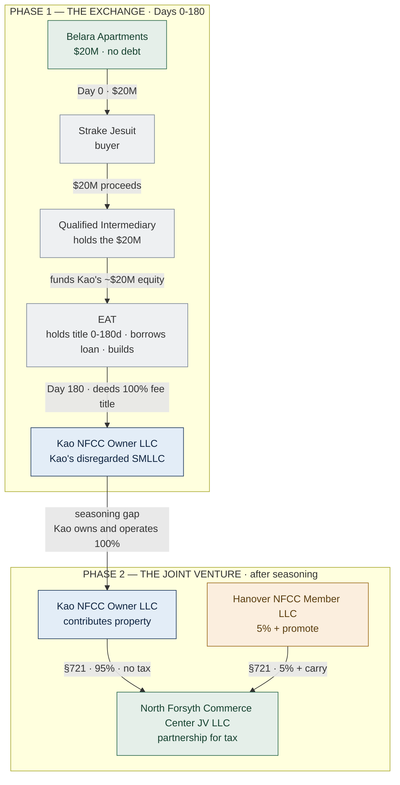

<!-- TAB:overview -->

## North Forsyth §1031 — Structure A

> **Privileged & Confidential — Attorney Work Product.** Illustrative summary only; not legal or tax advice and not a covered opinion. Figures are rounded planning numbers, not verified deal terms. Obtain a written §1031 opinion on the executed documents before Belara closes.

**The deal.** Kao sells **Belara Apartments** (~$20M, no debt; buyer **Strake Jesuit**) and §1031-exchanges into **North Forsyth Commerce Center** — a ~$50.3M ground-up industrial project (~327,600 SF) in Cumming, GA. **Hanover** develops, builds, guarantees the ~$29M construction loan, and takes **5% + a promote**.

| ~$20.0M | ~$50.3M | 95 / 5 | ~$29M |
|---|---|---|---|
| Belara sale (no debt) → deferred | NFCC project cost | Kao / Hanover economics | Construction loan |

**The problem, and the fix.** A promote is a profit share, which turns a co-ownership into a partnership — and a partnership interest is **not** like-kind real property. Put the promote *inside* the vehicle Kao receives and the exchange fails. Structure A separates the two in time:

1. **Phase 1 — the exchange.** Kao exchanges Belara into **100% fee title** in North Forsyth, through a Qualified Intermediary (QI) and a build-to-suit Exchange Accommodation Titleholder (EAT).
2. **Phase 2 — the JV.** After a **genuine seasoning period**, Kao contributes the property to a promoted Hanover joint venture under **§721** (tax-free). The JV carries the full term sheet: 95/5, the 20/30/40 promote over 10/14/18, the 4% and 4.5% fees, and the guaranties.

> **How strong is this, honestly?** **More likely than not** — not "clean," and not automatic. The main risk is the IRS collapsing the two phases into one (the step-transaction doctrine). The position **strengthens toward "should"** the longer Kao genuinely owns and operates North Forsyth before combining. If the parties want the strongest, simplest exchange, a fallback (**Structure B** — Kao 100% forever + an ordinary-income incentive fee) trades Hanover's capital-gain treatment for a bulletproof exchange.

See **Structure** for how it works and the diagrams; **Kao / Hanover / Strake** for each party's role; **Sources** for the authority.

<!-- TAB:structure -->

## How it works

Legend: **Kao = blue**, **Hanover = amber**, **neutral/third party = grey**, **asset/JV = green**.

**Two clocks in Phase 1.** Identify North Forsyth (and a backup DST) in writing by **Day 45**; the EAT must convey 100% fee title by **Day 180** (or the extended return due date — so **extend the 2026 return**). Only improvements actually **in place** by Day 180 count toward the exchange: land **$6.5M** + roughly **$13.5M** of completed construction = the ~$20M target. Any shortfall is taxable **boot** in 2026. Hanover's ~$1.1M and the ~$29M loan fund the rest of the build as **debt**, never as Hanover equity.

**Seasoning is the whole ballgame.** The clock runs from the **EAT→Kao deed date**, not Day 0. Working floor ≈ the later of **12 months** after the deed and **substantial completion**; ~**24 months** plus lease-up and/or a refinance supports a path to "should." During the gap Kao holds and operates as the genuine **100% owner**, with **no binding obligation to contribute** (a non-binding LOI only; no fixed-price equity option).

**Keeping Phase 1 neutral.** Hanover is protected as a contractor and creditor, not by a promise of future equity: market Development Management (4%) and GMP/GC (4.5%) contracts; its 5% funded as a **secured, interest-bearing loan** (not a "preferred return") that converts via §721 in Phase 2; a collateralized Kao indemnity; and a fixed/cost-based break fee (not promote-mirroring) if Kao chooses not to proceed.

**Partnership-tax overlays to model before signing.** The §721 contribution is nonrecognition, but watch **§707** (a contribution-plus-distribution within ~2 years can be a disguised sale), **§752** (Hanover's guaranties can shift the loan off Kao and trigger gain), and **§704(c)** (keeps the deferred Belara gain with Kao).

```mermaid
flowchart LR
  A["Pre-close<br/>QI · EAT · entities<br/>lender consent · opinion"]:::neutral
  B["Day 0<br/>Belara → QI<br/>$20M parked"]:::asset
  C["Day 45<br/>Identify NFCC + backup DST"]:::neutral
  D["Days 0-180<br/>EAT builds<br/>QI + loan fund draws"]:::neutral
  E["Day 180<br/>EAT deeds 100%<br/>to Kao SMLLC"]:::kao
  F["Seasoning (from deed)<br/>12-mo floor → ~24 mo + lease-up<br/>file Form 8824"]:::kao
  G["Phase 2<br/>§721 into the JV<br/>Hanover 5% + promote"]:::han
  H["Exit / refi<br/>promote paid<br/>§1061 > 3-yr hold"]:::asset
  A --> B --> C --> D --> E --> F --> G --> H
  classDef kao fill:#e3edf7,stroke:#1f3a5f,color:#0f2440;
  classDef han fill:#fbeede,stroke:#9c6b1e,color:#5a3d0e;
  classDef neutral fill:#eef0f2,stroke:#7a8696,color:#333;
  classDef asset fill:#e5efe9,stroke:#2d6a4f,color:#14402e;
```

<!-- TAB:kao -->

## Your Role — Kao (the Exchanger)

You sell Belara and acquire the replacement. Everything runs on the **45-day** and **180-day** clocks, and you must **never** touch the proceeds.

**Before Belara closes**
- Engage the QI and the EAT provider; engage §1031 counsel + CPA and obtain the written opinion on the final documents.
- Form `Kao NFCC Owner LLC`; the sole member must be the **exact taxpayer** that sells Belara. Admit no second member before the exchange completes.
- Confirm you have never owned North Forsyth (Rev. Proc. 2004-51); confirm the land seller is unrelated.
- Model boot, §752, and §707; line up a specific, named backup DST.

**During the exchange (Days 0–180)**
- Day 0: Belara closes; proceeds wire to the QI (never to you).
- Day 45: identify North Forsyth (and the backup DST) in writing.
- Day 180: the EAT deeds **100% fee title** to `Kao NFCC Owner LLC`. **Extend the 2026 return**; commission a Day-180 in-place valuation; file Form 8824.

**After (Phase 2)**
- Let the exchange **season** from the deed date; hold and operate as the genuine **100% owner**; **do not** pre-sign the JV contribution (non-binding LOI only).
- Contribute the property to the JV under §721; you become the **95%** member. Your deferred Belara gain stays with you under §704(c).

<!-- TAB:hanover -->

## Your Role — Hanover (Developer, GC, and 5% Promoted Partner)

Your economics are identical to the term sheet: 5% ownership, the 20/30/40 promote over 10/14/18, the 4% development fee, the 4.5% GC fee, and the guaranties. Only the **sequencing** changes — you take your ownership and promote in **Phase 2**, after Kao's exchange closes.

**Phase 1 (during the build)**
- Build under a standalone, market **Development Management Agreement (4%)** and a **GMP contract (4.5%** of hard costs).
- Provide the loan guaranties (completion, carry, overrun, carve-out), backed by a collateralized Kao indemnity.
- Fund your 5% **now as a secured, interest-bearing loan** (`Hanover NFCC Capital LLC`) — **not** a "preferred return." It converts to equity in Phase 2. You are **not** on title during the exchange.
- If Kao chooses not to proceed to Phase 2, you are made whole by a **fixed / cost-based break fee** (not a promote-mirroring payment).

**Phase 2 (the JV)**
- Contribute / convert into the JV under §721; receive your **5% membership + the promote** (carried interest).
- Your promote is **capital gain** because it is a partnership **profits interest** (not because of §1061). §1061 doesn't create capital gain — it just requires a **> 3-year hold** for long-term rates. Your dev and GC fees remain ordinary income.

> Prefer to avoid the Phase-2 sequencing? See **Structure B**: you stay a fee-based developer with a promote-replicating **incentive fee** — same pre-tax dollars, but the promote becomes **ordinary income** (gross it up to stay whole).

<!-- TAB:strake -->

## Your Role — Strake Jesuit (Buyer of Belara only)

You are the buyer of Belara and nothing else. You are not involved in North Forsyth, the EAT, the construction loan, or the joint venture.

- **Close on the agreed date.** Funds go through escrow to the **Qualified Intermediary**, not to Kao directly. This is required for Kao's §1031 exchange.
- **Coordinate logistics** with Kao and the QI on closing date, escrow instructions, and title.
- **Complete your own diligence** (title, survey, environmental, and any institutional / gift-acceptance items). Those are your own concerns, separate from the exchange.

<!-- TAB:references -->

## Sources

**Statute & regulations**
- [IRC §1031](https://www.law.cornell.edu/uscode/text/26/1031) — like-kind exchanges; real-property only post-TCJA (§1031(a)(1)), so a partnership interest cannot qualify.
- [Treas. Reg. §1.1031(a)-3](https://www.law.cornell.edu/cfr/text/26/1.1031(a)-3) — definition of "real property" (excludes a partnership interest).
- [IRC §721](https://www.law.cornell.edu/uscode/text/26/721) — nonrecognition on contributing property to a partnership.
- [IRC §704(c)](https://www.law.cornell.edu/uscode/text/26/704) — built-in gain stays with the contributing partner (Kao).
- [IRC §707(a)(2)(B)](https://www.law.cornell.edu/uscode/text/26/707) · [Reg. §1.707-3](https://www.law.cornell.edu/cfr/text/26/1.707-3) — disguised-sale rule (2-year presumption).
- [IRC §752](https://www.law.cornell.edu/uscode/text/26/752) · [Reg. §1.752-2](https://www.law.cornell.edu/cfr/text/26/1.752-2) — partnership liabilities; guaranties shifting debt off Kao.
- [IRC §1061](https://www.law.cornell.edu/uscode/text/26/1061) — 3-year hold for carried-interest long-term rates.
- [Treas. Reg. §1.1031(k)-1](https://www.law.cornell.edu/cfr/text/26/1.1031(k)-1) — QI / constructive-receipt safe harbor.
- [Treas. Reg. §301.7701-3](https://www.law.cornell.edu/cfr/text/26/301.7701-3) — disregarded entity.
- [IRS — About Form 8824](https://www.irs.gov/forms-pubs/about-form-8824) — reporting like-kind exchanges.

**Revenue procedures**
- [Rev. Proc. 2000-37](https://www.irs.gov/pub/irs-drop/rp-00-37.pdf) — QEAA / build-to-suit "parking" safe harbor.
- [Rev. Proc. 2004-51](https://www.irs.gov/pub/irs-drop/rp-04-51.pdf) — no safe harbor if the taxpayer pre-owned the replacement.
- [Rev. Proc. 2002-22](https://www.irs.gov/pub/irs-drop/rp-02-22.pdf) — TIC co-ownership guidance (advance-ruling guidance, **not** a safe harbor).

**Case law** *(read with their limits: both are pre-1984, Ninth Circuit; Georgia is in the Eleventh Circuit)*
- [Magneson v. Commissioner](https://openjurist.org/753/f2d/1490/magneson-v-commissioner-of-internal-revenue), 753 F.2d 1490 (9th Cir. 1985) — a post-exchange §721 contribution can still satisfy "held for investment."
- [Bolker v. Commissioner](https://law.justia.com/cases/federal/appellate-courts/F2/760/1039/), 760 F.2d 1039 (9th Cir. 1985) — supports "held for investment" despite a planned later step (**not** itself a §721 case).

---

*Illustrative summary only; entity names are placeholders. This is a conditional, more-likely-than-not position (not "clean"). Not a covered opinion — obtain a written §1031 opinion on the executed documents before Belara closes. The full analysis and the companion memos contain the detail behind this summary.*
