<!-- TAB:overview -->

> **Internal working model only** — not legal advice, not client-facing. No structure is locked; obtain §1031 counsel opinion before Belara closes.

## The deal

Sell **Belara Apartments** ($20M, no debt) and defer gain by reinvesting into **North Forsyth Commerce Center** — ≈$50.3M ground-up industrial (≈327,600 SF, Forsyth County GA) with **Hanover Industrial LLC** as developer.

| | |
|---|---|
| **Belara seller (today)** | Titan Management — **must align with exchanger** (prefer **Kao Management Trust**) |
| **Belara buyer** | Strake Jesuit |
| **Commercial LP (term sheet)** | Kao Management Trust — 95% economics |
| **Developer** | Hanover Industrial LLC |
| **Land** | $6.5M · third-party seller · **under PSA** · unaffiliated |
| **Project cost** | ≈$50.3M · construction loan **≈60% LTC** |
| **QI** | **Riverway Title** |
| **EAT** | TBD |
| **Model Day 0** | **Sept 15, 2026** (Belara + NFCC land / construction start) |
| **45-day ID deadline** | **Oct 30, 2026** — identification letter must be **on file with QI by then** (modeled **Sept 15**, before land wire) |
| **180-day completion deadline** | **Mar 14, 2027** — EAT must deed replacement property to exchanger |

## Commercial term sheet (unsigned — economics to preserve)

| Item | Term |
|---|---|
| Equity | **95% / 5%** |
| Promote | **20 / 30 / 40%** over **10 / 14 / 18%** IRR |
| Dev fee | **4%** · GC **4.5%** of hard ($300K GMP advance) |
| Overruns | **100% controllable** → Sponsor · **shared** → pro rata |
| Guaranties | Sponsor → lender + JV |
| Close intent | **Simultaneous:** JV + GMP + loan + land + permit |

Hanover has **not signed**. We will submit a **restructured term sheet** — same dollars, different legal sequencing for §1031.

## Why the term sheet LLC (Day 1) conflicts with §1031

The term sheet gives Kao a **95% LLC membership interest** at closing. Post-TCJA, §1031 applies only to **real property** — a partnership/LLC interest is **not** like-kind ([IRC §1031(a)(1)](https://www.law.cornell.edu/uscode/text/26/1031), [Reg. §1.1031(a)-3](https://www.law.cornell.edu/cfr/text/26/1.1031(a)-3)). A ground-up build also requires **QI + EAT** parking — not in the term sheet's simultaneous JV close.

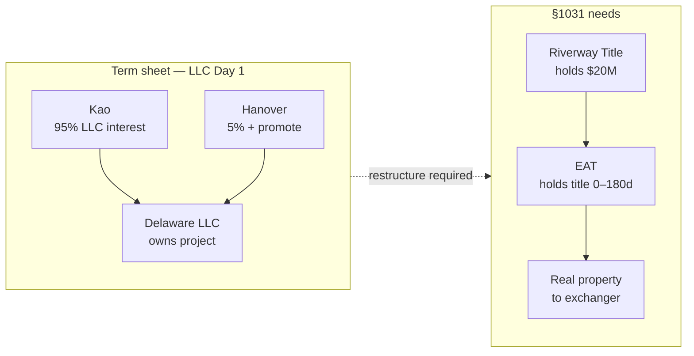

## Structure paths — compared (none locked)

| Path | What it is | Exchange (draft view) | Hanover gets equity |
|---|---|---|---|
| **A. Term sheet LLC** | JV Day 1 as written | **Fails** — LLC interest | Day 1 |
| **B. TIC + EAT** | Direct co-ownership at Day 180; promote as fee | Uncertain — counsel | Day 180 |
| **C. Exchange then §721** | 100% fee to Kao, then JV after seasoning | MLTN at best | After 12–24+ mo |
| **D. 100% + fee** | Kao owns forever; promote as incentive fee | Strongest exchange | Never (fee) |

**Our stance:** Whatever works — pick with counsel, not by label.

## Timeline & exchange equity draw

**Day 0 = Belara close** (IRS clocks start). Modeled **Sept 15, 2026**, aligned with NFCC land. Party detail → tabs.

### Two IRS clocks (do not confuse with action order)

| Clock | Starts | Last day (model) | What it means |
|---|---|---|---|
| **45-day identification** | Belara close | **Oct 30, 2026** | Exchangor must give QI a **written list** of replacement property **on or before** this date |
| **180-day completion** | Belara close | **Mar 14, 2027** | Replacement property must be **received** (here: EAT deeds to Kao LLC) **on or before** this date |

**Oct 30 is a deadline, not the day we identify.** QI cannot apply Belara proceeds to NFCC until NFCC is **identified**. In our model the identification letter is delivered **Sept 15 — same day as Belara, before the land wire** (see order below). Oct 30 is cushion if Belara slips.

### Sept 15 — order of operations (same calendar day)

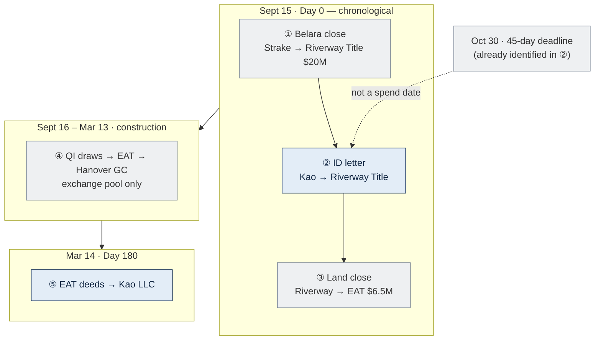

### Exchange pool — sources and uses

QI holds **≈$20M** from Belara (no debt). **Cannot disburse more than the pool** for exchange-funded work.

| Order | When | From → To | $ | Source |
|---|---|---|---|---|
| ① | Sept 15 | Strake → escrow → **Riverway Title** | **20.0M** | Belara sale |
| ② | Sept 15 | (no wire) Kao → **Riverway Title** | — | **ID letter** on file |
| ③ | Sept 15 | **Riverway Title** → **EAT** → land seller | **6.5M** | Exchange pool |
| ④ | Oct–Nov 2026 | **Riverway Title** → **EAT** → Hanover GC | **5.0M** | Exchange pool |
| ⑤ | Dec 2026–Feb 2027 | **Riverway Title** → **EAT** → Hanover GC | **8.5M** | Exchange pool (**exhausts ≈$20M**) |
| ⑤b | Dec 2026–Feb 2027 | **Lender** → **EAT** → Hanover GC | **1.5M** | **Construction loan** (foundations balance) |
| ⑥ | Mar 14, 2027 | **EAT** → **Kao LLC** (deed) | — | Exchange **completes** |

**Project draw model (user):** land $6.5M + sitework $5M + foundations $10M = **$21.5M** hard-cost phases. **Exchange pool covers $20.0M**; the last **$1.5M** of the foundations phase is **loan-funded**, not QI proceeds.

Full build ≈**11 months** (~Aug 2027). Remaining **≈$28.8M** of ≈$50.3M project (after land + early hard costs) → **construction loan** (~60% LTC) per model.

## Hanover entity map (roles — names TBD at formation)

**During Days 0–180:** **EAT** holds title; **Hanover Construction Group** contracts with EAT. Chart below is the **term-sheet target** after restructure (JV/co-ownership timing **OPEN**).

Pattern from Hanover's example deals + term sheet. **Hanover Construction Group** is the **GMP contractor** — not a JV equity holder during the EAT phase.

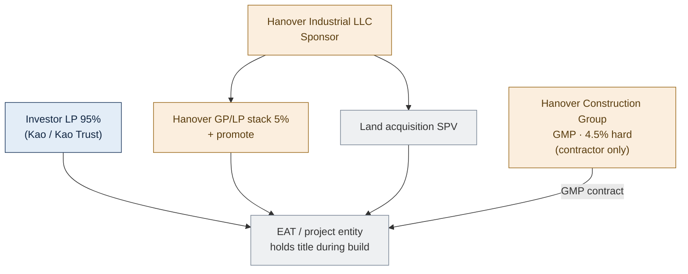

## Key terms (short)

| Term | Meaning |
|---|---|
| **QI** | **Riverway Title** — holds ≈$20M Belara proceeds; funds NFCC **only after** identification letter on file |
| **EAT** | Holds title during build (up to 180 days) — provider TBD |
| **45-day ID** | Written list to QI — **deadline** Oct 30, 2026; modeled **Sept 15** before land wire |
| **Boot** | Taxable if less than ≈$20M qualifying value in place by Day 180 |
| **Like-kind** | Real property only — not LLC/partnership interests |
| **Same taxpayer** | Belara seller = replacement recipient (resolve Titan vs Kao Trust) |

## Open before Belara PSA

1. **Exchangor entity** — align Titan Management → **Kao Management Trust** (preferred)  
2. **Structure path** — B, C, or D above — counsel review  
3. **EAT** provider · lender approval of chosen structure  
4. **Belara PSA** — QI/escrow language (Riverway Title)

## All parties — step index (model)

**Chronological order** — same story on every tab.

| # | When | What happens | Strake | Kao | Riverway (QI) | EAT | Hanover | Land seller | Lender |
|---|---|---|---|---|---|---|---|---|---|
| **1** | Pre-close | QI/EAT engaged; **ID letter drafted**; GMP; land PSA | PSA | Entity align | Engagement | QEAA | GMP + DMA | PSA | Comfort letter |
| **2** | **Sept 15 ①** | **Belara close** | **$20M → QI** | Signs; **no cash** | **Receives $20M** | — | — | — | — |
| **3** | **Sept 15 ②** | **ID letter to QI** (before NFCC spend) | — | **Delivers letter** | **Acknowledges** | — | — | — | — |
| **4** | **Sept 15 ③** | **Land close** | — | — | **$6.5M → EAT** | **On title** | GMP live | **Paid** | — |
| **5** | Sept 16 – Mar 13 | **Construction** | — | — | **Draws ≤ ≈$13.5M** to EAT | Pays GC | **Builds** | — | **Loan after pool exhausted** |
| **6** | **Mar 14** | **Exchange completes** | — | **Deed via LLC** | Closes exchange | **Deeds → Kao LLC** | GC continues | — | — |
| **7** | ~Aug 2027 | Full build | — | Owns | — | Dissolved | JV path **OPEN** | — | Funds balance |

| **Deadline only** | **Oct 30, 2026** | Last day to identify if not already done in step **3** | — | — | — | — | — | — | — |

<!-- TAB:strake -->

## Your role

**Buyer of Belara Apartments only** — **Strake Jesuit**. You purchase the relinquished property so Kao's family can run a §1031 exchange into North Forsyth. You are **not** a party to NFCC, the EAT, Hanover's development, or any exchange filing.

| Role | Party |
|---|---|
| **What you buy** | Belara Apartments — **$20M**, no debt |
| **Seller** | **Titan Management** today (may align to **Kao Management Trust** — not your problem to structure) |
| **Your counsel** | Your attorneys — PSA, diligence, institutional requirements |
| **Escrow / title** | Closing agent per PSA |
| **QI (exchange)** | **Riverway Title** — **your wire destination** at closing |
| **North Forsyth** | **Not involved** — different property, different parties |

## Why your closing matters for the exchange

Kao defers tax only if Belara sale proceeds go **directly to a Qualified Intermediary** — not to the seller. Your purchase price is the **$20M exchange pool** that funds NFCC land and construction. If proceeds wire to Titan/Kao instead of **Riverway Title**, the exchange fails.

You do **not** need to understand EATs or replacement property — but you **must** close with escrow instructions that send **net proceeds to Riverway Title**.

## Key dates (your involvement only)

| Milestone | Date (model) | Your action |
|---|---|---|
| **PSA signed** | Before Sept 15 | Agree price, diligence, closing logistics |
| **Day 0 — Belara close** | **Sept 15, 2026** | Wire **$20M** through escrow → **Riverway Title**; receive Belara deed |
| **After Day 0** | — | **Nothing** on NFCC, construction, or §1031 |

Modeled same day as Kao's NFCC land close — **your** obligation is only the Belara purchase. Kao delivers the §1031 identification letter to Riverway **before** Riverway wires any NFCC funds (not your document to sign).

## Step 1 — Pre-close (before Sept 15)

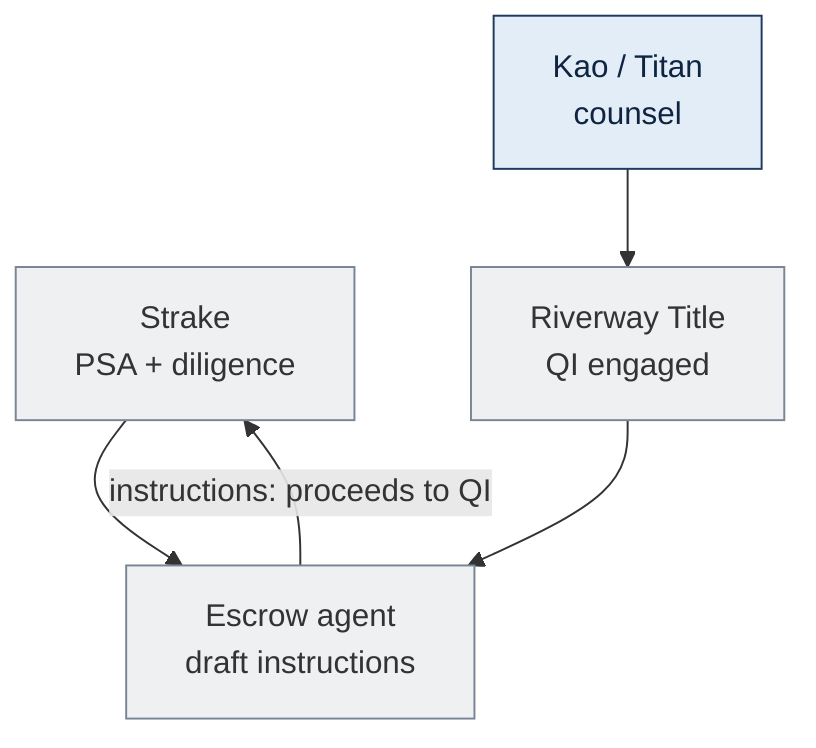

| Who | What |
|---|---|
| **Strake** | Complete diligence (title, survey, environmental, gift/institutional items on your side) |
| **Strake counsel** | Review PSA; confirm closing statement |
| **Kao / seller counsel** | Engage **Riverway Title** as QI; draft exchange + escrow language |
| **Escrow** | Instructions: **net sale proceeds wire to Riverway Title**, not seller |
| **Strake** | Approve escrow instructions before close |

**You do not** select the EAT, sign GMP, or approve NFCC identification.

## Step 2 — Day 0: Belara closing (Sept 15, 2026)

This is your **only** day in the transaction.

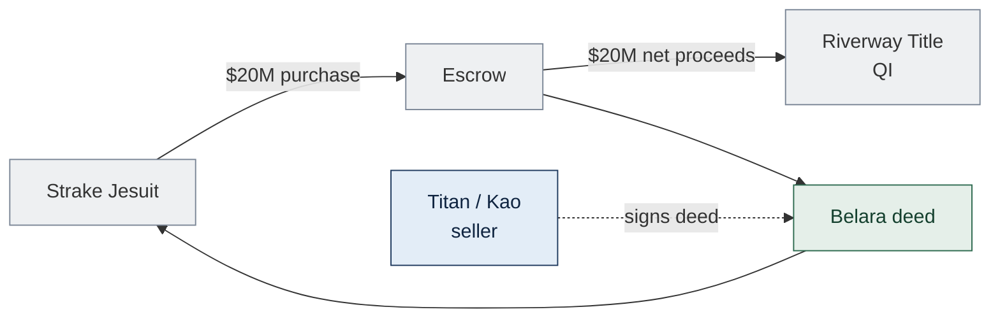

| From | To | $ | Note |
|---|---|---|---|
| **Strake Jesuit** | **Escrow** | **$20M** | Purchase price per PSA |
| **Escrow** | **Riverway Title** | **$20M** (net) | **Required** for §1031 — not to seller |
| **Seller** | **Strake** | — | Deed to Belara |

**You receive** title to Belara. **You do not** send money to North Forsyth, Hanover, or an EAT.

## Step 3 — After closing: what you do not do

| Topic | Strake involvement |
|---|---|
| North Forsyth / NFCC | **None** |
| EAT, construction, 180-day clock | **None** — Kao's exchange |
| Hanover JV, GMP, promote | **None** |
| Form 8824 or IRS filings | **None** — exchanger's return |
| Day 45 identification | **None** |
| Construction loan | **None** |

> Gift-acceptance or other institutional requirements are **your** legal matters — separate from the exchange.

## Escrow checklist (for your counsel)

- [ ] QI (**Riverway Title**) named in escrow instructions as proceeds recipient  
- [ ] Seller does **not** receive sale proceeds at closing  
- [ ] Closing date coordinated with Kao (modeled **Sept 15, 2026**)  
- [ ] No side letter directing proceeds elsewhere  

**Sources:** [Treas. Reg. §1.1031(k)-1](https://www.law.cornell.edu/cfr/text/26/1.1031(k)-1) · [IRS Like-Kind Exchanges](https://www.irs.gov/businesses/small-businesses-self-employed/like-kind-exchanges-real-estate-tax-tips)

<!-- TAB:hanover -->

## Your role

**Hanover Industrial LLC** = **Sponsor** on the unsigned term sheet — development manager, loan/JV guarantor, and target **5% + promote** economics. **Hanover Construction Group** (affiliate) = **GMP contractor** — 4.5% of hard costs; **not** a JV equity holder on the org chart.

**Legal structure is not locked.** Term sheet assumes **LLC JV Day 1**; §1031 requires **restructure** (EAT holds title during build; your equity/promote timing **OPEN**). **Commercial dollars** (fees, promote, guaranties) are what we aim to preserve.

| Role | Entity |
|---|---|
| **Sponsor / developer** | **Hanover Industrial LLC** — 4% dev fee, guaranties, 5% + promote (timing OPEN) |
| **GC / GMP** | **Hanover Construction Group** — contracts with **EAT / project entity**, not Kao directly |
| **Investor side** | **Kao Management Trust** — 95% economics on term sheet |
| **Title during build** | **EAT** (TBD) — legal owner Days 0–180 |
| **Exchange funds** | **Riverway Title (QI)** → EAT — not Hanover's balance sheet |
| **Construction loan** | Third-party lender — **~60% LTC**; you guaranty per term sheet |

## Why §1031 changes your closing sequence

Term sheet: **simultaneous** JV + GMP + loan + land + permit — Kao gets **95% LLC membership** Day 1. That **breaks §1031** (LLC interest ≠ like-kind real property). Restructured model:

1. **EAT** holds NFCC title and borrows during **180-day** exchange window  
2. **You** contract as **developer + GC** to the **EAT** — paid from QI draws, then construction loan  
3. **Your 5% + promote** enters **later** (Day 180 co-ownership, post-exchange §721 JV, or fee-only path) — **counsel picks**

Your fees and guaranties can start in Phase 1; **your equity membership** likely cannot.

## Key dates (Hanover — model)

| Milestone | Date | Hanover role |
|---|---|---|
| **Pre-close** | Before Sept 15 | Execute **GMP** + dev agreements with **EAT**; lender guaranty docs |
| **Day 0 — ① Belara** | **Sept 15, 2026** | **GMP effective** after Kao ID + land close to **EAT** |
| **Construction** | Sept 16, 2026 – Mar 13, 2027 | **Invoice EAT**; paid from QI draws then **loan** |
| **Day 180** | **Mar 14, 2027** | EAT deeds to **Kao LLC**; you remain **GC**; equity path **OPEN** |
| **Full build** | ~**Aug 2027** | Complete building; loan funds balance of ~$50.3M project |

## Step 1 — Pre-close (before Sept 15)

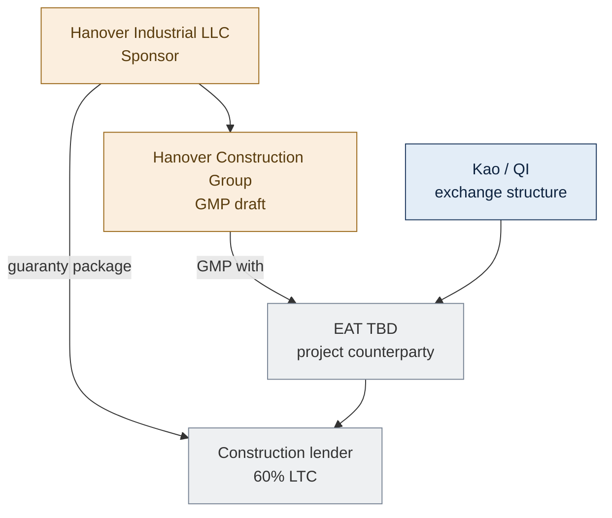

| Who | What |
|---|---|
| **Hanover Industrial** | Negotiate restructured economics; dev management agreement (4%) with **EAT** |
| **Hanover Construction Group** | Finalize **GMP** — 4.5% hard, $300K advance, 5% contingency — **contractor to EAT** |
| **Hanover** | Loan completion + overrun **guaranties** per term sheet — lender lends to **EAT** |
| **EAT** | Formed/engaged; signs QEAA with exchanger; holds title |
| **Not yet** | Delaware JV LLC with Kao 95% — **deferred** until structure path chosen |

## Step 2 — Day 0: land close (Sept 15, 2026)

You are **not** at the Belara closing. On NFCC, Riverway funds land **only after** Kao's identification letter is on file (same day, before this wire).

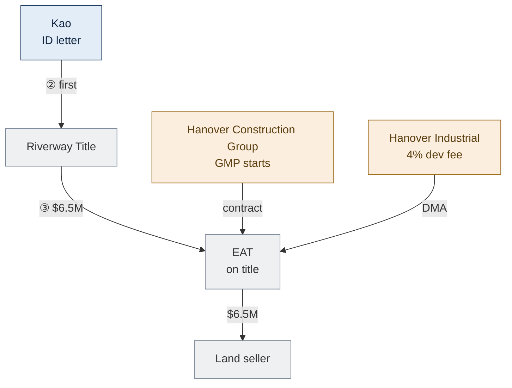

| From | To | $ | Hanover |
|---|---|---|---|
| **Riverway Title** | **EAT** | **$6.5M** | — (exchange funds, not your capital) |
| **EAT** | **Land seller** | **$6.5M** | You facilitate development; **EAT** is buyer of record |
| **EAT** | **Hanover Construction Group** | — | **GMP** in place; mobilization per contract |
| **EAT** | **Hanover Industrial** | — | **Dev management** (4%) accrues per DMA |

## Step 3 — Construction: who pays you (Sept 16, 2026 – Mar 13, 2027)

You bill the **EAT**. Early costs: **Riverway Title → EAT → you**. After the **≈$20M exchange pool** is spent, **lender → EAT → you**.

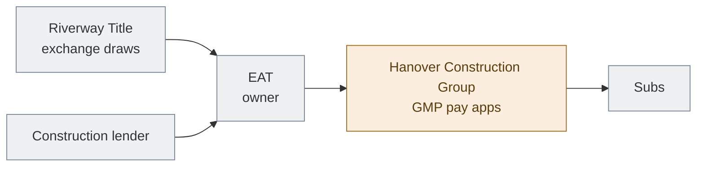

| Phase | Calendar | $ | **Paid from** | Hanover receives |
|---|---|---|---|---|
| Sitework | Oct–Nov 2026 | $5.0M | **QI → EAT** | GMP progress payments |
| Foundations (exchange) | Dec 2026–Feb 2027 | $8.5M | **QI → EAT** | Same |
| Foundations (balance) | Dec 2026–Feb 2027 | $1.5M | **Lender → EAT** | Same |
| Dev management | Ongoing | per DMA | EAT | **4%** dev fee |

- **Draw certification:** GC pay apps; QI releases only against **identified** NFCC and certified work  
- **After exchange pool exhausted (~$20M):** **construction lender** advances to EAT — you **guaranty** per term sheet  
- **Controllable overruns:** **100% Sponsor** per term sheet  

## Step 4 — Day 180 (Mar 14, 2027)

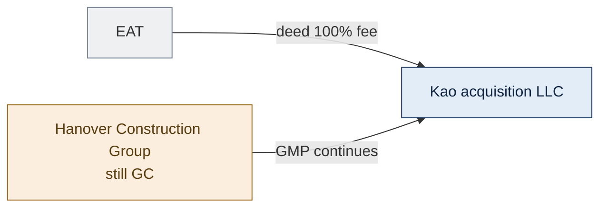

| Event | Hanover |
|---|---|
| **EAT → Kao LLC deed** | Exchange completes — **Kao** owns NFCC; you do **not** receive a deed slice yet (unless TIC path — OPEN) |
| **GMP** | Continues through **Kao LLC** as owner |
| **5% + promote** | **Not automatic** — depends on structure path (Overview) |

## Step 5 — After Day 180 (~Aug 2027 full build)

| Structure path (OPEN) | When Hanover gets equity / promote |
|---|---|
| **TIC + EAT** | Possible **5% undivided** co-ownership deed at Day 180 |
| **Exchange then §721** | **12–24+ mo** after deed; loan converts to 5% via contribution |
| **100% + incentive fee** | **Never** equity — promote as ordinary-income fee |
| **Term sheet LLC Day 1** | **Fails §1031** — not viable as written |

Construction to ~**$50.3M** total completes with **loan + remaining draws**; you keep earning **dev + GC fees** and bear **guaranty** exposure per negotiated restructure.

## Hanover entities (roles)

| Entity | Role |
|---|---|
| **Hanover Industrial LLC** | Sponsor — dev fee, guaranties, promote stack |
| **Land acquisition SPV** | May acquire land in non-§1031 deals; here **EAT** buys land (pattern TBD) |
| **Hanover Construction Group** | **GMP only** — 4.5% hard, $300K advance, 5% contingency |
| **Investor LP (95%)** | Kao side — **Phase 2** in most restructure paths |
| **Hanover GP/LP + capital** | 5% + promote — **timing OPEN** |

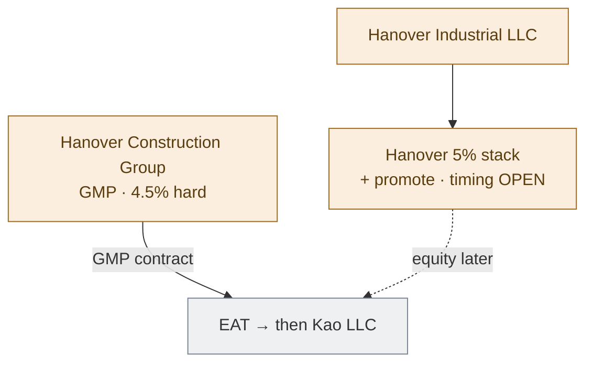

## Commercial terms (term sheet — unsigned)

| Item | Term |
|---|---|
| Equity | 5% (95% Kao) — **timing restructured for §1031** |
| Promote | 20/30/40 @ 10/14/18 IRR |
| Dev fee | 4% |
| GC / GMP | 4.5% hard · $300K advance |
| Overruns | 100% controllable → Sponsor |
| Guaranties | Lender + JV completion / overrun |

## Term sheet vs §1031 restructure

| Term sheet (as written) | Restructured model (draft) |
|---|---|
| LLC JV **Day 1** | **EAT** holds title **0–180d**; JV or co-ownership **later** |
| Kao 95% **membership** at close | Kao **real property** first; LLC interest **deferred** |
| Simultaneous JV + GMP + loan + land | Land + build via **QI/EAT**; loan to **EAT** |
| Promote **inside LLC** | Fee or **Phase-2** partnership — counsel |

**Intent:** same commercial economics — different legal sequencing and documents.

**Sources:** Term sheet 06.12.2026 · `docs/incoming/Hanover-Org-Chart-Example-Project.pdf`

<!-- TAB:kao -->

## Your role

**Exchangor (our family)** — the taxpayer selling Belara and acquiring North Forsyth to **defer** the Belara capital gain. Not Hanover. Not Strake.

| Role | Party |
|---|---|
| **Relinquished property** | Belara Apartments — legal seller today: **Titan Management** |
| **Preferred exchanger / term-sheet LP** | **Kao Management Trust** — **must align before Belara PSA** |
| **Belara buyer** | **Strake Jesuit** |
| **Qualified Intermediary** | **Riverway Title** — holds $20M; you **never** receive sale proceeds |
| **EAT** | **TBD** — temporary **legal owner** of NFCC during build (up to 180 days) |
| **Developer** | **Hanover Industrial LLC** — dev fee, guaranties; equity timing **OPEN** |
| **GC** | **Hanover Construction Group** — GMP contractor to EAT / project entity |
| **Land seller** | Third party, unaffiliated — **under PSA** |
| **Structure path** | **Not locked** — Overview tab |

## Why a §1031 exchange (not just "buying NFCC")

Selling Belara for **$20M** triggers a large capital gain. **IRC §1031** defers that tax if you reinvest into **like-kind real property** (North Forsyth) and follow IRS rules:

1. **Strake's purchase price** wires to **Riverway Title (QI)** — not to you. Touching the cash = **constructive receipt** = exchange fails.
2. **On or before 45 days** after Belara close, you must have given the QI a **written identification** of replacement property. **Oct 30, 2026** is the **last day**; in our model the letter goes to Riverway **Sept 15, before any NFCC disbursement**.
3. Within **180 days**, you **complete** the exchange. NFCC is not built yet, so an **Exchange Accommodation Titleholder (EAT)** holds title while **QI funds** (only after identification) buy land and pay construction; on Day 180 the EAT **deeds** the property to **your acquisition LLC**.

The word **"exchange"** means: Belara out → North Forsyth in, same taxpayer, QI in the middle, tax deferred. It is the **tax mechanism** for this deal — not a separate optional step.

## Key dates (model — STATED user)

**Day 0 = Belara close.** NFCC land closes **same day**, but **only after** the identification letter is on file with QI.

| Milestone | Date | What actually happens |
|---|---|---|
| **Day 0 — ① Belara** | **Sept 15, 2026** | Strake closes → **$20M to Riverway Title**; clocks start |
| **Day 0 — ② ID letter** | **Sept 15, 2026** | **Written identification** of NFCC to Riverway **before** land wire |
| **Day 0 — ③ Land** | **Sept 15, 2026** | Riverway releases **$6.5M** → **EAT**; land seller paid |
| **45-day deadline** | **Oct 30, 2026** | Last day to identify — **not** when we act in this model |
| **Construction** | Sept 16, 2026 – Mar 13, 2027 | QI draws (to ≈$20M) then loan → EAT → Hanover GC |
| **Day 180** | **Mar 14, 2027** | **EAT deeds** to **Kao acquisition LLC** — exchange **closes** |
| **Full build** | ~**Aug 2027** | ~11 months from Sept 15; balance via **construction loan** |

## Step 1 — Pre-close (before Sept 15)

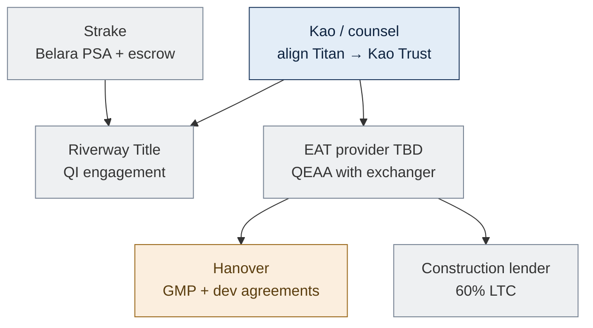

- **Same taxpayer** from Belara through replacement — resolve **Titan Management vs Kao Management Trust** first
- **Engage Riverway Title**; Belara PSA must wire proceeds **to QI only**
- **Select independent EAT** ([Rev. Proc. 2000-37](https://www.irs.gov/pub/irs-drop/rp-00-37.pdf))
- **Form Kao acquisition SMLLC** (name TBD) — receives Day 180 deed
- **Land PSA** with third-party seller ($6.5M)
- **Draft identification letter** for NFCC (land + improvements, value ≥ $20M) — ready to deliver **before** any QI disbursement to EAT

## Step 2 — Day 0: Belara, identification, land (Sept 15, 2026)

IRS **clocks start** at Belara close. **Same calendar day, fixed order** — QI will not fund NFCC until step **②** is complete.

### ② Identification letter (before any NFCC wire)

| | |
|---|---|
| **Who acts** | Exchangor (Kao / aligned entity), through §1031 counsel |
| **Who receives** | **Riverway Title** (QI) |
| **What** | **Written identification** — NFCC parcel, address, planned improvements, estimated value **≥ $20M** |
| **Why first** | Proceeds applied to replacement property must match **identified** property ([Reg. §1.1031(k)-1](https://www.law.cornell.edu/cfr/text/26/1.1031(k)-1)) |

**Oct 30, 2026** is the **45-day deadline** if Belara were earlier; delivering the letter **Sept 15** satisfies the rule and unlocks land/construction draws.

### ① Belara close + ③ NFCC land (after ID on file)

| Step | From | To | $ | Note |
|---|---|---|---|---|
| **①** | **Strake Jesuit** | **Riverway Title** | **$20M** | Belara proceeds — **not** to you |
| **②** | **You (exchangor)** | **Riverway Title** | — | ID letter — **no wire** |
| **③** | **Riverway Title** | **EAT** → land seller | **$6.5M** | Only after **②**; EAT on title |

**You** sign as seller/exchangor. **You do not** receive or control the $20M.

## Step 3 — Construction: who pays whom (Sept 16, 2026 – Mar 13, 2027)

**QI draws** = Riverway releasing **exchange pool** funds on certified requests. Pool is **≈$20M total** (after land: **≈$13.5M** left for improvements).

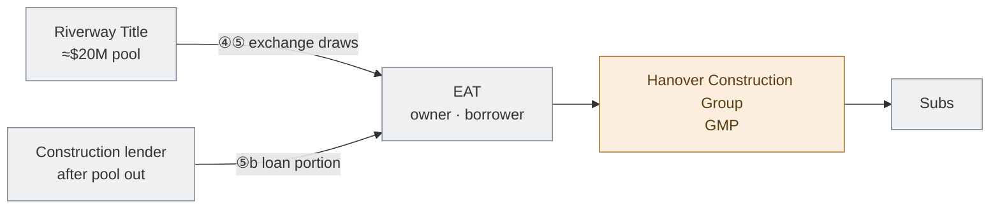

| Phase | Calendar | $ | **Source** | Exchange pool cumulative |
|---|---|---|---|---|
| Land | Sept 15 | $6.5M | **QI** | $6.5M |
| Sitework | Oct–Nov 2026 | $5.0M | **QI** | $11.5M |
| Foundations | Dec 2026–Feb 2027 | $8.5M | **QI** | **$20.0M** (pool exhausted) |
| Foundations (balance) | Dec 2026–Feb 2027 | $1.5M | **Construction loan** | — |
| **Project subtotal** | | **$21.5M** | | (user draw model) |

- **Who requests draws:** EAT / GC under GMP; **QI pays EAT** only for exchange-funded amounts
- **Who is paid:** **Hanover Construction Group** and subs — from **EAT's** account
- Only improvements **complete and paid with exchange funds within 180 days** count toward §1031 value — counsel must document; loan-funded work does not add exchange credit

After exchange pool is out, remaining **≈$28.8M** of ≈$50.3M project → **construction loan** (~60% LTC).

## Step 4 — Day 180: what "exchange complete" means (Mar 14, 2027)

Three concrete events — not a label:

1. **EAT deeds 100% fee simple** (land + improvements in place) → **Kao acquisition LLC** (disregarded → Kao Management Trust if aligned)
2. **Riverway Title** closes exchange per final disbursement instructions
3. You file **Form 8824** — gain deferred to extent **≈$20M** qualifying value was reinvested; shortfall = taxable **boot**

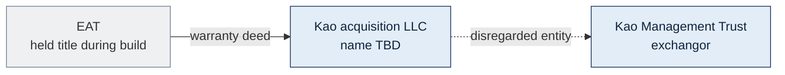

**Until this deed:** you do **not** own NFCC for §1031 purposes — the **EAT** does. That is why the EAT exists.

## After Day 180

Construction continues toward ~**Aug 2027** full completion. Hanover **95/5 JV and promote** depend on structure path (TIC, exchange-then-§721, fee-only, etc.) — **OPEN**. See Overview.

## Critical rules (exchangor)

- **Same taxpayer** Belara sale → replacement deed — resolve Titan vs Kao Trust **before PSA**
- **Never touch proceeds** — constructive receipt ends the exchange
- **No debt on Belara** at close — no mortgage boot
- **45-day identification** — letter on file **before** QI funds NFCC; **Oct 30** is last day, not action day
- **180-day completion** — deed by **Mar 14, 2027**
- **Form 8824**; boot if documented in-place value **< ≈$20M** at Day 180

## Before Belara closes

- [ ] Lock **exchangor entity** (Kao Trust preferred)  
- [ ] Engage **Riverway Title**; select **EAT**  
- [ ] §1031 counsel + CPA; pick structure path (Overview tab)  
- [ ] Draft **identification letter** — deliver to Riverway **before** any NFCC disbursement  
- [ ] Draft Belara PSA — proceeds to QI only  

**Sources:** [IRC §1031](https://www.law.cornell.edu/uscode/text/26/1031) · [Reg. §1.1031(k)-1](https://www.law.cornell.edu/cfr/text/26/1.1031(k)-1) · [Rev. Proc. 2000-37](https://www.irs.gov/pub/irs-drop/rp-00-37.pdf)

<!-- TAB:references -->

## Statute and IRS Guidance

- [IRC §1031 — Like-kind exchanges (real property only)](https://www.law.cornell.edu/uscode/text/26/1031)
- [Treas. Reg. §1.1031(a)-3 — Real property; partnership interest excluded](https://www.law.cornell.edu/cfr/text/26/1.1031(a)-3)
- [Treas. Reg. §1.1031(k)-1 — QI safe harbor](https://www.law.cornell.edu/cfr/text/26/1.1031(k)-1)
- [Treas. Reg. §301.7701-3 — Disregarded entity](https://www.law.cornell.edu/cfr/text/26/301.7701-3)
- [Form 8824](https://www.irs.gov/forms-pubs/about-form-8824)

## Build-to-suit and co-ownership

- [Rev. Proc. 2000-37 — EAT / build-to-suit](https://www.irs.gov/pub/irs-drop/rp-00-37.pdf)
- [Rev. Proc. 2002-22 — TIC guidance (not a safe harbor)](https://www.irs.gov/pub/irs-drop/rp-02-22.pdf)
- [IRC §721 — Contribution to partnership](https://www.law.cornell.edu/uscode/text/26/721)

## Case law

- *Gluck v. Commissioner*, T.C. Memo. 2020-66 — LLC interest / exchange issues

## Disclaimer

Internal working model only — not legal or tax advice. No structure on this site is locked or counsel-approved. Obtain a written §1031 opinion before Belara closes.
